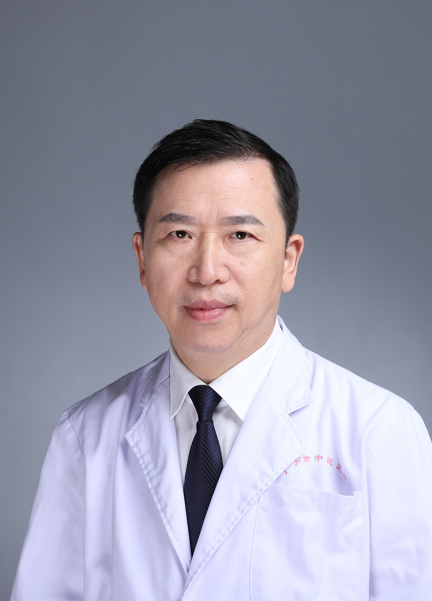

<!-- AUTO-GENERATED-BY: work/generate_obsidian_profiles.py -->

<!-- TEMPLATE: D:\workspace\信息收集整理\医生画像仓库\模板\医生画像模板.md -->

# 尧新华

## 基础信息

| 字段 | 内容 |
|---|---|
| 姓名 | 尧新华 |
| 医院 | 广州市中医院 |
| 科室 | 麻醉科 |
| 职称/身份 | 主任医师 |
| 来源链接 | [官网原文](https://www.gzszyy.com/expert/2026/oQeZ8vbp.html) |
| 采集日期 | 2026-08-13 |

## 简介/擅长

运用中医药主治失眠、颈肩疼痛、胸背痛、腰腿痛等疾病。

## 教育与进修经历

- 1987年毕业于江西医学院医学系， 1999 年在北京协和医院学习，从事临床麻醉、急救复苏、疼痛诊疗工作三十多年，具有丰富的临床经验。
- 2013 年在广州中医药大学参加“广东省中医医院非中医类别医师系统培训中医药知识和技能”培训，获得合格证书。

## 论文与学术产出

- 发表医学论文 20 多篇，其中 SCI 论文 2 篇。

## 可包装亮点

- 发表医学论文 20 多篇，其中 SCI 论文 2 篇。
- 现任广东省中西医结合学会麻醉专业委员会副主任委员，广州市医学会麻醉分会常委，广州市医学会疼痛分会常委，广州市医师协会麻醉医师分会常委，广州市医师协会急危重医师分会常委，广东抗癌协会麻醉与镇痛治疗专业委员会常委。

## 重点疾病/人群标签

- 慢性病：
- 肿瘤：癌、疼痛、急危重
- 生殖疾病：
- 免疫/风湿：
- 术后恢复/康复：癌、疼痛、急危重
- 疑难重症：癌、疼痛、急危重

## 证据摘录

> 只摘录官网公开信息中的短句或关键字段，不复制大段原文。

- 官网身份字段：主任医师
- 官网简介/擅长：运用中医药主治失眠、颈肩疼痛、胸背痛、腰腿痛等疾病。
- 官网亮眼经历线索：发表医学论文 20 多篇，其中 SCI 论文 2 篇。 现任广东省中西医结合学会麻醉专业委员会副主任委员，广州市医学会麻醉分会常委，广州市医学会疼痛分会常委，广州市医师协会麻醉医师分会常委，广州市医师协会急危重医师分会常委，广东抗癌协会麻醉与镇痛治疗专业委员会常委。
- 来源链接：https://www.gzszyy.com/expert/2026/oQeZ8vbp.html

## BD 画像摘要

尧新华医生可作为肿瘤、术后恢复/康复、疑难重症方向的基础画像候选。后续 BD 使用应继续以官网来源和人工复核为准，不添加疗效承诺或无来源包装。

## 合规边界

- 仅使用医院官网、官方公众号、官方小程序等公开渠道。
- 不采集私人电话、私人微信、家庭住址、患者隐私或非公开排班信息。
- 不写“保证治愈”“疗效第一”“包治疑难杂症”等无法由官网证明的表述。
