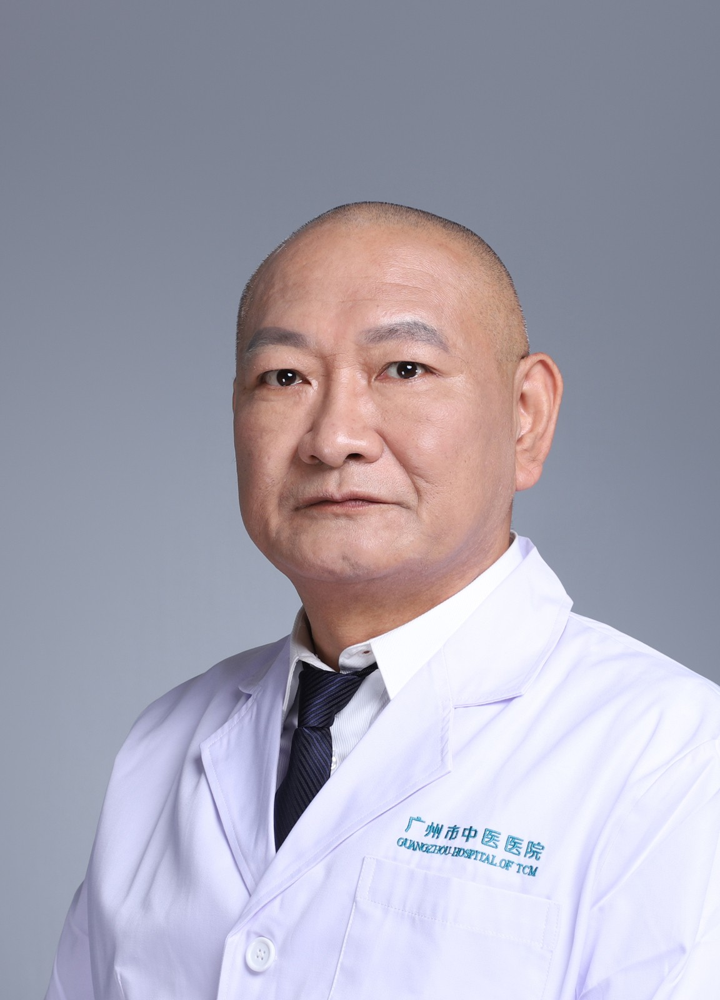

<!-- AUTO-GENERATED-BY: work/generate_obsidian_profiles.py -->

<!-- TEMPLATE: D:\workspace\信息收集整理\医生画像仓库\模板\医生画像模板.md -->

# 岑祖怡

## 基础信息

| 字段 | 内容 |
|---|---|
| 姓名 | 岑祖怡 |
| 医院 | 广州市中医院 |
| 科室 | 骨伤科 |
| 职称/身份 | 主治中医师 |
| 来源链接 | [官网原文](https://www.gzszyy.com/expert/2026/4oeE9ke0.html) |
| 采集日期 | 2026-08-13 |

## 简介/擅长

中医传统方法治疗各种常见骨关节疾病，在颈椎病、腰椎间盘突出症、肩周炎、膝骨关节炎、骨质疏松症等退行性疾病方面有较深的造诣和独到的见解。

## 教育与进修经历

- 本科毕业于广州中医学院， 从事中西医结合 骨伤科 疾病的临床诊疗工作近 30 多年，在骨创伤、关节及脊柱 外科 的保守治疗与微创手术方面积 累了丰富的临床经验。

## 可包装亮点

- 中医传统方法治疗各种常见骨关节疾病，在颈椎病、腰椎间盘突出症、肩周炎、膝骨关节炎、骨质疏松症等退行性疾病方面有较深的造诣和独到的见解。

## 重点疾病/人群标签

- 慢性病：
- 肿瘤：
- 生殖疾病：
- 免疫/风湿：
- 术后恢复/康复：
- 疑难重症：

## 证据摘录

> 只摘录官网公开信息中的短句或关键字段，不复制大段原文。

- 官网身份字段：主治中医师
- 官网简介/擅长：中医传统方法治疗各种常见骨关节疾病，在颈椎病、腰椎间盘突出症、肩周炎、膝骨关节炎、骨质疏松症等退行性疾病方面有较深的造诣和独到的见解。
- 来源链接：https://www.gzszyy.com/expert/2026/4oeE9ke0.html

## BD 画像摘要

岑祖怡医生可作为广州市中医院骨伤科的基础医生资料入库。当前重点方向以总底表标签为准，官网未展示的信息保持空白。

## 合规边界

- 仅使用医院官网、官方公众号、官方小程序等公开渠道。
- 不采集私人电话、私人微信、家庭住址、患者隐私或非公开排班信息。
- 不写“保证治愈”“疗效第一”“包治疑难杂症”等无法由官网证明的表述。
