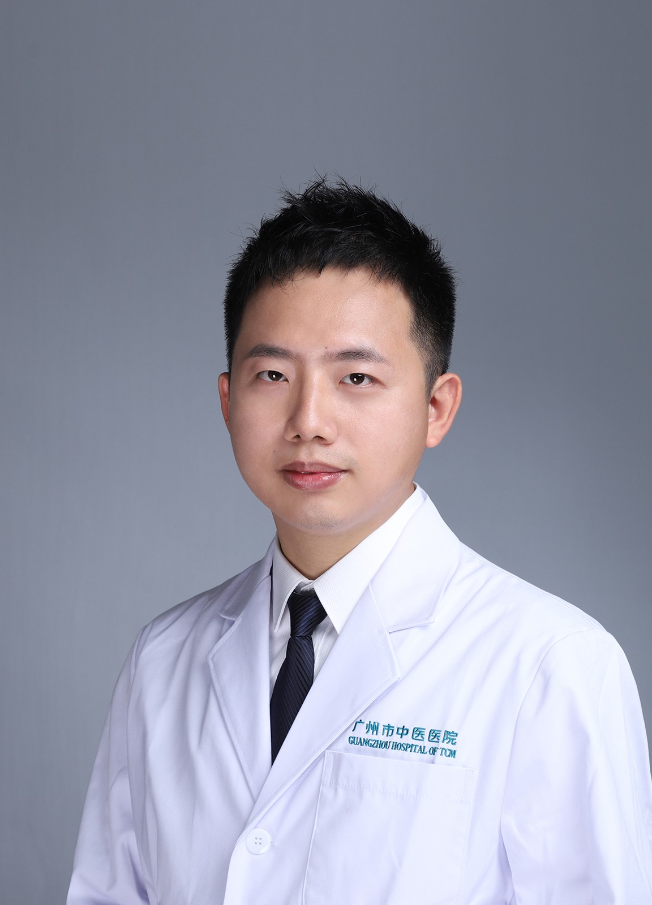

<!-- AUTO-GENERATED-BY: work/generate_obsidian_profiles.py -->

<!-- TEMPLATE: D:\workspace\信息收集整理\医生画像仓库\模板\医生画像模板.md -->

# 张学宏

## 基础信息

| 字段 | 内容 |
|---|---|
| 姓名 | 张学宏 |
| 医院 | 广州市中医院 |
| 科室 | 重症医学科 |
| 职称/身份 | 主治医师 |
| 来源链接 | [官网原文](https://www.gzszyy.com/expert/2026/y1aKOnaQ.html) |
| 采集日期 | 2026-08-13 |

## 简介/擅长

常见心脑血管疾病、重症肺炎、感染性休克、ARDS等危重疾病诊治

## 教育与进修经历

- 2013 年毕业于广州中医药大学，专业方向心血管方向，毕业至今从事 重症医学科 ，掌握常见心脑血管疾病、重症肺炎、感染性休克、 ARDS 等危重疾病诊治，熟悉血流动力学监测、呼吸机使用、气管插管、 CRRT 等重症支持技术。

## 科研项目与成果

- 广东省中西医结合学会疼痛专业委员会青年委员，广东省第二批名中医师承项目学员。

## 可包装亮点

- 广东省中西医结合学会疼痛专业委员会青年委员，广东省第二批名中医师承项目学员。
- 2013 年毕业于广州中医药大学，专业方向心血管方向，毕业至今从事 重症医学科 ，掌握常见心脑血管疾病、重症肺炎、感染性休克、 ARDS 等危重疾病诊治，熟悉血流动力学监测、呼吸机使用、气管插管、 CRRT 等重症支持技术。

## 重点疾病/人群标签

- 慢性病：
- 肿瘤：
- 生殖疾病：
- 免疫/风湿：感染、疼痛、危重、重症
- 术后恢复/康复：感染、疼痛、危重、重症
- 疑难重症：感染、疼痛、危重、重症

## 证据摘录

> 只摘录官网公开信息中的短句或关键字段，不复制大段原文。

- 官网身份字段：主治医师
- 官网简介/擅长：常见心脑血管疾病、重症肺炎、感染性休克、ARDS等危重疾病诊治
- 官网亮眼经历线索：广东省中西医结合学会疼痛专业委员会青年委员，广东省第二批名中医师承项目学员。 2013 年毕业于广州中医药大学，专业方向心血管方向，毕业至今从事 重症医学科 ，掌握常见心脑血管疾病、重症肺炎、感染性休克、 ARDS 等危重疾病诊治，熟悉血流动力学监测、呼吸机使用、气管插管、 CRRT 等重症支持技术。
- 来源链接：https://www.gzszyy.com/expert/2026/y1aKOnaQ.html

## BD 画像摘要

张学宏医生可作为免疫/风湿/感染、术后恢复/康复、疑难重症方向的基础画像候选。后续 BD 使用应继续以官网来源和人工复核为准，不添加疗效承诺或无来源包装。

## 合规边界

- 仅使用医院官网、官方公众号、官方小程序等公开渠道。
- 不采集私人电话、私人微信、家庭住址、患者隐私或非公开排班信息。
- 不写“保证治愈”“疗效第一”“包治疑难杂症”等无法由官网证明的表述。
