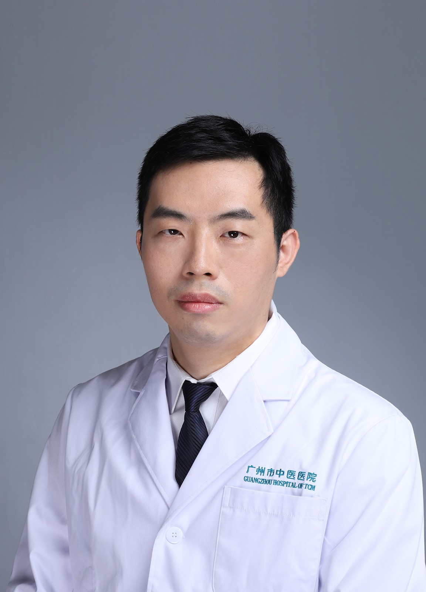

<!-- AUTO-GENERATED-BY: work/generate_obsidian_profiles.py -->

<!-- TEMPLATE: D:\workspace\信息收集整理\医生画像仓库\模板\医生画像模板.md -->

# 张智琳

## 基础信息

| 字段 | 内容 |
|---|---|
| 姓名 | 张智琳 |
| 医院 | 广州市中医院 |
| 科室 | 急诊科 |
| 职称/身份 | 主任中医师 |
| 来源链接 | [官网原文](https://www.gzszyy.com/expert/2026/xkazvraJ.html) |
| 采集日期 | 2026-08-13 |

## 简介/擅长

中西医结合治疗急危重症、心血管系统、呼吸系统和感染性疾病，以及痛风、失眠等内科常见病。

## 可包装亮点

- 广州医科大学附属中医医院 急诊科 副主任，主任中医师， 中医学博士、教授、硕士生导师 广州市优秀中医临床人才、广州市三级名中医。
- 擅长中西医结合治疗急危重症、心血管系统、呼吸系统和感染性疾病，以及痛风、失眠等内科常见病。
- 现任广东省中医药学会急诊医学专业委员会副主任委员、广东省民族医药协会急诊专业委员会副主任委员、美国心脏协会（AHA）高级心血管生命支持主讲导师，荣获“羊城好医生”称号。

## 重点疾病/人群标签

- 慢性病：
- 肿瘤：
- 生殖疾病：
- 免疫/风湿：感染、急危重
- 术后恢复/康复：
- 疑难重症：感染、急危重

## 证据摘录

> 只摘录官网公开信息中的短句或关键字段，不复制大段原文。

- 官网身份字段：主任中医师
- 官网简介/擅长：中西医结合治疗急危重症、心血管系统、呼吸系统和感染性疾病，以及痛风、失眠等内科常见病。
- 官网亮眼经历线索：广州医科大学附属中医医院 急诊科 副主任，主任中医师， 中医学博士、教授、硕士生导师 广州市优秀中医临床人才、广州市三级名中医。 擅长中西医结合治疗急危重症、心血管系统、呼吸系统和感染性疾病，以及痛风、失眠等内科常见病。 现任广东省中医药学会急诊医学专业委员会副主任委员、广东省民族医药协会急诊专业委员会副主任委员、美国心脏协会（AHA）高级心血管生命支持主讲导师，荣获“羊城好医生”称号。
- 来源链接：https://www.gzszyy.com/expert/2026/xkazvraJ.html

## BD 画像摘要

张智琳医生可作为免疫/风湿/感染、疑难重症方向的基础画像候选。后续 BD 使用应继续以官网来源和人工复核为准，不添加疗效承诺或无来源包装。

## 合规边界

- 仅使用医院官网、官方公众号、官方小程序等公开渠道。
- 不采集私人电话、私人微信、家庭住址、患者隐私或非公开排班信息。
- 不写“保证治愈”“疗效第一”“包治疑难杂症”等无法由官网证明的表述。
