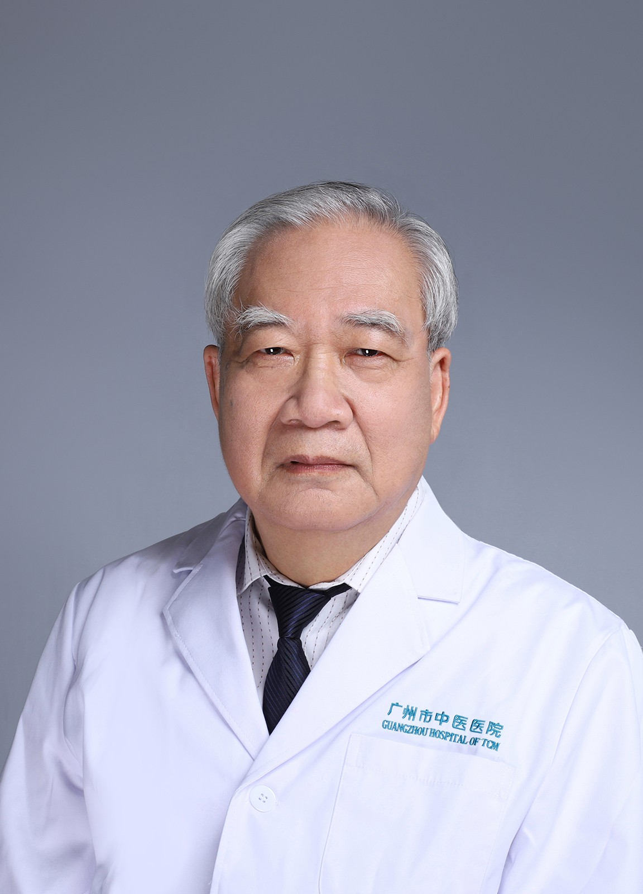

<!-- AUTO-GENERATED-BY: work/generate_obsidian_profiles.py -->

<!-- TEMPLATE: D:\workspace\信息收集整理\医生画像仓库\模板\医生画像模板.md -->

# 张汉樑

## 基础信息

| 字段 | 内容 |
|---|---|
| 姓名 | 张汉樑 |
| 医院 | 广州市中医院 |
| 科室 | 脑病科（神经内科） |
| 职称/身份 | 副主任中医师 |
| 来源链接 | [官网原文](https://www.gzszyy.com/expert/2026/QBeX5lay.html) |
| 采集日期 | 2026-08-13 |

## 简介/擅长

中西医结合治疗脑血管病、癫痫、复杂性偏头痛、紧张型头痛、外伤术后头痛、眩晕综合征、睡眠障碍、重症肌无力、不自主运动、面瘫、坐骨神经痛、帕金森氏病等疾病

## 教育与进修经历

- 毕业于广州中医药大学，从事医疗临床工作40余年，曾在中山医学院神经内科进修2年，擅长中西医结合治疗脑血管病、癫痫、复杂性偏头痛、紧张型头痛、外伤术后头痛、眩晕综合征、睡眠障碍、重症肌无力、不自主运动、面瘫、坐骨神经痛、帕金森氏病等疾病。

## 论文与学术产出

- 发表专业学术论文8篇。

## 可包装亮点

- 副教授, 医院名医带徒导师、曾任中华医学会中西医结合神经内科广东分会副主任委员。
- 曾获“广东省白求恩式先进工作者”称号、广州市“先进中医工作者”称号及广州市人民政府嘉奖。
- 毕业于广州中医药大学，从事医疗临床工作40余年，曾在中山医学院神经内科进修2年，擅长中西医结合治疗脑血管病、癫痫、复杂性偏头痛、紧张型头痛、外伤术后头痛、眩晕综合征、睡眠障碍、重症肌无力、不自主运动、面瘫、坐骨神经痛、帕金森氏病等疾病。
- 发表专业学术论文8篇。

## 重点疾病/人群标签

- 慢性病：
- 肿瘤：
- 生殖疾病：
- 免疫/风湿：
- 术后恢复/康复：术后、重症、复杂
- 疑难重症：术后、重症、复杂

## 证据摘录

> 只摘录官网公开信息中的短句或关键字段，不复制大段原文。

- 官网身份字段：副主任中医师
- 官网简介/擅长：中西医结合治疗脑血管病、癫痫、复杂性偏头痛、紧张型头痛、外伤术后头痛、眩晕综合征、睡眠障碍、重症肌无力、不自主运动、面瘫、坐骨神经痛、帕金森氏病等疾病
- 官网亮眼经历线索：副教授, 医院名医带徒导师、曾任中华医学会中西医结合神经内科广东分会副主任委员。 曾获“广东省白求恩式先进工作者”称号、广州市“先进中医工作者”称号及广州市人民政府嘉奖。 毕业于广州中医药大学，从事医疗临床工作40余年，曾在中山医学院神经内科进修2年，擅长中西医结合治疗脑血管病、癫痫、复杂性偏头痛、紧张型头痛、外伤术后头痛、眩晕综合征、睡眠障碍、重症肌无力、不自主运动、面瘫、坐骨神经痛、帕金森氏病等疾病。 发表专业学术论文8篇。
- 来源链接：https://www.gzszyy.com/expert/2026/QBeX5lay.html

## BD 画像摘要

张汉樑医生可作为术后恢复/康复、疑难重症方向的基础画像候选。后续 BD 使用应继续以官网来源和人工复核为准，不添加疗效承诺或无来源包装。

## 合规边界

- 仅使用医院官网、官方公众号、官方小程序等公开渠道。
- 不采集私人电话、私人微信、家庭住址、患者隐私或非公开排班信息。
- 不写“保证治愈”“疗效第一”“包治疑难杂症”等无法由官网证明的表述。
