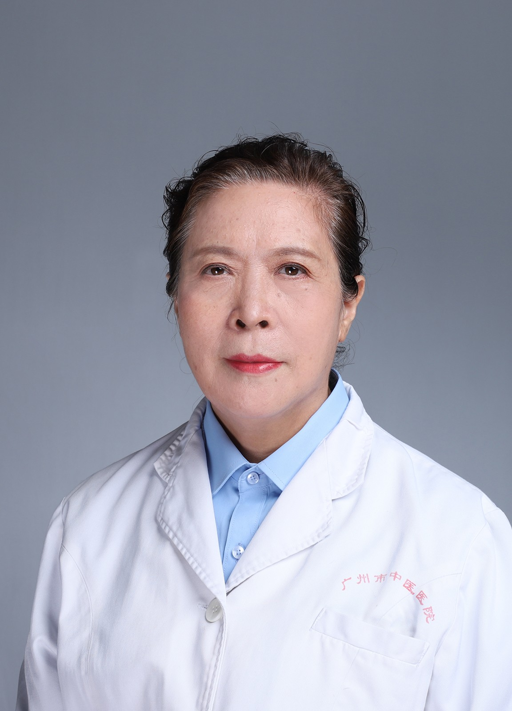

<!-- AUTO-GENERATED-BY: work/generate_obsidian_profiles.py -->

<!-- TEMPLATE: D:\workspace\信息收集整理\医生画像仓库\模板\医生画像模板.md -->

# 张玉辉

## 基础信息

| 字段 | 内容 |
|---|---|
| 姓名 | 张玉辉 |
| 医院 | 广州市中医院 |
| 科室 | 普通内科、杂病门诊 |
| 职称/身份 | 主任医师 |
| 来源链接 | [官网原文](https://www.gzszyy.com/expert/2026/xkazn7aJ.html) |
| 采集日期 | 2026-08-13 |

## 简介/擅长

心悸、胸痛、头痛、眩晕、胆石症、关节痛、老年病等内科杂症。

## 教育与进修经历

- 1983年毕业于河南中医药大学中医系，后到中国中医研究院和北京朝阳医院广州中医药大学深造，从事中医内科临床近40年，擅长于中西医结合治疗心脑血管疾病，重点探索和应用扶阳理论，治疗各种疑难杂症，深受患者好评。

## 可包装亮点

- 教授，硕士生导师，返聘专家。
- 1983年毕业于河南中医药大学中医系，后到中国中医研究院和北京朝阳医院广州中医药大学深造，从事中医内科临床近40年，擅长于中西医结合治疗心脑血管疾病，重点探索和应用扶阳理论，治疗各种疑难杂症，深受患者好评。

## 重点疾病/人群标签

- 慢性病：
- 肿瘤：
- 生殖疾病：
- 免疫/风湿：
- 术后恢复/康复：康复、疑难
- 疑难重症：康复、疑难

## 证据摘录

> 只摘录官网公开信息中的短句或关键字段，不复制大段原文。

- 官网身份字段：主任医师
- 官网简介/擅长：心悸、胸痛、头痛、眩晕、胆石症、关节痛、老年病等内科杂症。
- 官网亮眼经历线索：教授，硕士生导师，返聘专家。 1983年毕业于河南中医药大学中医系，后到中国中医研究院和北京朝阳医院广州中医药大学深造，从事中医内科临床近40年，擅长于中西医结合治疗心脑血管疾病，重点探索和应用扶阳理论，治疗各种疑难杂症，深受患者好评。
- 来源链接：https://www.gzszyy.com/expert/2026/xkazn7aJ.html

## BD 画像摘要

张玉辉医生可作为术后恢复/康复、疑难重症方向的基础画像候选。后续 BD 使用应继续以官网来源和人工复核为准，不添加疗效承诺或无来源包装。

## 合规边界

- 仅使用医院官网、官方公众号、官方小程序等公开渠道。
- 不采集私人电话、私人微信、家庭住址、患者隐私或非公开排班信息。
- 不写“保证治愈”“疗效第一”“包治疑难杂症”等无法由官网证明的表述。
