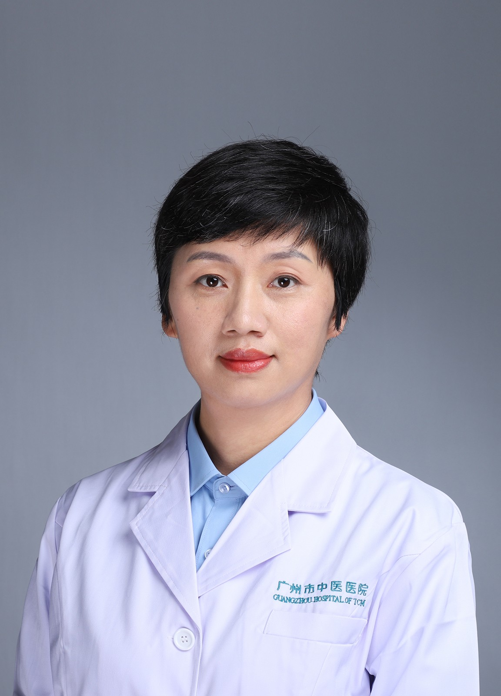

<!-- AUTO-GENERATED-BY: work/generate_obsidian_profiles.py -->

<!-- TEMPLATE: D:\workspace\信息收集整理\医生画像仓库\模板\医生画像模板.md -->

# 戚淑娟

## 基础信息

| 字段 | 内容 |
|---|---|
| 姓名 | 戚淑娟 |
| 医院 | 广州市中医院 |
| 科室 | 重症医学科 |
| 职称/身份 | 副主任中医师 |
| 来源链接 | [官网原文](https://www.gzszyy.com/expert/2026/BDbDRnel.html) |
| 采集日期 | 2026-08-13 |

## 简介/擅长

呼吸、消化、神经系统常见疾病及急危重症的中西医结合治疗。

## 科研项目与成果

- 广州医科大学附属中医医院 重症医学科 科主任，副主任中医师 广州市第三批中医优秀人才， 从事中医内科临床科研教学工作17年，先后师承广东省名中医 赵云燕 教授、邝卫红教授、国医大师凃晋文教授，擅长呼吸、消化、神经系统常见疾病及急危重症的中西医结合治疗，任省市多个学会任常委、委员。

## 可包装亮点

- 广州医科大学附属中医医院 重症医学科 科主任，副主任中医师 广州市第三批中医优秀人才， 从事中医内科临床科研教学工作17年，先后师承广东省名中医 赵云燕 教授、邝卫红教授、国医大师凃晋文教授，擅长呼吸、消化、神经系统常见疾病及急危重症的中西医结合治疗，任省市多个学会任常委、委员。

## 重点疾病/人群标签

- 慢性病：
- 肿瘤：
- 生殖疾病：
- 免疫/风湿：
- 术后恢复/康复：
- 疑难重症：重症、急危重

## 证据摘录

> 只摘录官网公开信息中的短句或关键字段，不复制大段原文。

- 官网身份字段：副主任中医师
- 官网简介/擅长：呼吸、消化、神经系统常见疾病及急危重症的中西医结合治疗。
- 官网亮眼经历线索：广州医科大学附属中医医院 重症医学科 科主任，副主任中医师 广州市第三批中医优秀人才， 从事中医内科临床科研教学工作17年，先后师承广东省名中医 赵云燕 教授、邝卫红教授、国医大师凃晋文教授，擅长呼吸、消化、神经系统常见疾病及急危重症的中西医结合治疗，任省市多个学会任常委、委员。
- 来源链接：https://www.gzszyy.com/expert/2026/BDbDRnel.html

## BD 画像摘要

戚淑娟医生可作为疑难重症方向的基础画像候选。后续 BD 使用应继续以官网来源和人工复核为准，不添加疗效承诺或无来源包装。

## 合规边界

- 仅使用医院官网、官方公众号、官方小程序等公开渠道。
- 不采集私人电话、私人微信、家庭住址、患者隐私或非公开排班信息。
- 不写“保证治愈”“疗效第一”“包治疑难杂症”等无法由官网证明的表述。
