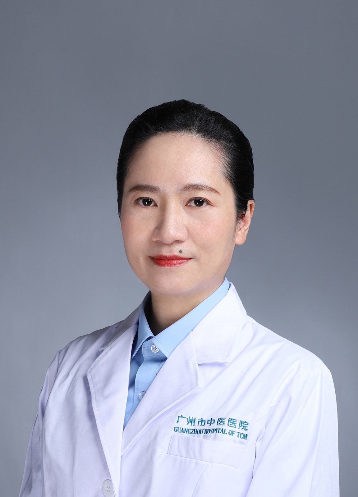

<!-- AUTO-GENERATED-BY: work/generate_obsidian_profiles.py -->

<!-- TEMPLATE: D:\workspace\信息收集整理\医生画像仓库\模板\医生画像模板.md -->

# 戴媺

## 基础信息

| 字段 | 内容 |
|---|---|
| 姓名 | 戴媺 |
| 医院 | 广州市中医院 |
| 科室 | 血液科 |
| 职称/身份 | 主任中医师 |
| 来源链接 | [官网原文](https://www.gzszyy.com/expert/2026/QBeXDWey.html) |
| 采集日期 | 2026-08-13 |

## 简介/擅长

中医内科血证、虚劳类病、血液病、癌瘤类血虚证，尤其在难治性血小板减少、淋巴瘤、多发性骨髓瘤、骨髓增生异常综合征等方面有深入的研究及经验。

## 可包装亮点

- 广州医科大学附属中医医院 血液科 主任，主任中医师，广州中医药大学教授 国家重点中医肿瘤专科多发性骨髓瘤专病负责人，羊城好医生。
- 现任广东省中医药学会、中西医结合学会血液分会副主任委员、老年保健协会淋巴瘤专业委员会常务委员、药学会 血液科 用药专家委员、抗癌协会委员。

## 重点疾病/人群标签

- 慢性病：
- 肿瘤：肿瘤、癌、瘤、淋巴瘤、难治
- 生殖疾病：
- 免疫/风湿：
- 术后恢复/康复：
- 疑难重症：肿瘤、癌、瘤、淋巴瘤、难治

## 证据摘录

> 只摘录官网公开信息中的短句或关键字段，不复制大段原文。

- 官网身份字段：主任中医师
- 官网简介/擅长：中医内科血证、虚劳类病、血液病、癌瘤类血虚证，尤其在难治性血小板减少、淋巴瘤、多发性骨髓瘤、骨髓增生异常综合征等方面有深入的研究及经验。
- 官网亮眼经历线索：广州医科大学附属中医医院 血液科 主任，主任中医师，广州中医药大学教授 国家重点中医肿瘤专科多发性骨髓瘤专病负责人，羊城好医生。 现任广东省中医药学会、中西医结合学会血液分会副主任委员、老年保健协会淋巴瘤专业委员会常务委员、药学会 血液科 用药专家委员、抗癌协会委员。
- 来源链接：https://www.gzszyy.com/expert/2026/QBeXDWey.html

## BD 画像摘要

戴媺医生可作为肿瘤、疑难重症方向的基础画像候选。后续 BD 使用应继续以官网来源和人工复核为准，不添加疗效承诺或无来源包装。

## 合规边界

- 仅使用医院官网、官方公众号、官方小程序等公开渠道。
- 不采集私人电话、私人微信、家庭住址、患者隐私或非公开排班信息。
- 不写“保证治愈”“疗效第一”“包治疑难杂症”等无法由官网证明的表述。
