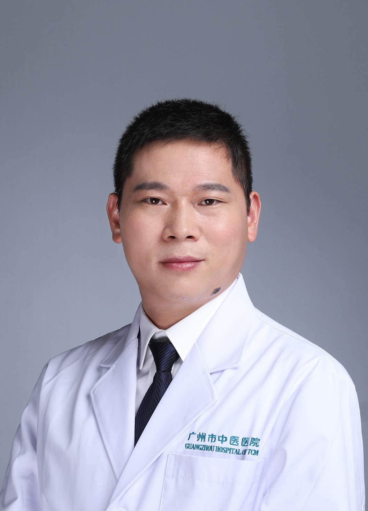

<!-- AUTO-GENERATED-BY: work/generate_obsidian_profiles.py -->

<!-- TEMPLATE: D:\workspace\信息收集整理\医生画像仓库\模板\医生画像模板.md -->

# 戴志兵

## 基础信息

| 字段 | 内容 |
|---|---|
| 姓名 | 戴志兵 |
| 医院 | 广州市中医院 |
| 科室 | 超声医学科 |
| 职称/身份 | 主任医师 |
| 来源链接 | [官网原文](https://www.gzszyy.com/expert/2026/GRb4kgaB.html) |
| 采集日期 | 2026-08-13 |

## 简介/擅长

浅表超声、肌骨超声、心血管超声、超声造影、超声介入等

## 教育与进修经历

- 毕业于南华大学衡阳医学院。
- 从事超声临床工作20余年，先后在北京大学第三医院、首都医科大学附属北京安贞医院、中山大学第一医院、四川大学华西医院进修学习。

## 科研项目与成果

- 主持广东省医学科研基金项目、广州市科学技术局科研项目各1项，参与国家、省市级课题多项。
- 发表科研论文20余篇，其中SCI论文3篇，核心期刊论文13篇。

## 论文与学术产出

- 发表科研论文20余篇，其中SCI论文3篇，核心期刊论文13篇。
- 参编医学专著2部。

## 可包装亮点

- 广州医科大学附属中医医院天河院区 超声医学科 组长，超声医学教学主任， 主任医师，医学硕士。
- 从事超声临床工作20余年，先后在北京大学第三医院、首都医科大学附属北京安贞医院、中山大学第一医院、四川大学华西医院进修学习。
- 发表科研论文20余篇，其中SCI论文3篇，核心期刊论文13篇。
- 现担任广东省基层医药学会微创介入专委会常务委员、广东省老年保健协会中西医结合肝胆胰疾病专委会委员、广州市中西医结合学会肝胆胰专委会常务委员、广州市医学会医疗事故技术鉴定和医疗损害鉴定专家、《影像研究与医学应用》杂志编委。

## 重点疾病/人群标签

- 慢性病：
- 肿瘤：
- 生殖疾病：
- 免疫/风湿：
- 术后恢复/康复：
- 疑难重症：

## 证据摘录

> 只摘录官网公开信息中的短句或关键字段，不复制大段原文。

- 官网身份字段：主任医师
- 官网简介/擅长：浅表超声、肌骨超声、心血管超声、超声造影、超声介入等
- 官网亮眼经历线索：广州医科大学附属中医医院天河院区 超声医学科 组长，超声医学教学主任， 主任医师，医学硕士。 从事超声临床工作20余年，先后在北京大学第三医院、首都医科大学附属北京安贞医院、中山大学第一医院、四川大学华西医院进修学习。 发表科研论文20余篇，其中SCI论文3篇，核心期刊论文13篇。 现担任广东省基层医药学会微创介入专委会常务委员、广东省老年保健协会中西医结合肝胆胰疾病专委会委员、广州市中西医结合学会肝胆胰专委会常务委员、广州市医学会医…
- 来源链接：https://www.gzszyy.com/expert/2026/GRb4kgaB.html

## BD 画像摘要

戴志兵医生可作为广州市中医院超声医学科的基础医生资料入库。当前重点方向以总底表标签为准，官网未展示的信息保持空白。

## 合规边界

- 仅使用医院官网、官方公众号、官方小程序等公开渠道。
- 不采集私人电话、私人微信、家庭住址、患者隐私或非公开排班信息。
- 不写“保证治愈”“疗效第一”“包治疑难杂症”等无法由官网证明的表述。
