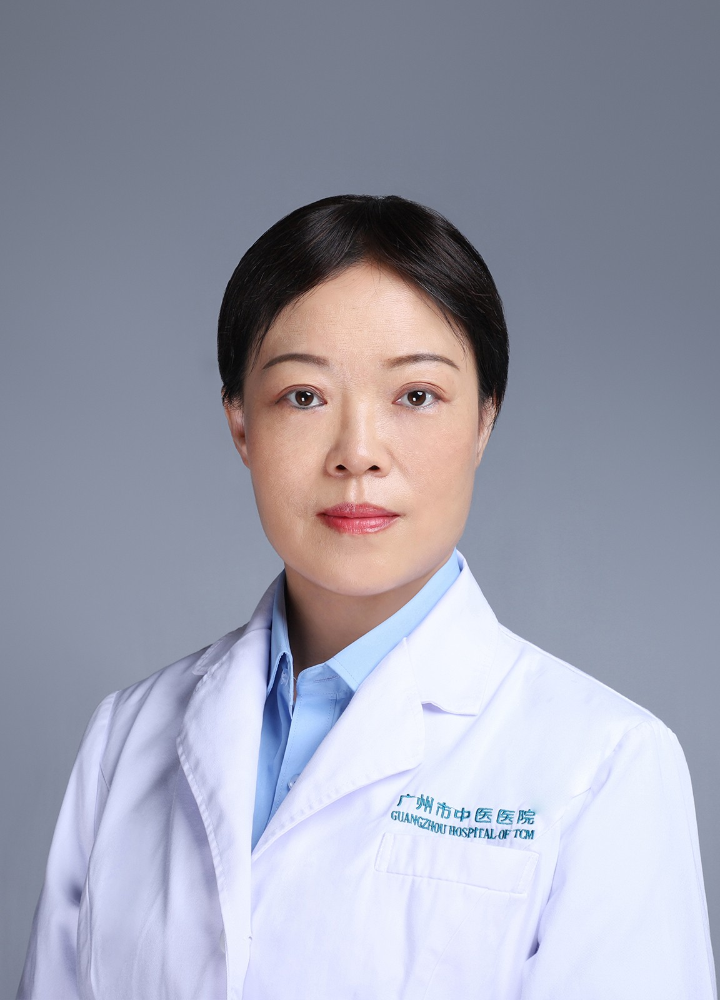

<!-- AUTO-GENERATED-BY: work/generate_obsidian_profiles.py -->

<!-- TEMPLATE: D:\workspace\信息收集整理\医生画像仓库\模板\医生画像模板.md -->

# 曹湘萍

## 基础信息

| 字段 | 内容 |
|---|---|
| 姓名 | 曹湘萍 |
| 医院 | 广州市中医院 |
| 科室 | 针灸康复科 |
| 职称/身份 | 副主任中医师 |
| 来源链接 | [官网原文](https://www.gzszyy.com/expert/2026/WPe9rxaL.html) |
| 采集日期 | 2026-08-13 |

## 简介/擅长

运用针灸及中药治疗神经系统疾病、各种痛证、抑郁症、更年期综合征、慢性疲劳综合征、月经病、乳腺病、不孕不育、脾胃病、鼻炎、失眠、及内科杂症。对于损美性疾病（肥胖、痤疮、色斑等）、体质调理等方面有独到之处。

## 教育与进修经历

- 湖南中医药大学针灸专业硕士研究生毕业，从事针灸临床二十多年，先后在广东省中医院、广州中医药大学第一附属医院、中山大学第一附属医院学习和工作，现为广州市中医医院 针灸康复科 副主任中医师，获“广州市中医临床优秀人才”“广州市中医医院院级人才”称号，为“广东省中西医结合学会”“广东省针灸学会文献和信息专委会”委员。

## 可包装亮点

- 湖南中医药大学针灸专业硕士研究生毕业，从事针灸临床二十多年，先后在广东省中医院、广州中医药大学第一附属医院、中山大学第一附属医院学习和工作，现为广州市中医医院 针灸康复科 副主任中医师，获“广州市中医临床优秀人才”“广州市中医医院院级人才”称号，为“广东省中西医结合学会”“广东省针灸学会文献和信息专委会”委员。

## 重点疾病/人群标签

- 慢性病：慢性、不孕、月经、康复
- 肿瘤：
- 生殖疾病：慢性、不孕、月经、康复
- 免疫/风湿：
- 术后恢复/康复：慢性、不孕、月经、康复
- 疑难重症：

## 证据摘录

> 只摘录官网公开信息中的短句或关键字段，不复制大段原文。

- 官网身份字段：副主任中医师
- 官网简介/擅长：运用针灸及中药治疗神经系统疾病、各种痛证、抑郁症、更年期综合征、慢性疲劳综合征、月经病、乳腺病、不孕不育、脾胃病、鼻炎、失眠、及内科杂症。对于损美性疾病（肥胖、痤疮、色斑等）、体质调理等方面有独到之处。
- 官网亮眼经历线索：湖南中医药大学针灸专业硕士研究生毕业，从事针灸临床二十多年，先后在广东省中医院、广州中医药大学第一附属医院、中山大学第一附属医院学习和工作，现为广州市中医医院 针灸康复科 副主任中医师，获“广州市中医临床优秀人才”“广州市中医医院院级人才”称号，为“广东省中西医结合学会”“广东省针灸学会文献和信息专委会”委员。
- 来源链接：https://www.gzszyy.com/expert/2026/WPe9rxaL.html

## BD 画像摘要

曹湘萍医生可作为慢性病、生殖疾病、术后恢复/康复方向的基础画像候选。后续 BD 使用应继续以官网来源和人工复核为准，不添加疗效承诺或无来源包装。

## 合规边界

- 仅使用医院官网、官方公众号、官方小程序等公开渠道。
- 不采集私人电话、私人微信、家庭住址、患者隐私或非公开排班信息。
- 不写“保证治愈”“疗效第一”“包治疑难杂症”等无法由官网证明的表述。
