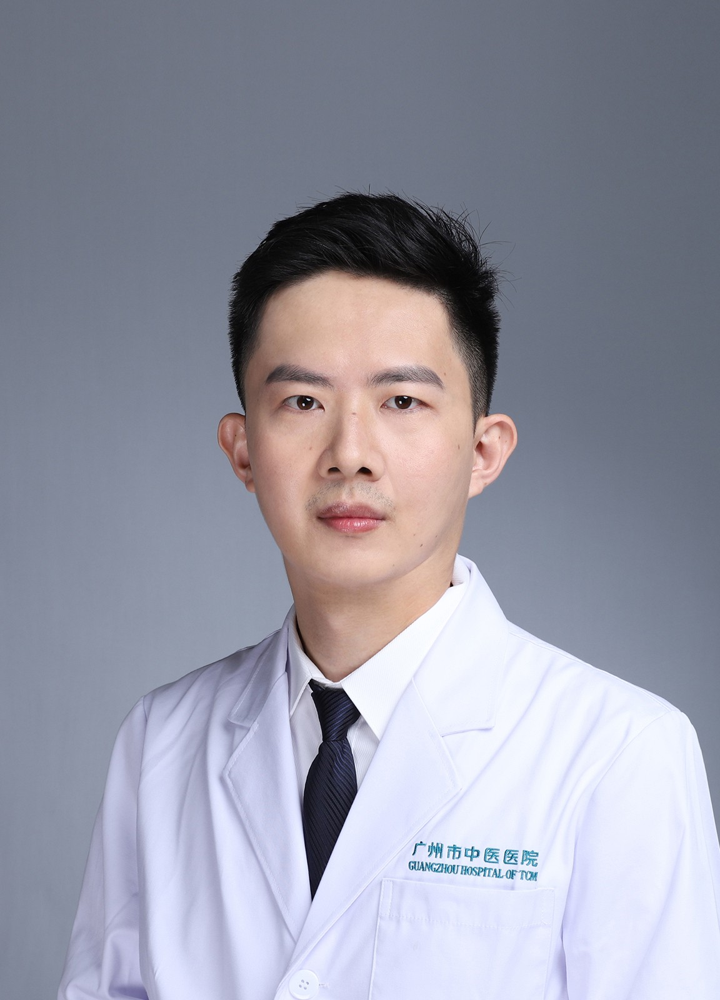

<!-- AUTO-GENERATED-BY: work/generate_obsidian_profiles.py -->

<!-- TEMPLATE: D:\workspace\信息收集整理\医生画像仓库\模板\医生画像模板.md -->

# 曾博煌

## 基础信息

| 字段 | 内容 |
|---|---|
| 姓名 | 曾博煌 |
| 医院 | 广州市中医院 |
| 科室 | 检验病理科 |
| 职称/身份 | 主管技师 |
| 来源链接 | [官网原文](https://www.gzszyy.com/expert/2026/4QbY70ez.html) |
| 采集日期 | 2026-08-13 |

## 简介/擅长

临床生化、免疫检验及检验质量控制方面。

## 教育与进修经历

- 2011年毕业于广州医学院医学检验系。

## 可包装亮点

- 临床生化、免疫检验及检验质量控制方面。

## 重点疾病/人群标签

- 慢性病：
- 肿瘤：
- 生殖疾病：
- 免疫/风湿：
- 术后恢复/康复：
- 疑难重症：

## 证据摘录

> 只摘录官网公开信息中的短句或关键字段，不复制大段原文。

- 官网身份字段：主管技师
- 官网简介/擅长：临床生化、免疫检验及检验质量控制方面。
- 异常提示：职称/身份需人工复核
- 来源链接：https://www.gzszyy.com/expert/2026/4QbY70ez.html

## BD 画像摘要

曾博煌医生可作为广州市中医院检验病理科的基础医生资料入库。当前重点方向以总底表标签为准，官网未展示的信息保持空白。

## 合规边界

- 仅使用医院官网、官方公众号、官方小程序等公开渠道。
- 不采集私人电话、私人微信、家庭住址、患者隐私或非公开排班信息。
- 不写“保证治愈”“疗效第一”“包治疑难杂症”等无法由官网证明的表述。
