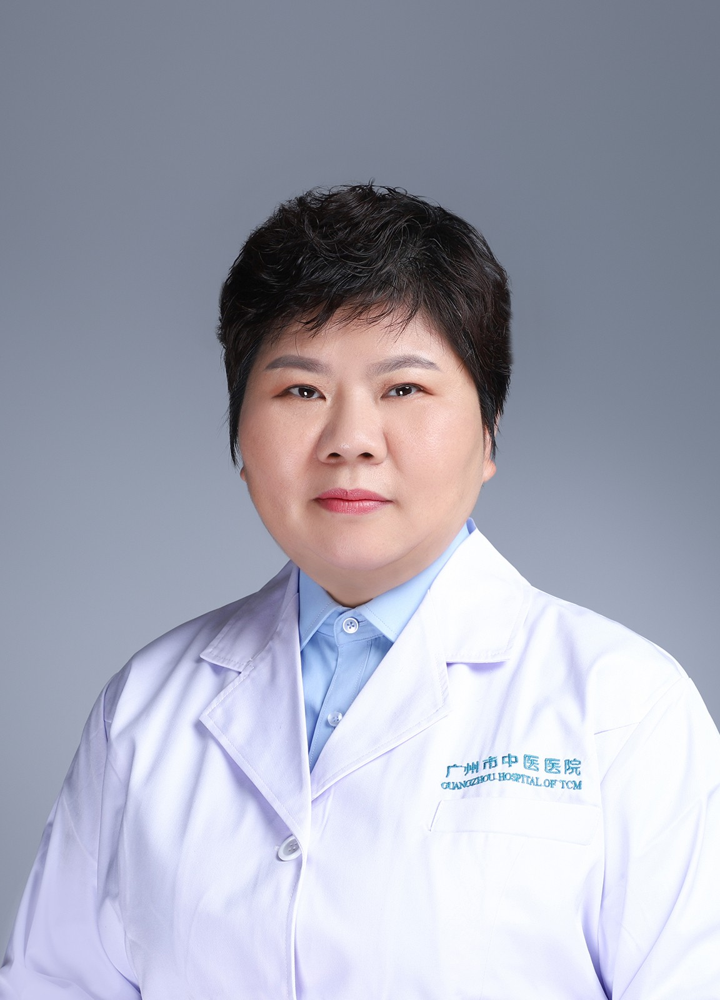

<!-- AUTO-GENERATED-BY: work/generate_obsidian_profiles.py -->

<!-- TEMPLATE: D:\workspace\信息收集整理\医生画像仓库\模板\医生画像模板.md -->

# 李丽霞

## 基础信息

| 字段 | 内容 |
|---|---|
| 姓名 | 李丽霞 |
| 医院 | 广州市中医院 |
| 科室 | 名医堂、针灸科 |
| 职称/身份 | 主任中医师 |
| 来源链接 | [官网原文](https://www.gzszyy.com/expert/2026/KQe1wRbJ.html) |
| 采集日期 | 2026-08-13 |

## 简介/擅长

应用岭南火针等各种特色针法治疗各种痛证、神经系统疾病和各种疑难杂症。

## 科研项目与成果

- 广东省名中医，广州医科大学附属中医医院 针灸科 学术带头人，主任中医师 广东省第二批名中医师承项目指导老师，广州市优秀中医临床人才，广州市医学重点人才，广州市针灸学会会长，广州中医药学会针灸分会主任委员， 广东省针灸学会文献和信息专业委员会名誉主委 ，擅长应用岭南火针等各种特色针法治疗各种痛证、神经系统疾病和各种疑难杂症。

## 可包装亮点

- 广东省名中医，广州医科大学附属中医医院 针灸科 学术带头人，主任中医师 广东省第二批名中医师承项目指导老师，广州市优秀中医临床人才，广州市医学重点人才，广州市针灸学会会长，广州中医药学会针灸分会主任委员， 广东省针灸学会文献和信息专业委员会名誉主委 ，擅长应用岭南火针等各种特色针法治疗各种痛证、神经系统疾病和各种疑难杂症。

## 重点疾病/人群标签

- 慢性病：
- 肿瘤：
- 生殖疾病：
- 免疫/风湿：
- 术后恢复/康复：
- 疑难重症：疑难

## 证据摘录

> 只摘录官网公开信息中的短句或关键字段，不复制大段原文。

- 官网身份字段：主任中医师
- 官网简介/擅长：应用岭南火针等各种特色针法治疗各种痛证、神经系统疾病和各种疑难杂症。
- 官网亮眼经历线索：广东省名中医，广州医科大学附属中医医院 针灸科 学术带头人，主任中医师 广东省第二批名中医师承项目指导老师，广州市优秀中医临床人才，广州市医学重点人才，广州市针灸学会会长，广州中医药学会针灸分会主任委员， 广东省针灸学会文献和信息专业委员会名誉主委 ，擅长应用岭南火针等各种特色针法治疗各种痛证、神经系统疾病和各种疑难杂症。
- 来源链接：https://www.gzszyy.com/expert/2026/KQe1wRbJ.html

## BD 画像摘要

李丽霞医生可作为疑难重症方向的基础画像候选。后续 BD 使用应继续以官网来源和人工复核为准，不添加疗效承诺或无来源包装。

## 合规边界

- 仅使用医院官网、官方公众号、官方小程序等公开渠道。
- 不采集私人电话、私人微信、家庭住址、患者隐私或非公开排班信息。
- 不写“保证治愈”“疗效第一”“包治疑难杂症”等无法由官网证明的表述。
