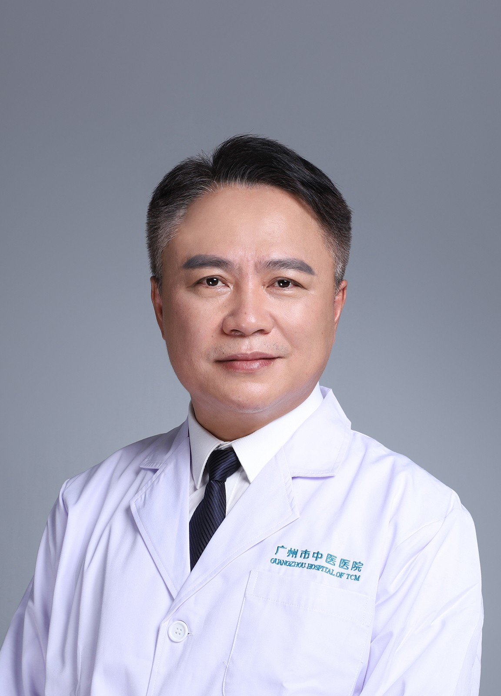

<!-- AUTO-GENERATED-BY: work/generate_obsidian_profiles.py -->

<!-- TEMPLATE: D:\workspace\信息收集整理\医生画像仓库\模板\医生画像模板.md -->

# 李乙根

## 基础信息

| 字段 | 内容 |
|---|---|
| 姓名 | 李乙根 |
| 医院 | 广州市中医院 |
| 科室 | 心病科（心血管内科） |
| 职称/身份 | 主任中医师 |
| 来源链接 | [官网原文](https://www.gzszyy.com/expert/2026/BDbDkxal.html) |
| 采集日期 | 2026-08-13 |

## 简介/擅长

中西医治疗高血压、冠心病、急慢性心脏衰竭、心律失常、心脏瓣膜病等心血管常见病及急、危、重症。对心脏康复、“双心疾病”及疑难杂症中医治疗颇有心得。

## 教育与进修经历

- 从事临床医疗工作30年，师从国医大师林天东教授，曾在空军军医大学第一附属医院（西京医院）心血管内科进修学习。

## 可包装亮点

- 广州医科大学附属中医医院同德院区心病科主任、党支部书记，主任中医师， 广州中医药大学副教授 第七届羊城好医生、广州市三级名中医。
- 从事临床医疗工作30年，师从国医大师林天东教授，曾在空军军医大学第一附属医院（西京医院）心血管内科进修学习。
- 对心脏康复、“双心疾病”及疑难杂症中医治疗颇有心得。
- 任广东省心血管保健协会副主任委员、广东省中西医结合双心医学会常委

## 重点疾病/人群标签

- 慢性病：高血压、冠心病、慢性、康复、疑难、重症
- 肿瘤：
- 生殖疾病：
- 免疫/风湿：
- 术后恢复/康复：高血压、冠心病、慢性、康复、疑难、重症
- 疑难重症：高血压、冠心病、慢性、康复、疑难、重症

## 证据摘录

> 只摘录官网公开信息中的短句或关键字段，不复制大段原文。

- 官网身份字段：主任中医师
- 官网简介/擅长：中西医治疗高血压、冠心病、急慢性心脏衰竭、心律失常、心脏瓣膜病等心血管常见病及急、危、重症。对心脏康复、“双心疾病”及疑难杂症中医治疗颇有心得。
- 官网亮眼经历线索：广州医科大学附属中医医院同德院区心病科主任、党支部书记，主任中医师， 广州中医药大学副教授 第七届羊城好医生、广州市三级名中医。 从事临床医疗工作30年，师从国医大师林天东教授，曾在空军军医大学第一附属医院（西京医院）心血管内科进修学习。 对心脏康复、“双心疾病”及疑难杂症中医治疗颇有心得。 任广东省心血管保健协会副主任委员、广东省中西医结合双心医学会常委
- 来源链接：https://www.gzszyy.com/expert/2026/BDbDkxal.html

## BD 画像摘要

李乙根医生可作为慢性病、术后恢复/康复、疑难重症方向的基础画像候选。后续 BD 使用应继续以官网来源和人工复核为准，不添加疗效承诺或无来源包装。

## 合规边界

- 仅使用医院官网、官方公众号、官方小程序等公开渠道。
- 不采集私人电话、私人微信、家庭住址、患者隐私或非公开排班信息。
- 不写“保证治愈”“疗效第一”“包治疑难杂症”等无法由官网证明的表述。
