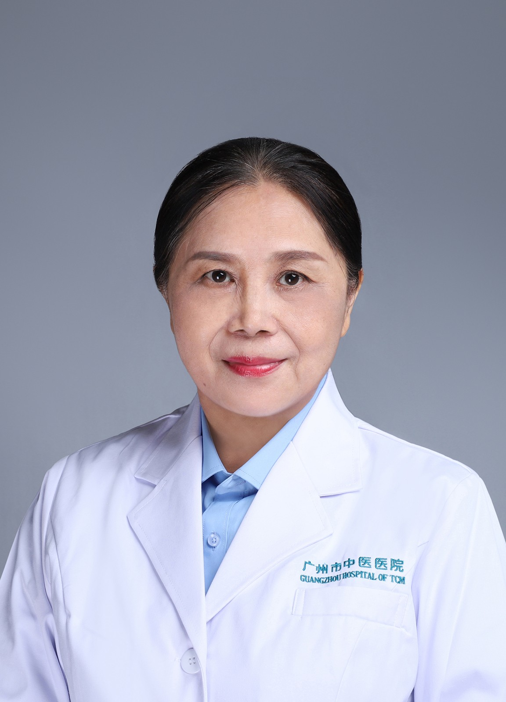

<!-- AUTO-GENERATED-BY: work/generate_obsidian_profiles.py -->

<!-- TEMPLATE: D:\workspace\信息收集整理\医生画像仓库\模板\医生画像模板.md -->

# 李俐

## 基础信息

| 字段 | 内容 |
|---|---|
| 姓名 | 李俐 |
| 医院 | 广州市中医院 |
| 科室 | 肺病科（呼吸内科） |
| 职称/身份 | 主任医师 |
| 来源链接 | [官网原文](https://www.gzszyy.com/expert/2026/lNbWqXey.html) |
| 采集日期 | 2026-08-13 |

## 简介/擅长

呼吸系统疾病的中西结合诊治和调理

## 教育与进修经历

- 硕士生导师, 退休返聘专家, 1983年毕业于广州中医学院中医医疗系，一直从事临床工作，对呼吸系统疾病如上呼吸道感染、支气管炎、肺炎、过敏性鼻炎、支气管哮喘、慢性咳嗽、支气管扩张、慢阻肺等疾病的诊治和调理有丰富的经验和心得。

## 可包装亮点

- 硕士生导师, 退休返聘专家, 1983年毕业于广州中医学院中医医疗系，一直从事临床工作，对呼吸系统疾病如上呼吸道感染、支气管炎、肺炎、过敏性鼻炎、支气管哮喘、慢性咳嗽、支气管扩张、慢阻肺等疾病的诊治和调理有丰富的经验和心得。

## 重点疾病/人群标签

- 慢性病：慢性、感染
- 肿瘤：
- 生殖疾病：
- 免疫/风湿：慢性、感染
- 术后恢复/康复：
- 疑难重症：

## 证据摘录

> 只摘录官网公开信息中的短句或关键字段，不复制大段原文。

- 官网身份字段：主任医师
- 官网简介/擅长：呼吸系统疾病的中西结合诊治和调理
- 官网亮眼经历线索：硕士生导师, 退休返聘专家, 1983年毕业于广州中医学院中医医疗系，一直从事临床工作，对呼吸系统疾病如上呼吸道感染、支气管炎、肺炎、过敏性鼻炎、支气管哮喘、慢性咳嗽、支气管扩张、慢阻肺等疾病的诊治和调理有丰富的经验和心得。
- 来源链接：https://www.gzszyy.com/expert/2026/lNbWqXey.html

## BD 画像摘要

李俐医生可作为慢性病、免疫/风湿/感染方向的基础画像候选。后续 BD 使用应继续以官网来源和人工复核为准，不添加疗效承诺或无来源包装。

## 合规边界

- 仅使用医院官网、官方公众号、官方小程序等公开渠道。
- 不采集私人电话、私人微信、家庭住址、患者隐私或非公开排班信息。
- 不写“保证治愈”“疗效第一”“包治疑难杂症”等无法由官网证明的表述。
