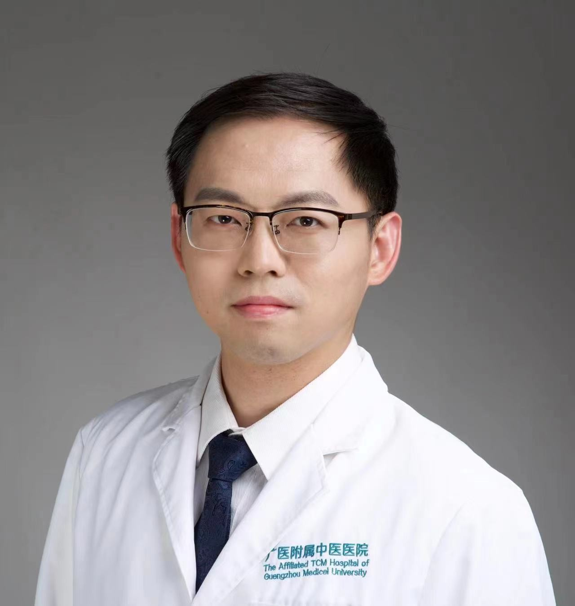

<!-- AUTO-GENERATED-BY: work/generate_obsidian_profiles.py -->

<!-- TEMPLATE: D:\workspace\信息收集整理\医生画像仓库\模板\医生画像模板.md -->

# 李国栋

## 基础信息

| 字段 | 内容 |
|---|---|
| 姓名 | 李国栋 |
| 医院 | 广州市中医院 |
| 科室 | 治未病科 |
| 职称/身份 | 主治中医师 |
| 来源链接 | [官网原文](https://www.gzszyy.com/expert/2026/LDdwEga1.html) |
| 采集日期 | 2026-08-13 |

## 简介/擅长

临床善用“病症结合、审证求机、揣穴针刺、深刺八髎”等思维诊疗。针药结合治疗：颈肩腰腿痛、扭伤等骨关节病；中风、面瘫、带状疱疹等神经系统病；类风湿、干燥综合症、强直性脊柱炎等风湿免疫病；以及月经不调、二便失调、体质调理的治疗。

## 教育与进修经历

- 本、硕、博均毕业于南京中医药大学，中医师承澳门名老中医李权（父）和江苏省风湿病名中医汪悦教授；

## 科研项目与成果

- 主治中医师， 医学博士 从事中医内科学及针灸推拿学临床科研工作10余年。

## 可包装亮点

- 针灸师承澄江针灸学派名医王玲玲、姜劲峰、 王欣 君教授。
- 在广东省中医药学会治未病、内科学、针灸学、风湿病等专委会任委员多职。

## 重点疾病/人群标签

- 慢性病：
- 肿瘤：
- 生殖疾病：月经、风湿、免疫、类风湿、强直性脊柱炎
- 免疫/风湿：月经、风湿、免疫、类风湿、强直性脊柱炎
- 术后恢复/康复：
- 疑难重症：

## 证据摘录

> 只摘录官网公开信息中的短句或关键字段，不复制大段原文。

- 官网身份字段：主治中医师
- 官网简介/擅长：临床善用“病症结合、审证求机、揣穴针刺、深刺八髎”等思维诊疗。针药结合治疗：颈肩腰腿痛、扭伤等骨关节病；中风、面瘫、带状疱疹等神经系统病；类风湿、干燥综合症、强直性脊柱炎等风湿免疫病；以及月经不调、二便失调、体质调理的治疗。
- 官网亮眼经历线索：针灸师承澄江针灸学派名医王玲玲、姜劲峰、 王欣 君教授。 在广东省中医药学会治未病、内科学、针灸学、风湿病等专委会任委员多职。
- 来源链接：https://www.gzszyy.com/expert/2026/LDdwEga1.html

## BD 画像摘要

李国栋医生可作为生殖疾病、免疫/风湿/感染方向的基础画像候选。后续 BD 使用应继续以官网来源和人工复核为准，不添加疗效承诺或无来源包装。

## 合规边界

- 仅使用医院官网、官方公众号、官方小程序等公开渠道。
- 不采集私人电话、私人微信、家庭住址、患者隐私或非公开排班信息。
- 不写“保证治愈”“疗效第一”“包治疑难杂症”等无法由官网证明的表述。
