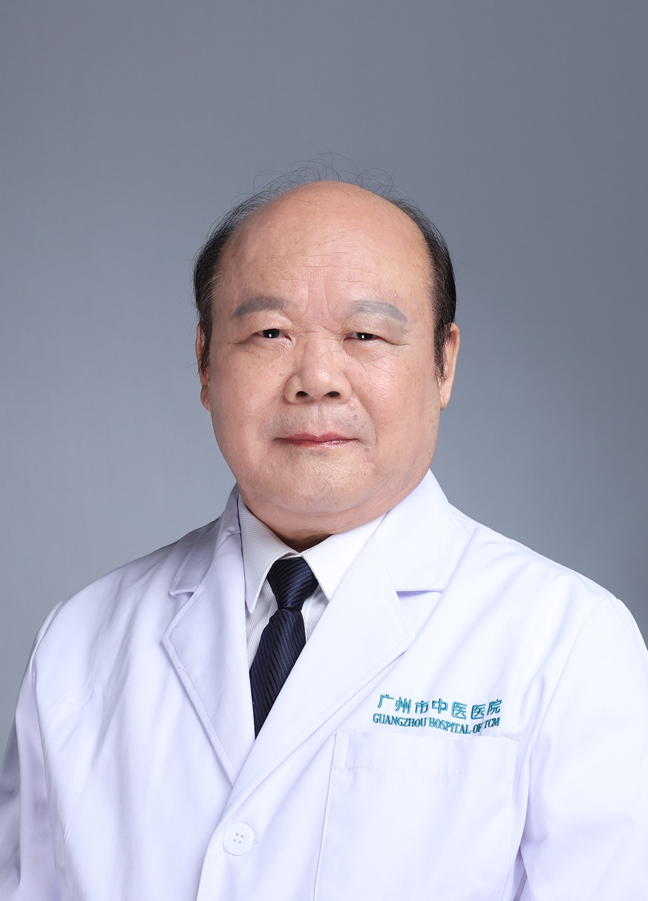

<!-- AUTO-GENERATED-BY: work/generate_obsidian_profiles.py -->

<!-- TEMPLATE: D:\workspace\信息收集整理\医生画像仓库\模板\医生画像模板.md -->

# 李均乐

## 基础信息

| 字段 | 内容 |
|---|---|
| 姓名 | 李均乐 |
| 医院 | 广州市中医院 |
| 科室 | 外科 |
| 职称/身份 | 主任医师 |
| 来源链接 | [官网原文](https://www.gzszyy.com/expert/2026/46dBnnd7.html) |
| 采集日期 | 2026-08-13 |

## 简介/擅长

普通外科常见病、多发病、疑难杂症、疑难重症的诊断和治疗。特别对低位直肠癌，本人发明创新的手术（低位直肠癌根治重建内外括约肌原位肛门再造术）可免除直肠癌病人腹壁挂“粪袋”之苦，深受患者欢迎。

## 教育与进修经历

- 毕业于广州中山医科大学医疗系。
- 曾担任： 外科 主任.中华医学会普 外科 学会委员.广州市医疗事故技术鉴定专家.中华实验 外科 杂志特邀编辑.医师进修杂志特邀编辑.中国现代医学杂志特邀编辑.中国中西医学杂志特邀编辑.同济医科大学 外科 学副教授.广州中医药大学 外科 学教授。

## 科研项目与成果

- 从事 外科 临床、教学、科研工作45年。

## 论文与学术产出

- 撰写医学论文30多篇，在国家级和省级医学杂志上发表论文30篇。

## 可包装亮点

- 对 外科 常见病、多发病、疑难杂症、疑难重症病、有较强的诊断和处理能力。
- 撰写医学论文30多篇，在国家级和省级医学杂志上发表论文30篇。
- 获省级科学技术进步三等奖二项、获市级科学技术进步三等奖三项。
- 曾担任： 外科 主任.中华医学会普 外科 学会委员.广州市医疗事故技术鉴定专家.中华实验 外科 杂志特邀编辑.医师进修杂志特邀编辑.中国现代医学杂志特邀编辑.中国中西医学杂志特邀编辑.同济医科大学 外科 学副教授.广州中医药大学 外科 学教授。

## 重点疾病/人群标签

- 慢性病：
- 肿瘤：肠癌、疑难、重症
- 生殖疾病：
- 免疫/风湿：
- 术后恢复/康复：
- 疑难重症：肠癌、疑难、重症

## 证据摘录

> 只摘录官网公开信息中的短句或关键字段，不复制大段原文。

- 官网身份字段：主任医师
- 官网简介/擅长：普通外科常见病、多发病、疑难杂症、疑难重症的诊断和治疗。特别对低位直肠癌，本人发明创新的手术（低位直肠癌根治重建内外括约肌原位肛门再造术）可免除直肠癌病人腹壁挂“粪袋”之苦，深受患者欢迎。
- 官网亮眼经历线索：对 外科 常见病、多发病、疑难杂症、疑难重症病、有较强的诊断和处理能力。 撰写医学论文30多篇，在国家级和省级医学杂志上发表论文30篇。 获省级科学技术进步三等奖二项、获市级科学技术进步三等奖三项。 曾担任： 外科 主任.中华医学会普 外科 学会委员.广州市医疗事故技术鉴定专家.中华实验 外科 杂志特邀编辑.医师进修杂志特邀编辑.中国现代医学杂志特邀编辑.中国中西医学杂志特邀编辑.同济医科大学 外科 学副教授.广州中医药大学 外科 学…
- 来源链接：https://www.gzszyy.com/expert/2026/46dBnnd7.html

## BD 画像摘要

李均乐医生可作为肿瘤、疑难重症方向的基础画像候选。后续 BD 使用应继续以官网来源和人工复核为准，不添加疗效承诺或无来源包装。

## 合规边界

- 仅使用医院官网、官方公众号、官方小程序等公开渠道。
- 不采集私人电话、私人微信、家庭住址、患者隐私或非公开排班信息。
- 不写“保证治愈”“疗效第一”“包治疑难杂症”等无法由官网证明的表述。
