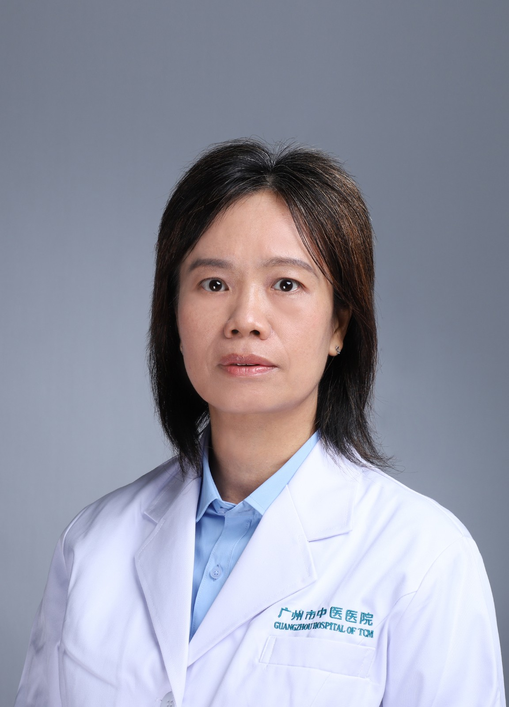

<!-- AUTO-GENERATED-BY: work/generate_obsidian_profiles.py -->

<!-- TEMPLATE: D:\workspace\信息收集整理\医生画像仓库\模板\医生画像模板.md -->

# 李晚君

## 基础信息

| 字段 | 内容 |
|---|---|
| 姓名 | 李晚君 |
| 医院 | 广州市中医院 |
| 科室 | 医学影像科 |
| 职称/身份 | 主任医师 |
| 来源链接 | [官网原文](https://www.gzszyy.com/expert/2026/opengDa7.html) |
| 采集日期 | 2026-08-13 |

## 简介/擅长

胸腹部疾病的CT/MR诊断

## 教育与进修经历

- 1988年毕业于广州医科大学医学影像系。

## 科研项目与成果

- 从事放射诊断、教学、科研工作三十多年，熟悉全身各系统的影像诊断，尤为擅长胸腹部疾病的 CT/MR 诊断；
- 主持和参与广东省中医药局及广州市卫健委多项课题的研究，发表多篇专业论文。

## 论文与学术产出

- 主持和参与广东省中医药局及广州市卫健委多项课题的研究，发表多篇专业论文。

## 可包装亮点

- 主持和参与广东省中医药局及广州市卫健委多项课题的研究，发表多篇专业论文。
- 现为“广东省中西医结合影像专业委员会常务委员”、“广东省胸部疾病学会胸部影像专委会常务委员”“广东省医学会放射学会委员”、“广东省医院协会影像专业委员会委员”、“广州市医学会放射学分会常务委员”、“广州市医师协会放射分会常务委员”。

## 重点疾病/人群标签

- 慢性病：
- 肿瘤：
- 生殖疾病：
- 免疫/风湿：
- 术后恢复/康复：
- 疑难重症：

## 证据摘录

> 只摘录官网公开信息中的短句或关键字段，不复制大段原文。

- 官网身份字段：主任医师
- 官网简介/擅长：胸腹部疾病的CT/MR诊断
- 官网亮眼经历线索：主持和参与广东省中医药局及广州市卫健委多项课题的研究，发表多篇专业论文。 现为“广东省中西医结合影像专业委员会常务委员”、“广东省胸部疾病学会胸部影像专委会常务委员”“广东省医学会放射学会委员”、“广东省医院协会影像专业委员会委员”、“广州市医学会放射学分会常务委员”、“广州市医师协会放射分会常务委员”。
- 来源链接：https://www.gzszyy.com/expert/2026/opengDa7.html

## BD 画像摘要

李晚君医生可作为广州市中医院医学影像科的基础医生资料入库。当前重点方向以总底表标签为准，官网未展示的信息保持空白。

## 合规边界

- 仅使用医院官网、官方公众号、官方小程序等公开渠道。
- 不采集私人电话、私人微信、家庭住址、患者隐私或非公开排班信息。
- 不写“保证治愈”“疗效第一”“包治疑难杂症”等无法由官网证明的表述。
