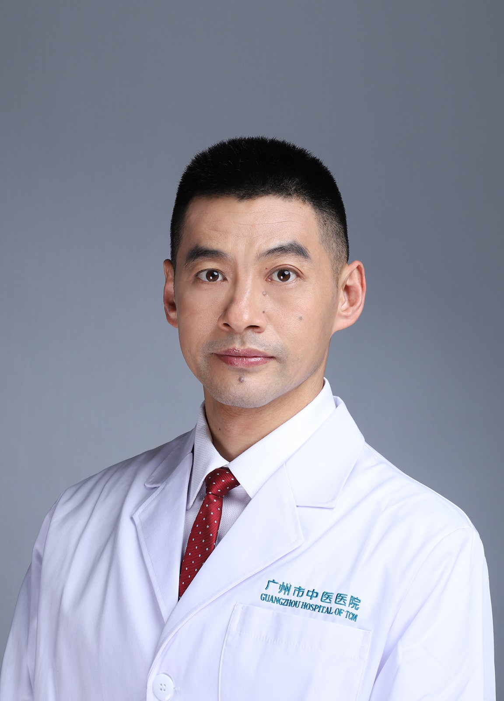

<!-- AUTO-GENERATED-BY: work/generate_obsidian_profiles.py -->

<!-- TEMPLATE: D:\workspace\信息收集整理\医生画像仓库\模板\医生画像模板.md -->

# 李洋

## 基础信息

| 字段 | 内容 |
|---|---|
| 姓名 | 李洋 |
| 医院 | 广州市中医院 |
| 科室 | 肛肠科 |
| 职称/身份 | 副主任中医师 |
| 来源链接 | [官网原文](https://www.gzszyy.com/expert/2026/jnegZ9dw.html) |
| 采集日期 | 2026-08-13 |

## 简介/擅长

西医结合疗法治疗便秘、炎性肠病、肛周湿疹、小儿肛周脓肿等疾病。

## 科研项目与成果

- 主持市级课题一项，院级课题一项，参与省级课题多项，主持发明专利一项，发表及参与发表国内期刊数篇。
- 广东省基层医药学会肛肠专委会副主任委员、 广东省中西医结合大肠肛门病主委会委员、 广州市医师学会中医分会常务委员、 广东省第二批名中医师承项目学术继承人 、 规培导师

## 论文与学术产出

- 主持市级课题一项，院级课题一项，参与省级课题多项，主持发明专利一项，发表及参与发表国内期刊数篇。

## 可包装亮点

- 副主任中医师， 硕士研究生导师， 第十届羊城青年好医生 熟练掌握痔、瘘、裂、直肠脱垂等直肠肛门疾病的手术治疗。
- 主持市级课题一项，院级课题一项，参与省级课题多项，主持发明专利一项，发表及参与发表国内期刊数篇。
- 广东省基层医药学会肛肠专委会副主任委员、 广东省中西医结合大肠肛门病主委会委员、 广州市医师学会中医分会常务委员、 广东省第二批名中医师承项目学术继承人 、 规培导师

## 重点疾病/人群标签

- 慢性病：
- 肿瘤：肿瘤、化疗、恢复
- 生殖疾病：
- 免疫/风湿：
- 术后恢复/康复：肿瘤、化疗、恢复
- 疑难重症：

## 证据摘录

> 只摘录官网公开信息中的短句或关键字段，不复制大段原文。

- 官网身份字段：副主任中医师
- 官网简介/擅长：西医结合疗法治疗便秘、炎性肠病、肛周湿疹、小儿肛周脓肿等疾病。
- 官网亮眼经历线索：副主任中医师， 硕士研究生导师， 第十届羊城青年好医生 熟练掌握痔、瘘、裂、直肠脱垂等直肠肛门疾病的手术治疗。 主持市级课题一项，院级课题一项，参与省级课题多项，主持发明专利一项，发表及参与发表国内期刊数篇。 广东省基层医药学会肛肠专委会副主任委员、 广东省中西医结合大肠肛门病主委会委员、 广州市医师学会中医分会常务委员、 广东省第二批名中医师承项目学术继承人 、 规培导师
- 来源链接：https://www.gzszyy.com/expert/2026/jnegZ9dw.html

## BD 画像摘要

李洋医生可作为肿瘤、术后恢复/康复方向的基础画像候选。后续 BD 使用应继续以官网来源和人工复核为准，不添加疗效承诺或无来源包装。

## 合规边界

- 仅使用医院官网、官方公众号、官方小程序等公开渠道。
- 不采集私人电话、私人微信、家庭住址、患者隐私或非公开排班信息。
- 不写“保证治愈”“疗效第一”“包治疑难杂症”等无法由官网证明的表述。
