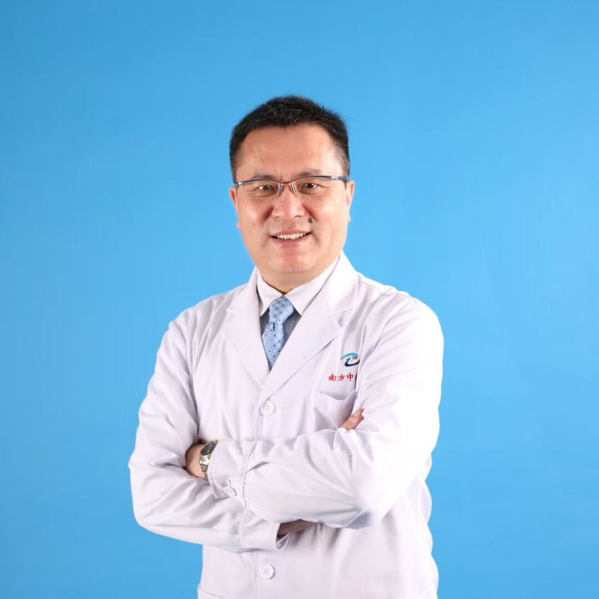

<!-- AUTO-GENERATED-BY: work/generate_obsidian_profiles.py -->

<!-- TEMPLATE: D:\workspace\信息收集整理\医生画像仓库\模板\医生画像模板.md -->

# 李爱民

## 基础信息

| 字段 | 内容 |
|---|---|
| 姓名 | 李爱民 |
| 医院 | 广州市中医院 |
| 科室 |  |
| 职称/身份 |  |
| 来源链接 | [官网原文](https://www.gzszyy.com/expert/2026/lNbWW4by.html) |
| 采集日期 | 2026-08-13 |

## 简介/擅长

## 教育与进修经历

- 肿瘤中心主任、教授、博士生导师 、博士后合作导师。
- 中国抗癌协会理事、中国留学归国人员联谊会肝胆医师分会副主任委员、 广东 省中西医结合学会副会长、广州抗癌协会副会长、 广东 省保健协会首席专家 、广东省企业家健康管理学会副会长 ，首届广东省医师奖获得者。

## 论文与学术产出

- 主编的《现代肿瘤生物治疗学》由人民卫生出版社出版。

## 可包装亮点

- 肿瘤中心主任、教授、博士生导师 、博士后合作导师。
- 中国抗癌协会理事、中国留学归国人员联谊会肝胆医师分会副主任委员、 广东 省中西医结合学会副会长、广州抗癌协会副会长、 广东 省保健协会首席专家 、广东省企业家健康管理学会副会长 ，首届广东省医师奖获得者。
- 1987年 本科就读于第一军医大学 军医系 ，先后在 南方医科大学 南方医院、中西医结合医院从事肿瘤综合诊疗工作， 先后在美国密西根州立大学和新加坡国立大学学习，2025年10月调入本院。
- 参与索拉菲尼、仑伐替尼 、PD-I单抗 等靶向和免疫治疗药物上市前 临床 研究等30余项临床研究，获中华医学科技奖三等奖1项、广东省科学技术奖二等奖1项、军队科技进步二等奖1项。

## 重点疾病/人群标签

- 慢性病：
- 肿瘤：
- 生殖疾病：
- 免疫/风湿：
- 术后恢复/康复：
- 疑难重症：

## 证据摘录

> 只摘录官网公开信息中的短句或关键字段，不复制大段原文。

- 官网亮眼经历线索：肿瘤中心主任、教授、博士生导师 、博士后合作导师。 中国抗癌协会理事、中国留学归国人员联谊会肝胆医师分会副主任委员、 广东 省中西医结合学会副会长、广州抗癌协会副会长、 广东 省保健协会首席专家 、广东省企业家健康管理学会副会长 ，首届广东省医师奖获得者。 1987年 本科就读于第一军医大学 军医系 ，先后在 南方医科大学 南方医院、中西医结合医院从事肿瘤综合诊疗工作， 先后在美国密西根州立大学和新加坡国立大学学习，2025年10月调…
- 异常提示：科室需人工复核；职称/身份需人工复核
- 来源链接：https://www.gzszyy.com/expert/2026/lNbWW4by.html

## BD 画像摘要

当前画像仅作基础资料归档，后续使用需先完成人工复核。

## 合规边界

- 仅使用医院官网、官方公众号、官方小程序等公开渠道。
- 不采集私人电话、私人微信、家庭住址、患者隐私或非公开排班信息。
- 不写“保证治愈”“疗效第一”“包治疑难杂症”等无法由官网证明的表述。
