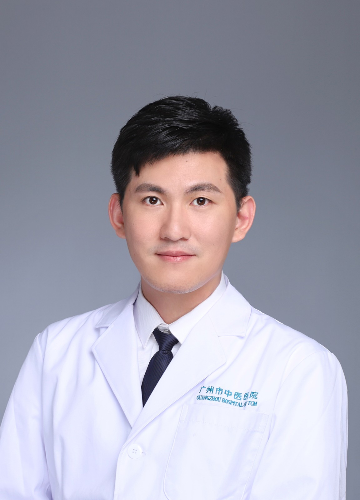

<!-- AUTO-GENERATED-BY: work/generate_obsidian_profiles.py -->

<!-- TEMPLATE: D:\workspace\信息收集整理\医生画像仓库\模板\医生画像模板.md -->

# 李钊杨

## 基础信息

| 字段 | 内容 |
|---|---|
| 姓名 | 李钊杨 |
| 医院 | 广州市中医院 |
| 科室 | 五羊门诊部 |
| 职称/身份 | 副主任医师 |
| 来源链接 | [官网原文](https://www.gzszyy.com/expert/2026/QBeXMlay.html) |
| 采集日期 | 2026-08-13 |

## 简介/擅长

运用针灸、埋线、自血疗法、五色疗法等外治法及中药综合治疗：皮肤病（荨麻疹、湿疹、痤疮、带状疱疹、黄褐斑、斑秃等）、内外妇儿病（感冒、鼻咽炎、头痛、失眠、面瘫、耳鸣耳聋、胃肠疾病、痛风、颈肩腰膝腿痛、扭伤、月经不调、痛经、更年期综合征等）、减肥美容及体质调理

## 可包装亮点

- 副主任医师 从事中医针灸方向临床科教研工作10年，师从李素荷教授和王野野老师。
- 广东省针灸学会文献与信息专业委员会委员、广东省中医药学会小儿推拿专业委员会委员、 广东省针灸学会文献与信息专业委员会委员、 广东省中医药学会小儿推拿专业委员会委员、 广东中医药研究促进会针灸康复专业委员会委员。

## 重点疾病/人群标签

- 慢性病：
- 肿瘤：
- 生殖疾病：月经、康复
- 免疫/风湿：
- 术后恢复/康复：月经、康复
- 疑难重症：

## 证据摘录

> 只摘录官网公开信息中的短句或关键字段，不复制大段原文。

- 官网身份字段：副主任医师
- 官网简介/擅长：运用针灸、埋线、自血疗法、五色疗法等外治法及中药综合治疗：皮肤病（荨麻疹、湿疹、痤疮、带状疱疹、黄褐斑、斑秃等）、内外妇儿病（感冒、鼻咽炎、头痛、失眠、面瘫、耳鸣耳聋、胃肠疾病、痛风、颈肩腰膝腿痛、扭伤、月经不调、痛经、更年期综合征等）、减肥美容及体质调理
- 官网亮眼经历线索：副主任医师 从事中医针灸方向临床科教研工作10年，师从李素荷教授和王野野老师。 广东省针灸学会文献与信息专业委员会委员、广东省中医药学会小儿推拿专业委员会委员、 广东省针灸学会文献与信息专业委员会委员、 广东省中医药学会小儿推拿专业委员会委员、 广东中医药研究促进会针灸康复专业委员会委员。
- 来源链接：https://www.gzszyy.com/expert/2026/QBeXMlay.html

## BD 画像摘要

李钊杨医生可作为生殖疾病、术后恢复/康复方向的基础画像候选。后续 BD 使用应继续以官网来源和人工复核为准，不添加疗效承诺或无来源包装。

## 合规边界

- 仅使用医院官网、官方公众号、官方小程序等公开渠道。
- 不采集私人电话、私人微信、家庭住址、患者隐私或非公开排班信息。
- 不写“保证治愈”“疗效第一”“包治疑难杂症”等无法由官网证明的表述。
