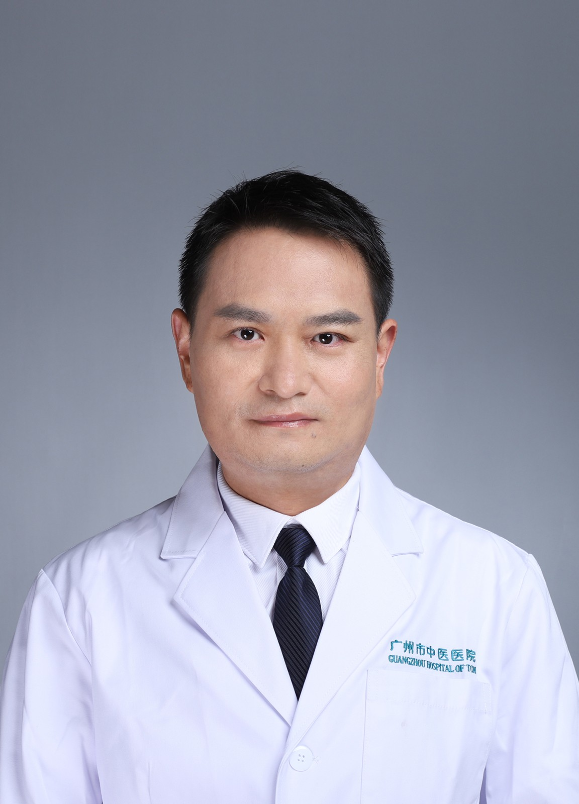

<!-- AUTO-GENERATED-BY: work/generate_obsidian_profiles.py -->

<!-- TEMPLATE: D:\workspace\信息收集整理\医生画像仓库\模板\医生画像模板.md -->

# 杜广亮

## 基础信息

| 字段 | 内容 |
|---|---|
| 姓名 | 杜广亮 |
| 医院 | 广州市中医院 |
| 科室 | 儿科 |
| 职称/身份 | 副主任医师 |
| 来源链接 | [官网原文](https://www.gzszyy.com/expert/2026/lNbWngay.html) |
| 采集日期 | 2026-08-13 |

## 简介/擅长

通过中药调理、膳食指导、情志调护等方式进行儿童体质调理、儿童体重管理，中西医结合治疗儿童反复呼吸道感染、过敏性鼻炎、过敏性咳嗽、小儿腹泻病、小儿厌食等取得满意疗效。

## 教育与进修经历

- 天河院区 儿科 负责人， 副主任医师 硕士学位，毕业于广州中医药大学，师承广州中医药大学教授、岭南名医 肖达民 教授。

## 可包装亮点

- 天河院区 儿科 负责人， 副主任医师 硕士学位，毕业于广州中医药大学，师承广州中医药大学教授、岭南名医 肖达民 教授。
- 广东省中西医结合学会感染病（热病）委员会委员；
- 广州市医师协会中医学医师分会委员。

## 重点疾病/人群标签

- 慢性病：
- 肿瘤：
- 生殖疾病：
- 免疫/风湿：感染
- 术后恢复/康复：
- 疑难重症：

## 证据摘录

> 只摘录官网公开信息中的短句或关键字段，不复制大段原文。

- 官网身份字段：副主任医师
- 官网简介/擅长：通过中药调理、膳食指导、情志调护等方式进行儿童体质调理、儿童体重管理，中西医结合治疗儿童反复呼吸道感染、过敏性鼻炎、过敏性咳嗽、小儿腹泻病、小儿厌食等取得满意疗效。
- 官网亮眼经历线索：天河院区 儿科 负责人， 副主任医师 硕士学位，毕业于广州中医药大学，师承广州中医药大学教授、岭南名医 肖达民 教授。 广东省中西医结合学会感染病（热病）委员会委员； 广州市医师协会中医学医师分会委员。
- 来源链接：https://www.gzszyy.com/expert/2026/lNbWngay.html

## BD 画像摘要

杜广亮医生可作为免疫/风湿/感染方向的基础画像候选。后续 BD 使用应继续以官网来源和人工复核为准，不添加疗效承诺或无来源包装。

## 合规边界

- 仅使用医院官网、官方公众号、官方小程序等公开渠道。
- 不采集私人电话、私人微信、家庭住址、患者隐私或非公开排班信息。
- 不写“保证治愈”“疗效第一”“包治疑难杂症”等无法由官网证明的表述。
