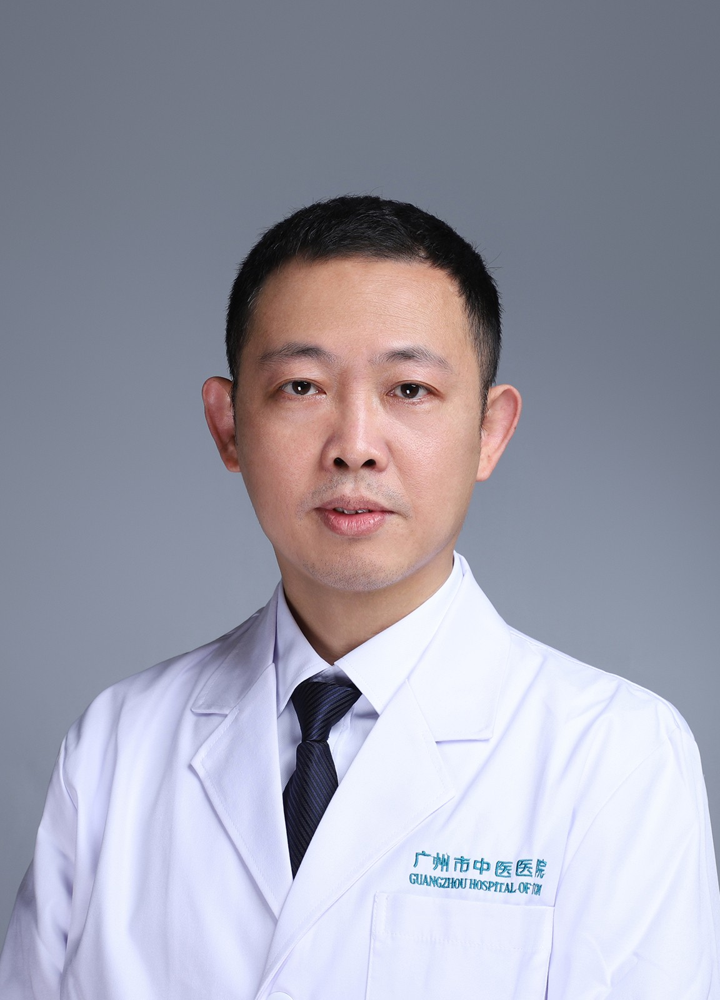

<!-- AUTO-GENERATED-BY: work/generate_obsidian_profiles.py -->

<!-- TEMPLATE: D:\workspace\信息收集整理\医生画像仓库\模板\医生画像模板.md -->

# 杜文坚

## 基础信息

| 字段 | 内容 |
|---|---|
| 姓名 | 杜文坚 |
| 医院 | 广州市中医院 |
| 科室 | 治未病科 |
| 职称/身份 | 副主任中医师 |
| 来源链接 | [官网原文](https://www.gzszyy.com/expert/2026/LDdw0Je1.html) |
| 采集日期 | 2026-08-13 |

## 简介/擅长

慢病调养，未病先防。尤其擅长于治疗急慢性支气管炎、支气管哮喘、慢性阻塞性肺气肿、肺炎、支气管扩张等呼吸系统疾病及其他内科常见病

## 教育与进修经历

- 广州中医药大学副教授 广东省中西医结合学会治未病专委会常务委员 广东省中医药学会络病专委会委员 广州市中医治未病服务质量控制中心秘书 广州市中医治未病服务联盟秘书 从事呼吸内科临床工作多年，曾在广州市呼吸研究所进修学习肺功能测定及纤维支气管镜，擅长于治疗急慢性支气管炎、支气管哮喘、慢性阻塞性肺气肿、肺炎、支气管扩张等呼吸系统疾病及其他内科常见病，具丰富临床经验。

## 科研项目与成果

- 参与省中医药管理局的课题两项并在省级以上医学刊物发表多篇论文。

## 论文与学术产出

- 参与省中医药管理局的课题两项并在省级以上医学刊物发表多篇论文。

## 可包装亮点

- 广州中医药大学副教授 广东省中西医结合学会治未病专委会常务委员 广东省中医药学会络病专委会委员 广州市中医治未病服务质量控制中心秘书 广州市中医治未病服务联盟秘书 从事呼吸内科临床工作多年，曾在广州市呼吸研究所进修学习肺功能测定及纤维支气管镜，擅长于治疗急慢性支气管炎、支气管哮喘、慢性阻塞性肺气肿、肺炎、支气管扩张等呼吸系统疾病及其他内科常见病，具丰富临床…
- 参与省中医药管理局的课题两项并在省级以上医学刊物发表多篇论文。

## 重点疾病/人群标签

- 慢性病：慢性、免疫
- 肿瘤：
- 生殖疾病：
- 免疫/风湿：慢性、免疫
- 术后恢复/康复：
- 疑难重症：

## 证据摘录

> 只摘录官网公开信息中的短句或关键字段，不复制大段原文。

- 官网身份字段：副主任中医师
- 官网简介/擅长：慢病调养，未病先防。尤其擅长于治疗急慢性支气管炎、支气管哮喘、慢性阻塞性肺气肿、肺炎、支气管扩张等呼吸系统疾病及其他内科常见病
- 官网亮眼经历线索：广州中医药大学副教授 广东省中西医结合学会治未病专委会常务委员 广东省中医药学会络病专委会委员 广州市中医治未病服务质量控制中心秘书 广州市中医治未病服务联盟秘书 从事呼吸内科临床工作多年，曾在广州市呼吸研究所进修学习肺功能测定及纤维支气管镜，擅长于治疗急慢性支气管炎、支气管哮喘、慢性阻塞性肺气肿、肺炎、支气管扩张等呼吸系统疾病及其他内科常见病，具丰富临床经验。 参与省中医药管理局的课题两项并在省级以上医学刊物发表多篇论文。
- 来源链接：https://www.gzszyy.com/expert/2026/LDdw0Je1.html

## BD 画像摘要

杜文坚医生可作为慢性病、免疫/风湿/感染方向的基础画像候选。后续 BD 使用应继续以官网来源和人工复核为准，不添加疗效承诺或无来源包装。

## 合规边界

- 仅使用医院官网、官方公众号、官方小程序等公开渠道。
- 不采集私人电话、私人微信、家庭住址、患者隐私或非公开排班信息。
- 不写“保证治愈”“疗效第一”“包治疑难杂症”等无法由官网证明的表述。
