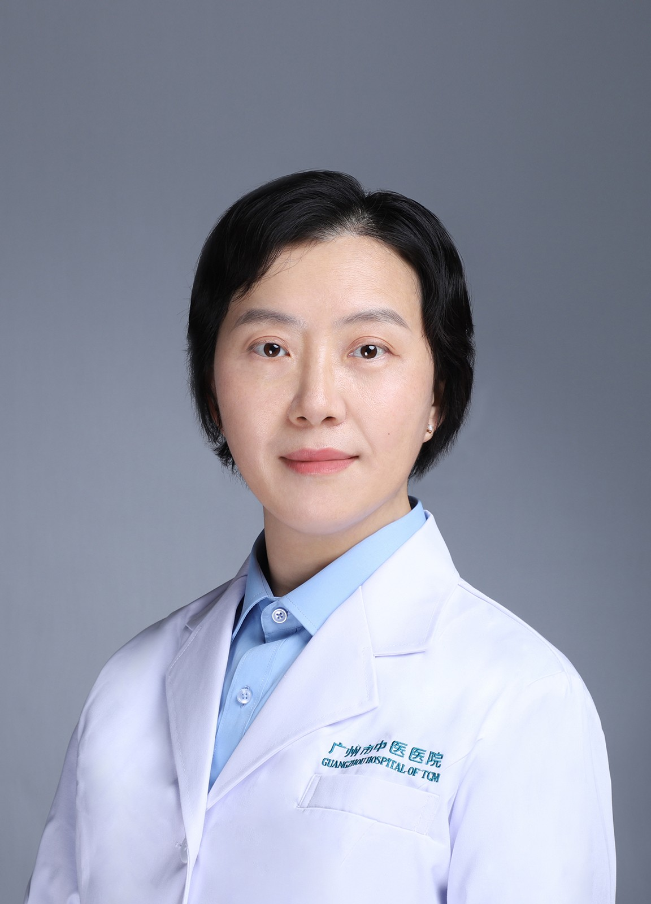

<!-- AUTO-GENERATED-BY: work/generate_obsidian_profiles.py -->

<!-- TEMPLATE: D:\workspace\信息收集整理\医生画像仓库\模板\医生画像模板.md -->

# 杜红彦

## 基础信息

| 字段 | 内容 |
|---|---|
| 姓名 | 杜红彦 |
| 医院 | 广州市中医院 |
| 科室 | 眼科 |
| 职称/身份 | 主任中医师 |
| 来源链接 | [官网原文](https://www.gzszyy.com/expert/2026/pmbk8Xdz.html) |
| 采集日期 | 2026-08-13 |

## 简介/擅长

白内障、青光眼、泪道病、胬肉、眼睑整形及肿物等手术治疗；针灸、中药联合激光治疗各种疑难眼病，如糖网、视网膜血管阻塞、黄斑病、视神经病、葡萄膜炎、飞蚊症、干眼症、角膜病、儿童近视、斜弱视等

## 科研项目与成果

- 主持国自然、省市级课题多项，发表论文20余篇， SCI 论文2篇。

## 论文与学术产出

- 主持国自然、省市级课题多项，发表论文20余篇， SCI 论文2篇。

## 可包装亮点

- 主任中医师， 眼科 博士，硕士研究生导师，广州市三级名中医 杜红彦 工作室负责人，广州市卫健委“优秀人才”，市中医药学会首届“优秀青年中医”，我院“优秀科技人才”。
- 针灸、中药联合激光治疗各种疑难眼病，如糖网、视网膜血管阻塞、黄斑病、视神经病、葡萄膜炎、飞蚊症、干眼症、角膜病、儿童近视、斜弱视等；
- 主持国自然、省市级课题多项，发表论文20余篇， SCI 论文2篇。
- 中华中医药学会 眼科 分会委员、广东省视光学学会中西医结合专委会常委、广东省养老养生健康促进会眼与视觉健康专委会常委、广东省基层医药学会 眼科 专委会白内障学组委员、广东省眼健康协会眼底病专委会委员

## 重点疾病/人群标签

- 慢性病：
- 肿瘤：
- 生殖疾病：
- 免疫/风湿：
- 术后恢复/康复：
- 疑难重症：疑难

## 证据摘录

> 只摘录官网公开信息中的短句或关键字段，不复制大段原文。

- 官网身份字段：主任中医师
- 官网简介/擅长：白内障、青光眼、泪道病、胬肉、眼睑整形及肿物等手术治疗；针灸、中药联合激光治疗各种疑难眼病，如糖网、视网膜血管阻塞、黄斑病、视神经病、葡萄膜炎、飞蚊症、干眼症、角膜病、儿童近视、斜弱视等
- 官网亮眼经历线索：主任中医师， 眼科 博士，硕士研究生导师，广州市三级名中医 杜红彦 工作室负责人，广州市卫健委“优秀人才”，市中医药学会首届“优秀青年中医”，我院“优秀科技人才”。 针灸、中药联合激光治疗各种疑难眼病，如糖网、视网膜血管阻塞、黄斑病、视神经病、葡萄膜炎、飞蚊症、干眼症、角膜病、儿童近视、斜弱视等； 主持国自然、省市级课题多项，发表论文20余篇， SCI 论文2篇。 中华中医药学会 眼科 分会委员、广东省视光学学会中西医结合专委会常委…
- 来源链接：https://www.gzszyy.com/expert/2026/pmbk8Xdz.html

## BD 画像摘要

杜红彦医生可作为疑难重症方向的基础画像候选。后续 BD 使用应继续以官网来源和人工复核为准，不添加疗效承诺或无来源包装。

## 合规边界

- 仅使用医院官网、官方公众号、官方小程序等公开渠道。
- 不采集私人电话、私人微信、家庭住址、患者隐私或非公开排班信息。
- 不写“保证治愈”“疗效第一”“包治疑难杂症”等无法由官网证明的表述。
