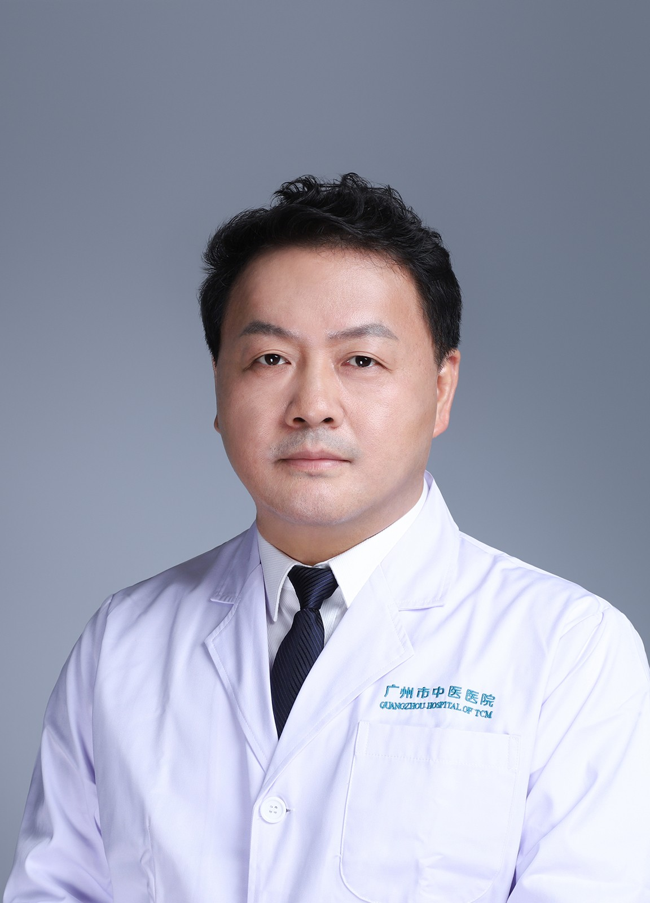

<!-- AUTO-GENERATED-BY: work/generate_obsidian_profiles.py -->

<!-- TEMPLATE: D:\workspace\信息收集整理\医生画像仓库\模板\医生画像模板.md -->

# 杨振淮

## 基础信息

| 字段 | 内容 |
|---|---|
| 姓名 | 杨振淮 |
| 医院 | 广州市中医院 |
| 科室 | 外科 |
| 职称/身份 | 主任医师 |
| 来源链接 | [官网原文](https://www.gzszyy.com/expert/2026/QBeXrkby.html) |
| 采集日期 | 2026-08-13 |

## 简介/擅长

胃，小肠，结肠、直肠等消化道肿瘤的微创手术；甲状腺，疝，肝，胆疾病的外科手术；乳腺良、恶性疾病的手术治疗和中西医结合治疗以及各类肿瘤手术后的康复及中西医结合治疗。

## 可包装亮点

- 广州医科大学附属中医医院外一科主任，主任医师， 硕士研究生导师、教授 广州医科大学附属中医医院首届名医、第七届羊城好医生。
- 广东省中西医结合学会乳腺专业分会副主任委员，广州市医师协会普外分会副主任委员，广州市医师协会乳腺专业分会副主任委员，广州医学会普外分会委员，广东医师协会胃肠 外科 委员

## 重点疾病/人群标签

- 慢性病：
- 肿瘤：肿瘤、术后、康复
- 生殖疾病：
- 免疫/风湿：
- 术后恢复/康复：肿瘤、术后、康复
- 疑难重症：

## 证据摘录

> 只摘录官网公开信息中的短句或关键字段，不复制大段原文。

- 官网身份字段：主任医师
- 官网简介/擅长：胃，小肠，结肠、直肠等消化道肿瘤的微创手术；甲状腺，疝，肝，胆疾病的外科手术；乳腺良、恶性疾病的手术治疗和中西医结合治疗以及各类肿瘤手术后的康复及中西医结合治疗。
- 官网亮眼经历线索：广州医科大学附属中医医院外一科主任，主任医师， 硕士研究生导师、教授 广州医科大学附属中医医院首届名医、第七届羊城好医生。 广东省中西医结合学会乳腺专业分会副主任委员，广州市医师协会普外分会副主任委员，广州市医师协会乳腺专业分会副主任委员，广州医学会普外分会委员，广东医师协会胃肠 外科 委员
- 来源链接：https://www.gzszyy.com/expert/2026/QBeXrkby.html

## BD 画像摘要

杨振淮医生可作为肿瘤、术后恢复/康复方向的基础画像候选。后续 BD 使用应继续以官网来源和人工复核为准，不添加疗效承诺或无来源包装。

## 合规边界

- 仅使用医院官网、官方公众号、官方小程序等公开渠道。
- 不采集私人电话、私人微信、家庭住址、患者隐私或非公开排班信息。
- 不写“保证治愈”“疗效第一”“包治疑难杂症”等无法由官网证明的表述。
