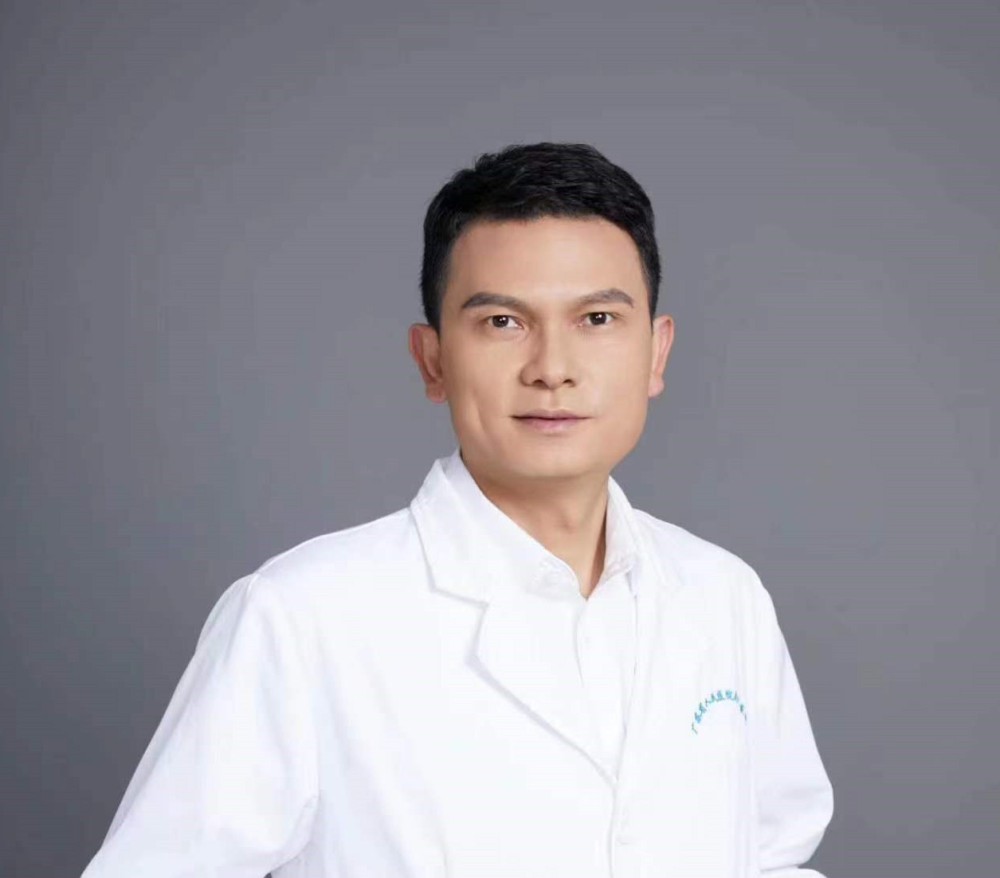

<!-- AUTO-GENERATED-BY: work/generate_obsidian_profiles.py -->

<!-- TEMPLATE: D:\workspace\信息收集整理\医生画像仓库\模板\医生画像模板.md -->

# 杨波涛

## 基础信息

| 字段 | 内容 |
|---|---|
| 姓名 | 杨波涛 |
| 医院 | 广州市中医院 |
| 科室 | 皮肤科 |
| 职称/身份 | 副主任医师 |
| 来源链接 | [官网原文](https://www.gzszyy.com/expert/2026/WPe924aL.html) |
| 采集日期 | 2026-08-13 |

## 简介/擅长

熟练治疗白癜风、银屑病、痤疮、带状疱疹、皮炎湿疹等常见皮肤科疾病，尤其擅长儿童皮肤病以及常见性病的诊治。

## 可包装亮点

- 对红斑狼疮、血管炎、硬皮病、天疱疮等疑难皮肤病有一定研究，并掌握 毛发病 、指甲病和各类皮肤良性肿瘤、痣、囊肿等的 外科 手术切除。
- 广州医科大学附属中医医院 皮肤科 科主任；
- 第十届羊城好医生；
- 广东省中西医结合学会皮肤病专业委员会常委；

## 重点疾病/人群标签

- 慢性病：
- 肿瘤：肿瘤、癌、红斑狼疮、疑难
- 生殖疾病：
- 免疫/风湿：肿瘤、癌、红斑狼疮、疑难
- 术后恢复/康复：
- 疑难重症：肿瘤、癌、红斑狼疮、疑难

## 证据摘录

> 只摘录官网公开信息中的短句或关键字段，不复制大段原文。

- 官网身份字段：副主任医师
- 官网简介/擅长：熟练治疗白癜风、银屑病、痤疮、带状疱疹、皮炎湿疹等常见皮肤科疾病，尤其擅长儿童皮肤病以及常见性病的诊治。
- 官网亮眼经历线索：对红斑狼疮、血管炎、硬皮病、天疱疮等疑难皮肤病有一定研究，并掌握 毛发病 、指甲病和各类皮肤良性肿瘤、痣、囊肿等的 外科 手术切除。 广州医科大学附属中医医院 皮肤科 科主任； 第十届羊城好医生； 广东省中西医结合学会皮肤病专业委员会常委；
- 来源链接：https://www.gzszyy.com/expert/2026/WPe924aL.html

## BD 画像摘要

杨波涛医生可作为肿瘤、免疫/风湿/感染、疑难重症方向的基础画像候选。后续 BD 使用应继续以官网来源和人工复核为准，不添加疗效承诺或无来源包装。

## 合规边界

- 仅使用医院官网、官方公众号、官方小程序等公开渠道。
- 不采集私人电话、私人微信、家庭住址、患者隐私或非公开排班信息。
- 不写“保证治愈”“疗效第一”“包治疑难杂症”等无法由官网证明的表述。
