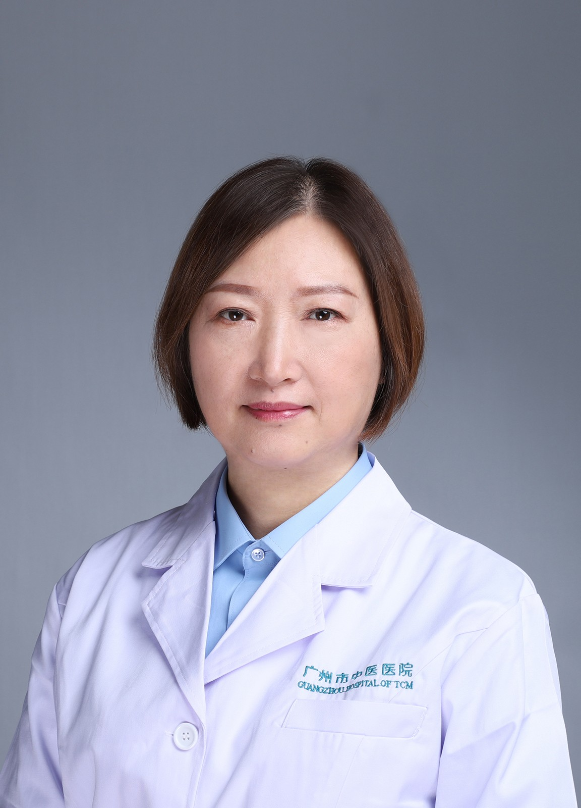

<!-- AUTO-GENERATED-BY: work/generate_obsidian_profiles.py -->

<!-- TEMPLATE: D:\workspace\信息收集整理\医生画像仓库\模板\医生画像模板.md -->

# 林少贞

## 基础信息

| 字段 | 内容 |
|---|---|
| 姓名 | 林少贞 |
| 医院 | 广州市中医院 |
| 科室 | 针灸科、针灸康复科 |
| 职称/身份 | 主任中医师 |
| 来源链接 | [官网原文](https://www.gzszyy.com/expert/2026/ELe31Mb6.html) |
| 采集日期 | 2026-08-13 |

## 简介/擅长

颈肩背腰腿痛及脊椎相关疾病、面瘫、失眠、眩晕、过敏性鼻炎、慢性咳喘、月经不调、胃肠功能紊乱症、单纯性肥胖症、身体亚健康状态等病症的针灸及中西药物治疗。

## 教育与进修经历

- 1984年毕业于广州中医药大学中医医疗系。

## 科研项目与成果

- 主任中医师， 广州中医药大学教授， 硕士研究生导师， 广东省及广州市优秀中医临床人才， 广东省第二批名中医师承项目指导老师， 海珠区第二批名医专家学术经验继承工作指导老师， 兼任广东省针灸学会第三届、第四届理事会理事， 广东省针灸学会针法专业委员会第一届委员会常务委员， 广东省中西医结合学会康复专业委员会第一届委员会常务委员， 广东省中西医结合学会治未病专业委员会第二届委员会委员等学术团体职位。
- 主持或参与省、市科研项目多项，在国家级及省级学术期刊上发表论文20余篇。

## 论文与学术产出

- 主持或参与省、市科研项目多项，在国家级及省级学术期刊上发表论文20余篇。

## 可包装亮点

- 主任中医师， 广州中医药大学教授， 硕士研究生导师， 广东省及广州市优秀中医临床人才， 广东省第二批名中医师承项目指导老师， 海珠区第二批名医专家学术经验继承工作指导老师， 兼任广东省针灸学会第三届、第四届理事会理事， 广东省针灸学会针法专业委员会第一届委员会常务委员， 广东省中西医结合学会康复专业委员会第一届委员会常务委员， 广东省中西医结合学会治未病专…
- 主持或参与省、市科研项目多项，在国家级及省级学术期刊上发表论文20余篇。

## 重点疾病/人群标签

- 慢性病：慢性、月经、风湿、康复
- 肿瘤：
- 生殖疾病：慢性、月经、风湿、康复
- 免疫/风湿：慢性、月经、风湿、康复
- 术后恢复/康复：慢性、月经、风湿、康复
- 疑难重症：

## 证据摘录

> 只摘录官网公开信息中的短句或关键字段，不复制大段原文。

- 官网身份字段：主任中医师
- 官网简介/擅长：颈肩背腰腿痛及脊椎相关疾病、面瘫、失眠、眩晕、过敏性鼻炎、慢性咳喘、月经不调、胃肠功能紊乱症、单纯性肥胖症、身体亚健康状态等病症的针灸及中西药物治疗。
- 官网亮眼经历线索：主任中医师， 广州中医药大学教授， 硕士研究生导师， 广东省及广州市优秀中医临床人才， 广东省第二批名中医师承项目指导老师， 海珠区第二批名医专家学术经验继承工作指导老师， 兼任广东省针灸学会第三届、第四届理事会理事， 广东省针灸学会针法专业委员会第一届委员会常务委员， 广东省中西医结合学会康复专业委员会第一届委员会常务委员， 广东省中西医结合学会治未病专业委员会第二届委员会委员等学术团体职位。 主持或参与省、市科研项目多项，在国家级…
- 来源链接：https://www.gzszyy.com/expert/2026/ELe31Mb6.html

## BD 画像摘要

林少贞医生可作为慢性病、生殖疾病、免疫/风湿/感染、术后恢复/康复方向的基础画像候选。后续 BD 使用应继续以官网来源和人工复核为准，不添加疗效承诺或无来源包装。

## 合规边界

- 仅使用医院官网、官方公众号、官方小程序等公开渠道。
- 不采集私人电话、私人微信、家庭住址、患者隐私或非公开排班信息。
- 不写“保证治愈”“疗效第一”“包治疑难杂症”等无法由官网证明的表述。
