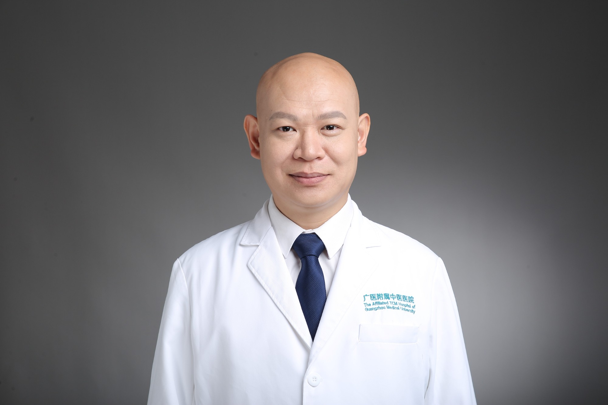

<!-- AUTO-GENERATED-BY: work/generate_obsidian_profiles.py -->

<!-- TEMPLATE: D:\workspace\信息收集整理\医生画像仓库\模板\医生画像模板.md -->

# 林晓光

## 基础信息

| 字段 | 内容 |
|---|---|
| 姓名 | 林晓光 |
| 医院 | 广州市中医院 |
| 科室 | 骨伤科 |
| 职称/身份 | 主任中医师 |
| 来源链接 | [官网原文](https://www.gzszyy.com/expert/2026/pmbkoYbz.html) |
| 采集日期 | 2026-08-13 |

## 简介/擅长

中医正骨手法、骨折脱位整复治疗、创伤矫形手术等,对外伤、颈肩腰腿痛、少年儿童生长发育骨病、脊柱侧弯、骨关节炎、骨质疏松、筋骨康复、颈椎病、腰椎间盘突出症、腰椎间盘滑脱症等

## 可包装亮点

- 中西医结合创伤骨科主任、广州中医药大学教授、研究生导师、广州医科大学研究生导师、高层次引进人才、原佛山市中医院创伤骨科主任中医师、“佛山中医院正骨流派”第五代技术传承人。
- 中国民族医药学会筋骨养护分会常务理事，广东省老年保健协会骨科分会副主委。

## 重点疾病/人群标签

- 慢性病：
- 肿瘤：
- 生殖疾病：
- 免疫/风湿：
- 术后恢复/康复：康复
- 疑难重症：

## 证据摘录

> 只摘录官网公开信息中的短句或关键字段，不复制大段原文。

- 官网身份字段：主任中医师
- 官网简介/擅长：中医正骨手法、骨折脱位整复治疗、创伤矫形手术等,对外伤、颈肩腰腿痛、少年儿童生长发育骨病、脊柱侧弯、骨关节炎、骨质疏松、筋骨康复、颈椎病、腰椎间盘突出症、腰椎间盘滑脱症等
- 官网亮眼经历线索：中西医结合创伤骨科主任、广州中医药大学教授、研究生导师、广州医科大学研究生导师、高层次引进人才、原佛山市中医院创伤骨科主任中医师、“佛山中医院正骨流派”第五代技术传承人。 中国民族医药学会筋骨养护分会常务理事，广东省老年保健协会骨科分会副主委。
- 来源链接：https://www.gzszyy.com/expert/2026/pmbkoYbz.html

## BD 画像摘要

林晓光医生可作为术后恢复/康复方向的基础画像候选。后续 BD 使用应继续以官网来源和人工复核为准，不添加疗效承诺或无来源包装。

## 合规边界

- 仅使用医院官网、官方公众号、官方小程序等公开渠道。
- 不采集私人电话、私人微信、家庭住址、患者隐私或非公开排班信息。
- 不写“保证治愈”“疗效第一”“包治疑难杂症”等无法由官网证明的表述。
