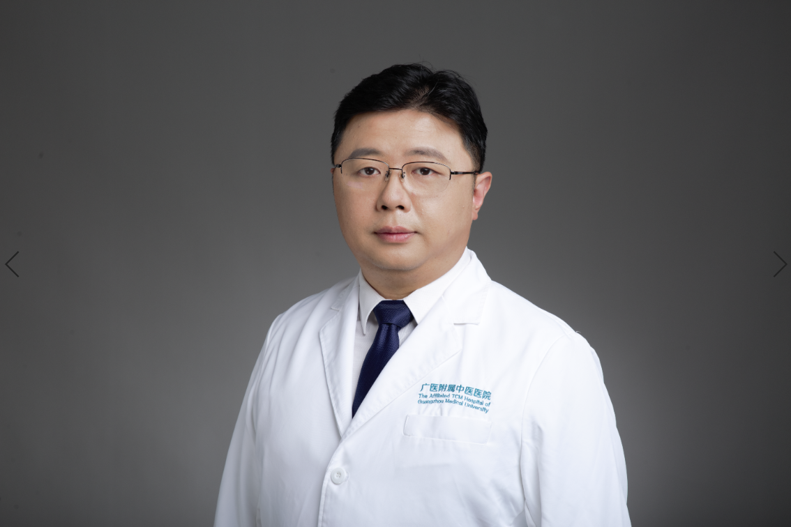

<!-- AUTO-GENERATED-BY: work/generate_obsidian_profiles.py -->

<!-- TEMPLATE: D:\workspace\信息收集整理\医生画像仓库\模板\医生画像模板.md -->

# 林欢

## 基础信息

| 字段 | 内容 |
|---|---|
| 姓名 | 林欢 |
| 医院 | 广州市中医院 |
| 科室 | 外科 |
| 职称/身份 | 副主任医师 |
| 来源链接 | [官网原文](https://www.gzszyy.com/expert/2026/JxboONbg.html) |
| 采集日期 | 2026-08-13 |

## 简介/擅长

腔镜乳腺癌微创保乳、皮下腺体切除及假体植入重建等、男性乳房发育腔镜微创切除、经典乳腺癌改良根治、保乳、乳房重建、腔镜辅助下乳房巨大肿物切除及乳房重建、乳腺癌减毒增效及乳腺增生的中医治疗。

## 可包装亮点

- 广州医科大学附属中医医院天河院区乳腺科主任，副主任医师。
- 第10届羊城好医生，首届“中青年肿瘤防治菁英”。
- 美国ASCO会员、中国抗癌协会个案管理专委会常委、中国民族医药学会 外科 分会常务理事、中国老年保健医学研究会女性健康分会常委、中华中医药学会乳腺病分会青委。

## 重点疾病/人群标签

- 慢性病：
- 肿瘤：肿瘤、癌、乳腺癌
- 生殖疾病：
- 免疫/风湿：
- 术后恢复/康复：
- 疑难重症：

## 证据摘录

> 只摘录官网公开信息中的短句或关键字段，不复制大段原文。

- 官网身份字段：副主任医师
- 官网简介/擅长：腔镜乳腺癌微创保乳、皮下腺体切除及假体植入重建等、男性乳房发育腔镜微创切除、经典乳腺癌改良根治、保乳、乳房重建、腔镜辅助下乳房巨大肿物切除及乳房重建、乳腺癌减毒增效及乳腺增生的中医治疗。
- 官网亮眼经历线索：广州医科大学附属中医医院天河院区乳腺科主任，副主任医师。 第10届羊城好医生，首届“中青年肿瘤防治菁英”。 美国ASCO会员、中国抗癌协会个案管理专委会常委、中国民族医药学会 外科 分会常务理事、中国老年保健医学研究会女性健康分会常委、中华中医药学会乳腺病分会青委。
- 来源链接：https://www.gzszyy.com/expert/2026/JxboONbg.html

## BD 画像摘要

林欢医生可作为肿瘤方向的基础画像候选。后续 BD 使用应继续以官网来源和人工复核为准，不添加疗效承诺或无来源包装。

## 合规边界

- 仅使用医院官网、官方公众号、官方小程序等公开渠道。
- 不采集私人电话、私人微信、家庭住址、患者隐私或非公开排班信息。
- 不写“保证治愈”“疗效第一”“包治疑难杂症”等无法由官网证明的表述。
