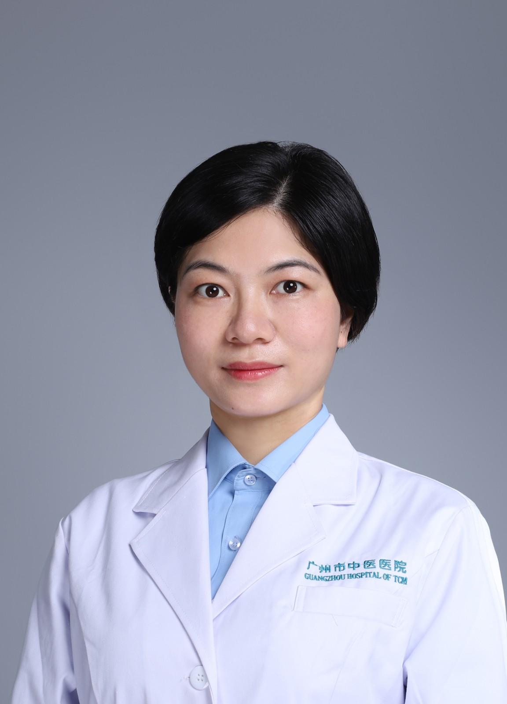

<!-- AUTO-GENERATED-BY: work/generate_obsidian_profiles.py -->

<!-- TEMPLATE: D:\workspace\信息收集整理\医生画像仓库\模板\医生画像模板.md -->

# 梁月云

## 基础信息

| 字段 | 内容 |
|---|---|
| 姓名 | 梁月云 |
| 医院 | 广州市中医院 |
| 科室 | 同德综合门诊部 |
| 职称/身份 | 医师 |
| 来源链接 | [官网原文](https://www.gzszyy.com/expert/2026/APdRPLaG.html) |
| 采集日期 | 2026-08-13 |

## 简介/擅长

治疗肥胖症及肥胖相关疾病；颈椎病、肩周炎、网球肘、膝关节炎、坐骨神经痛等各种病痛；痛经及月经不调，宫寒不孕、产后腰痛、漏尿等妇科疾病；痤疮、中风后遗症、失眠、紧张性头痛、面瘫、过敏性鼻炎、胃肠功能紊乱、体质调理等。

## 可包装亮点

- 副主任医师， 医学硕士 从事针灸临床科教研工作十余年，师承广东省名中医 祝维峰 教授及中国蜂疗分会会长李万瑶教授。
- 广东省针灸学会减肥及内分泌专业委员。

## 重点疾病/人群标签

- 慢性病：
- 肿瘤：
- 生殖疾病：不孕、月经
- 免疫/风湿：
- 术后恢复/康复：
- 疑难重症：

## 证据摘录

> 只摘录官网公开信息中的短句或关键字段，不复制大段原文。

- 官网身份字段：医师
- 官网简介/擅长：治疗肥胖症及肥胖相关疾病；颈椎病、肩周炎、网球肘、膝关节炎、坐骨神经痛等各种病痛；痛经及月经不调，宫寒不孕、产后腰痛、漏尿等妇科疾病；痤疮、中风后遗症、失眠、紧张性头痛、面瘫、过敏性鼻炎、胃肠功能紊乱、体质调理等。
- 官网亮眼经历线索：副主任医师， 医学硕士 从事针灸临床科教研工作十余年，师承广东省名中医 祝维峰 教授及中国蜂疗分会会长李万瑶教授。 广东省针灸学会减肥及内分泌专业委员。
- 来源链接：https://www.gzszyy.com/expert/2026/APdRPLaG.html

## BD 画像摘要

梁月云医生可作为生殖疾病方向的基础画像候选。后续 BD 使用应继续以官网来源和人工复核为准，不添加疗效承诺或无来源包装。

## 合规边界

- 仅使用医院官网、官方公众号、官方小程序等公开渠道。
- 不采集私人电话、私人微信、家庭住址、患者隐私或非公开排班信息。
- 不写“保证治愈”“疗效第一”“包治疑难杂症”等无法由官网证明的表述。
