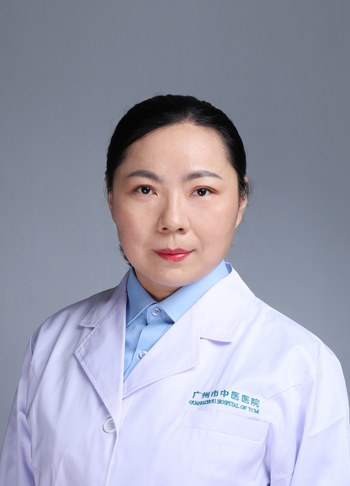

<!-- AUTO-GENERATED-BY: work/generate_obsidian_profiles.py -->

<!-- TEMPLATE: D:\workspace\信息收集整理\医生画像仓库\模板\医生画像模板.md -->

# 梁艳菊

## 基础信息

| 字段 | 内容 |
|---|---|
| 姓名 | 梁艳菊 |
| 医院 | 广州市中医院 |
| 科室 | 肿瘤二区 |
| 职称/身份 | 副主任中医师 |
| 来源链接 | [官网原文](https://www.gzszyy.com/expert/2026/openZle7.html) |
| 采集日期 | 2026-08-13 |

## 简介/擅长

中西医结合防治鼻咽癌、肺癌、乳腺癌、肝癌、胃癌、结直肠癌、妇科等恶性肿瘤，及肺结节、乳腺增生等疾病的诊治，肿瘤的增效减毒治疗，运用中医经典理论诊治内科疾病。

## 教育与进修经历

- 中西医结合副主任医师， 博士研究生毕业，师从广州中医药大学国医大师周岱翰教授，广州市第三批优秀中医临床研修人才。
- 从事中西医结合临床工作近20年，曾在广东省中医院芳村分院经典科及肿瘤科进修学习。

## 可包装亮点

- 中西医结合副主任医师， 博士研究生毕业，师从广州中医药大学国医大师周岱翰教授，广州市第三批优秀中医临床研修人才。
- 从事中西医结合临床工作近20年，曾在广东省中医院芳村分院经典科及肿瘤科进修学习。
- 在广东省中医药学会等多个学会任职。

## 重点疾病/人群标签

- 慢性病：
- 肿瘤：肿瘤、鼻咽癌、肺癌、肝癌、胃癌、肠癌、乳腺癌
- 生殖疾病：
- 免疫/风湿：
- 术后恢复/康复：
- 疑难重症：

## 证据摘录

> 只摘录官网公开信息中的短句或关键字段，不复制大段原文。

- 官网身份字段：副主任中医师
- 官网简介/擅长：中西医结合防治鼻咽癌、肺癌、乳腺癌、肝癌、胃癌、结直肠癌、妇科等恶性肿瘤，及肺结节、乳腺增生等疾病的诊治，肿瘤的增效减毒治疗，运用中医经典理论诊治内科疾病。
- 官网亮眼经历线索：中西医结合副主任医师， 博士研究生毕业，师从广州中医药大学国医大师周岱翰教授，广州市第三批优秀中医临床研修人才。 从事中西医结合临床工作近20年，曾在广东省中医院芳村分院经典科及肿瘤科进修学习。 在广东省中医药学会等多个学会任职。
- 来源链接：https://www.gzszyy.com/expert/2026/openZle7.html

## BD 画像摘要

梁艳菊医生可作为肿瘤方向的基础画像候选。后续 BD 使用应继续以官网来源和人工复核为准，不添加疗效承诺或无来源包装。

## 合规边界

- 仅使用医院官网、官方公众号、官方小程序等公开渠道。
- 不采集私人电话、私人微信、家庭住址、患者隐私或非公开排班信息。
- 不写“保证治愈”“疗效第一”“包治疑难杂症”等无法由官网证明的表述。
