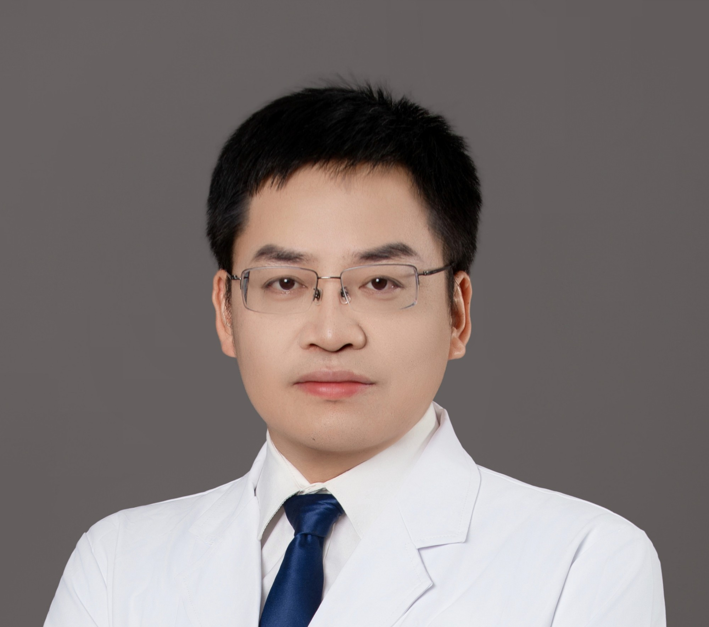

<!-- AUTO-GENERATED-BY: work/generate_obsidian_profiles.py -->

<!-- TEMPLATE: D:\workspace\信息收集整理\医生画像仓库\模板\医生画像模板.md -->

# 段渊

## 基础信息

| 字段 | 内容 |
|---|---|
| 姓名 | 段渊 |
| 医院 | 广州市中医院 |
| 科室 | 针灸康复科 |
| 职称/身份 | 副主任中医师 |
| 来源链接 | [官网原文](https://www.gzszyy.com/expert/2026/GRb4WgaB.html) |
| 采集日期 | 2026-08-13 |

## 简介/擅长

运用针法（内针、刃针、针刀等）、正骨推拿配合现代康复治疗脑卒中、脑外伤、脊髓损伤、颈肩腰腿痛及各种运动损伤。

## 教育与进修经历

- 曾于华中科技大学附属武汉同济医院参加康复医学国家紧缺人才培训1年，系统学习现代康复理论与实践技术。

## 可包装亮点

- 曾于华中科技大学附属武汉同济医院参加康复医学国家紧缺人才培训1年，系统学习现代康复理论与实践技术。

## 重点疾病/人群标签

- 慢性病：
- 肿瘤：
- 生殖疾病：
- 免疫/风湿：
- 术后恢复/康复：康复、疼痛
- 疑难重症：

## 证据摘录

> 只摘录官网公开信息中的短句或关键字段，不复制大段原文。

- 官网身份字段：副主任中医师
- 官网简介/擅长：运用针法（内针、刃针、针刀等）、正骨推拿配合现代康复治疗脑卒中、脑外伤、脊髓损伤、颈肩腰腿痛及各种运动损伤。
- 官网亮眼经历线索：曾于华中科技大学附属武汉同济医院参加康复医学国家紧缺人才培训1年，系统学习现代康复理论与实践技术。
- 来源链接：https://www.gzszyy.com/expert/2026/GRb4WgaB.html

## BD 画像摘要

段渊医生可作为术后恢复/康复方向的基础画像候选。后续 BD 使用应继续以官网来源和人工复核为准，不添加疗效承诺或无来源包装。

## 合规边界

- 仅使用医院官网、官方公众号、官方小程序等公开渠道。
- 不采集私人电话、私人微信、家庭住址、患者隐私或非公开排班信息。
- 不写“保证治愈”“疗效第一”“包治疑难杂症”等无法由官网证明的表述。
