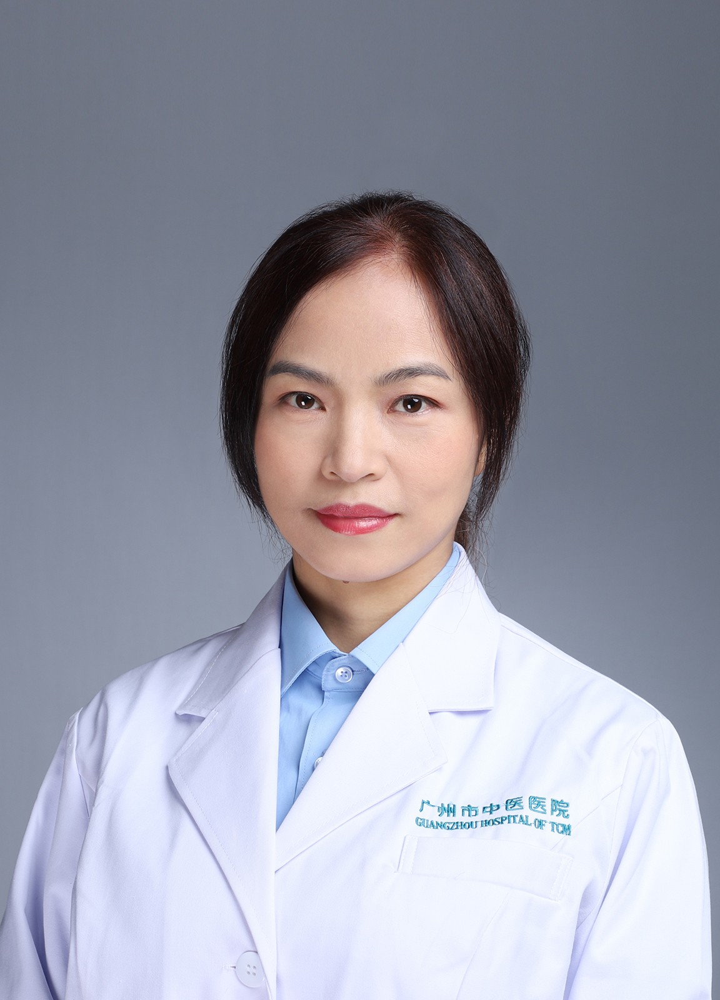

<!-- AUTO-GENERATED-BY: work/generate_obsidian_profiles.py -->

<!-- TEMPLATE: D:\workspace\信息收集整理\医生画像仓库\模板\医生画像模板.md -->

# 江沂

## 基础信息

| 字段 | 内容 |
|---|---|
| 姓名 | 江沂 |
| 医院 | 广州市中医院 |
| 科室 | 检验病理科 |
| 职称/身份 | 副主任医师 |
| 来源链接 | [官网原文](https://www.gzszyy.com/expert/2026/J0dNOLeL.html) |
| 采集日期 | 2026-08-13 |

## 简介/擅长

外科病理常见病与疑难病的病理及鉴别诊断，擅长乳腺、消化、生殖等系统诊断及鉴别诊断；并且对穿刺细胞学诊断、宫颈液基细胞学及胸腹水脱落细胞学也有丰富的诊断经验。

## 教育与进修经历

- 从事病理工作近 20 多年，曾在中山医科大学及北京友谊医院进修学习；

## 科研项目与成果

- 参加省级及市级课题及发表文章数篇。

## 论文与学术产出

- 参加省级及市级课题及发表文章数篇。

## 可包装亮点

- 从事病理工作近 20 多年，曾在中山医科大学及北京友谊医院进修学习；
- 参加省级及市级课题及发表文章数篇。
- 广州市医师协会病理学分会委员 广州市医师协会乳腺病学分会委员 广州市医学会病理学分会委员会委员 广州市病理质量控制中心专家委员会成员 广东省临床病理控制中心细胞病理室间质控专家小组成员

## 重点疾病/人群标签

- 慢性病：
- 肿瘤：
- 生殖疾病：生殖、疑难
- 免疫/风湿：
- 术后恢复/康复：
- 疑难重症：生殖、疑难

## 证据摘录

> 只摘录官网公开信息中的短句或关键字段，不复制大段原文。

- 官网身份字段：副主任医师
- 官网简介/擅长：外科病理常见病与疑难病的病理及鉴别诊断，擅长乳腺、消化、生殖等系统诊断及鉴别诊断；并且对穿刺细胞学诊断、宫颈液基细胞学及胸腹水脱落细胞学也有丰富的诊断经验。
- 官网亮眼经历线索：从事病理工作近 20 多年，曾在中山医科大学及北京友谊医院进修学习； 参加省级及市级课题及发表文章数篇。 广州市医师协会病理学分会委员 广州市医师协会乳腺病学分会委员 广州市医学会病理学分会委员会委员 广州市病理质量控制中心专家委员会成员 广东省临床病理控制中心细胞病理室间质控专家小组成员
- 来源链接：https://www.gzszyy.com/expert/2026/J0dNOLeL.html

## BD 画像摘要

江沂医生可作为生殖疾病、疑难重症方向的基础画像候选。后续 BD 使用应继续以官网来源和人工复核为准，不添加疗效承诺或无来源包装。

## 合规边界

- 仅使用医院官网、官方公众号、官方小程序等公开渠道。
- 不采集私人电话、私人微信、家庭住址、患者隐私或非公开排班信息。
- 不写“保证治愈”“疗效第一”“包治疑难杂症”等无法由官网证明的表述。
