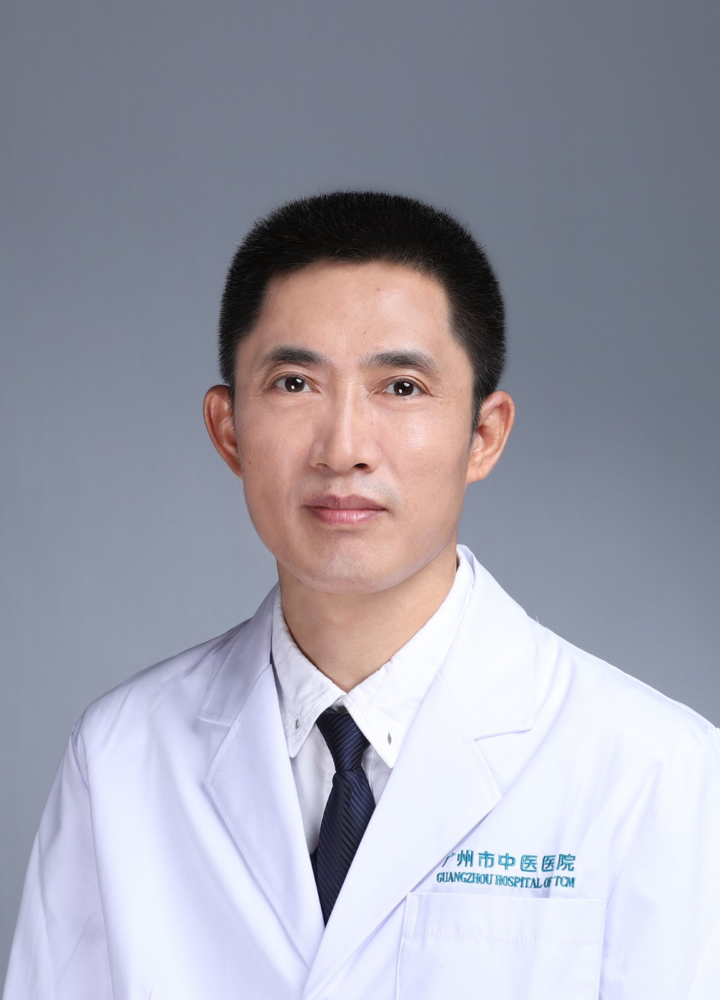

<!-- AUTO-GENERATED-BY: work/generate_obsidian_profiles.py -->

<!-- TEMPLATE: D:\workspace\信息收集整理\医生画像仓库\模板\医生画像模板.md -->

# 王修银

## 基础信息

| 字段 | 内容 |
|---|---|
| 姓名 | 王修银 |
| 医院 | 广州市中医院 |
| 科室 | 检验病理科 |
| 职称/身份 | 主任技师 |
| 来源链接 | [官网原文](https://www.gzszyy.com/expert/2026/9wdLZgaj.html) |
| 采集日期 | 2026-08-13 |

## 简介/擅长

临床医学检验（含临床检验、生化检验、微生物检验、免疫检验、输血相关技术等）

## 教育与进修经历

- 1994年七月毕业于湖南医科大学医学检验系分配到本院，从事检验医学临床工作近三十年，在检验临床、检验质量控制、实验室建设和规范化管理等方面积累了较丰富的经验，其间共发表相关学术论文数十篇，先后主持并参与完成了国家、省、市级各项课题十余项。

## 科研项目与成果

- 1994年七月毕业于湖南医科大学医学检验系分配到本院，从事检验医学临床工作近三十年，在检验临床、检验质量控制、实验室建设和规范化管理等方面积累了较丰富的经验，其间共发表相关学术论文数十篇，先后主持并参与完成了国家、省、市级各项课题十余项。

## 论文与学术产出

- 1994年七月毕业于湖南医科大学医学检验系分配到本院，从事检验医学临床工作近三十年，在检验临床、检验质量控制、实验室建设和规范化管理等方面积累了较丰富的经验，其间共发表相关学术论文数十篇，先后主持并参与完成了国家、省、市级各项课题十余项。

## 可包装亮点

- 1994年七月毕业于湖南医科大学医学检验系分配到本院，从事检验医学临床工作近三十年，在检验临床、检验质量控制、实验室建设和规范化管理等方面积累了较丰富的经验，其间共发表相关学术论文数十篇，先后主持并参与完成了国家、省、市级各项课题十余项。
- 三级、二级甲等中医医院评审专家，兼有广东省中医药学会检验分会副主任委员、广东省中西医结合学会检验分会常委、广东省中西医结合学会输血医学专业委员会常委、广州市医学会检验分会常委、广州市卫健委临床用血管理专家库成员等主要社会任职。

## 重点疾病/人群标签

- 慢性病：
- 肿瘤：
- 生殖疾病：
- 免疫/风湿：
- 术后恢复/康复：
- 疑难重症：

## 证据摘录

> 只摘录官网公开信息中的短句或关键字段，不复制大段原文。

- 官网身份字段：主任技师
- 官网简介/擅长：临床医学检验（含临床检验、生化检验、微生物检验、免疫检验、输血相关技术等）
- 官网亮眼经历线索：1994年七月毕业于湖南医科大学医学检验系分配到本院，从事检验医学临床工作近三十年，在检验临床、检验质量控制、实验室建设和规范化管理等方面积累了较丰富的经验，其间共发表相关学术论文数十篇，先后主持并参与完成了国家、省、市级各项课题十余项。 三级、二级甲等中医医院评审专家，兼有广东省中医药学会检验分会副主任委员、广东省中西医结合学会检验分会常委、广东省中西医结合学会输血医学专业委员会常委、广州市医学会检验分会常委、广州市卫健委临床用血管…
- 异常提示：职称/身份需人工复核
- 来源链接：https://www.gzszyy.com/expert/2026/9wdLZgaj.html

## BD 画像摘要

王修银医生可作为广州市中医院检验病理科的基础医生资料入库。当前重点方向以总底表标签为准，官网未展示的信息保持空白。

## 合规边界

- 仅使用医院官网、官方公众号、官方小程序等公开渠道。
- 不采集私人电话、私人微信、家庭住址、患者隐私或非公开排班信息。
- 不写“保证治愈”“疗效第一”“包治疑难杂症”等无法由官网证明的表述。
