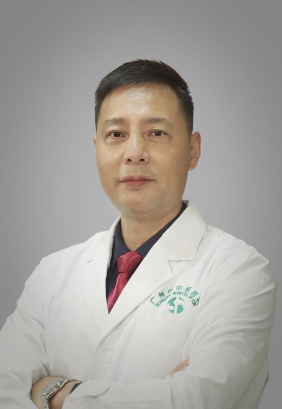

<!-- AUTO-GENERATED-BY: work/generate_obsidian_profiles.py -->

<!-- TEMPLATE: D:\workspace\信息收集整理\医生画像仓库\模板\医生画像模板.md -->

# 王健

## 基础信息

| 字段 | 内容 |
|---|---|
| 姓名 | 王健 |
| 医院 | 广州市中医院 |
| 科室 | 外科 |
| 职称/身份 | 主任医师 |
| 来源链接 | [官网原文](https://www.gzszyy.com/expert/2026/WZdP6yaK.html) |
| 采集日期 | 2026-08-13 |

## 简介/擅长

腹部肝胆、胃肠等消化系统复杂肿瘤、结石、炎症等疾病，及各类腹壁疝疾病的诊治。尤其擅长腹腔镜，软/硬胆道镜、十二指肠镜，以及介入等多种微创技术诊治肝胆胰肿瘤、结石、慢性炎症、功能失调等疾病。

## 教育与进修经历

- 毕业于华中科技大学同济医学院，从事普通 外科 临床科教研工作30余年。

## 科研项目与成果

- 获省市科技项目七项，发表SCI及核心期刊论文二十余篇，主持国家级医学教育项目三项，获国家专利五项。

## 论文与学术产出

- 获省市科技项目七项，发表SCI及核心期刊论文二十余篇，主持国家级医学教育项目三项，获国家专利五项。

## 可包装亮点

- 获省市科技项目七项，发表SCI及核心期刊论文二十余篇，主持国家级医学教育项目三项，获国家专利五项。
- 第八届羊城好医生 。
- 广东省医学会理事， 广东省老年保健协会中西医结合肝胆胰专委会副 主 委，广东省健康管理学会胰腺专委会副主委，广州市医学会加速康复 外科 学分会副主委 ， 广州市中西医结合学会肝胆胰专委会主委，世界内镜医师协会 外科 联盟 常务 理事， 广州市医师协会肝胆胰 外科 医师分会常委等 。

## 重点疾病/人群标签

- 慢性病：
- 肿瘤：
- 生殖疾病：
- 免疫/风湿：
- 术后恢复/康复：
- 疑难重症：

## 证据摘录

> 只摘录官网公开信息中的短句或关键字段，不复制大段原文。

- 官网身份字段：主任医师
- 官网简介/擅长：腹部肝胆、胃肠等消化系统复杂肿瘤、结石、炎症等疾病，及各类腹壁疝疾病的诊治。尤其擅长腹腔镜，软/硬胆道镜、十二指肠镜，以及介入等多种微创技术诊治肝胆胰肿瘤、结石、慢性炎症、功能失调等疾病。
- 官网亮眼经历线索：获省市科技项目七项，发表SCI及核心期刊论文二十余篇，主持国家级医学教育项目三项，获国家专利五项。 第八届羊城好医生 。 广东省医学会理事， 广东省老年保健协会中西医结合肝胆胰专委会副 主 委，广东省健康管理学会胰腺专委会副主委，广州市医学会加速康复 外科 学分会副主委 ， 广州市中西医结合学会肝胆胰专委会主委，世界内镜医师协会 外科 联盟 常务 理事， 广州市医师协会肝胆胰 外科 医师分会常委等 。
- 异常提示：同名待甄别
- 来源链接：https://www.gzszyy.com/expert/2026/WZdP6yaK.html

## BD 画像摘要

王健医生可作为广州市中医院外科的基础医生资料入库。当前重点方向以总底表标签为准，官网未展示的信息保持空白。

## 合规边界

- 仅使用医院官网、官方公众号、官方小程序等公开渠道。
- 不采集私人电话、私人微信、家庭住址、患者隐私或非公开排班信息。
- 不写“保证治愈”“疗效第一”“包治疑难杂症”等无法由官网证明的表述。
