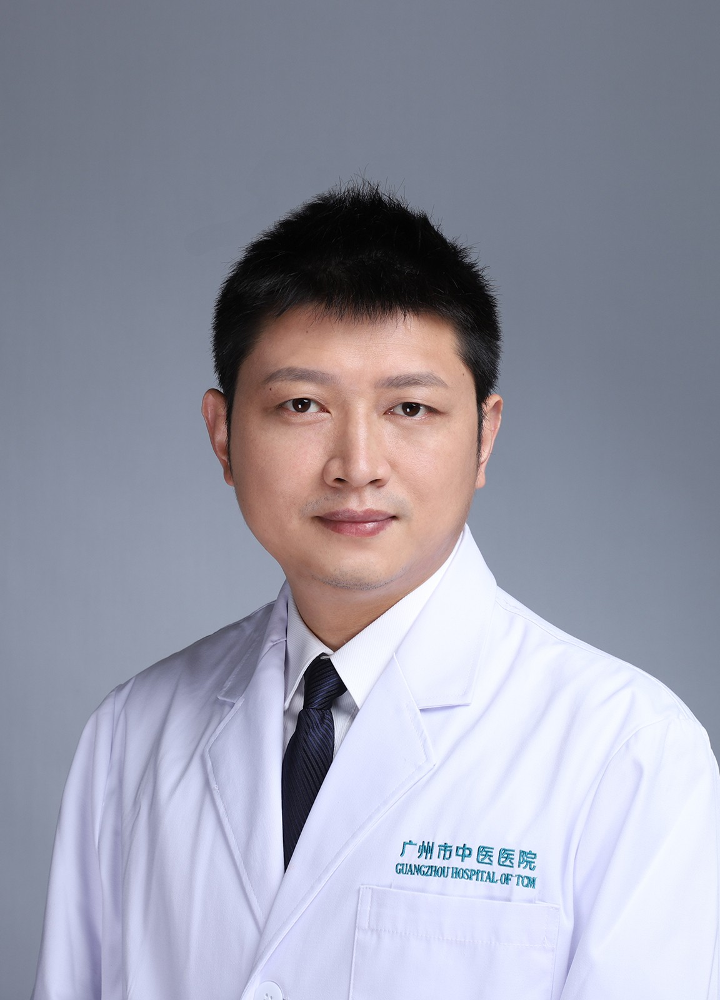

<!-- AUTO-GENERATED-BY: work/generate_obsidian_profiles.py -->

<!-- TEMPLATE: D:\workspace\信息收集整理\医生画像仓库\模板\医生画像模板.md -->

# 田天照

## 基础信息

| 字段 | 内容 |
|---|---|
| 姓名 | 田天照 |
| 医院 | 广州市中医院 |
| 科室 | 骨伤科 |
| 职称/身份 | 副主任中医师 |
| 来源链接 | [官网原文](https://www.gzszyy.com/expert/2026/xkazK8bJ.html) |
| 采集日期 | 2026-08-13 |

## 简介/擅长

各种骨关节疾病的诊断及微创治疗，如髋、膝关节炎、髋关节发育不良、成人及小儿股骨头坏死、各种运动损伤等，善于运用关节镜治疗膝交叉韧带断裂、半月板损伤、软骨损伤、肩袖损伤、盂唇损伤、肩关节脱位、踝关节损伤等；熟练运用人工关节置换手术治疗髋、膝、肩关节疾病。擅用正骨理筋手法治疗伤科疾病。

## 教育与进修经历

- 骨伤科 博士，现任中华康复医学会骨与关节及风湿病分会委员，中国中医药研究促进会 骨伤科 分会委员，广东省中医药学会运动医学分会委员，广东省中西医结合关节专业学组委员，广州市 120 指挥中心院前急救技能培训师资。

## 科研项目与成果

- 主持市级课题 1 项，参与国家、省级科研课题各两项，以第一作者公开发表学术论文 6 篇，其中 SCI1 篇。

## 论文与学术产出

- 主持市级课题 1 项，参与国家、省级科研课题各两项，以第一作者公开发表学术论文 6 篇，其中 SCI1 篇。

## 可包装亮点

- 骨伤科 博士，现任中华康复医学会骨与关节及风湿病分会委员，中国中医药研究促进会 骨伤科 分会委员，广东省中医药学会运动医学分会委员，广东省中西医结合关节专业学组委员，广州市 120 指挥中心院前急救技能培训师资。
- 主持市级课题 1 项，参与国家、省级科研课题各两项，以第一作者公开发表学术论文 6 篇，其中 SCI1 篇。

## 重点疾病/人群标签

- 慢性病：
- 肿瘤：
- 生殖疾病：
- 免疫/风湿：风湿、康复
- 术后恢复/康复：风湿、康复
- 疑难重症：

## 证据摘录

> 只摘录官网公开信息中的短句或关键字段，不复制大段原文。

- 官网身份字段：副主任中医师
- 官网简介/擅长：各种骨关节疾病的诊断及微创治疗，如髋、膝关节炎、髋关节发育不良、成人及小儿股骨头坏死、各种运动损伤等，善于运用关节镜治疗膝交叉韧带断裂、半月板损伤、软骨损伤、肩袖损伤、盂唇损伤、肩关节脱位、踝关节损伤等；熟练运用人工关节置换手术治疗髋、膝、肩关节疾病。擅用正骨理筋手法治疗伤科疾病。
- 官网亮眼经历线索：骨伤科 博士，现任中华康复医学会骨与关节及风湿病分会委员，中国中医药研究促进会 骨伤科 分会委员，广东省中医药学会运动医学分会委员，广东省中西医结合关节专业学组委员，广州市 120 指挥中心院前急救技能培训师资。 主持市级课题 1 项，参与国家、省级科研课题各两项，以第一作者公开发表学术论文 6 篇，其中 SCI1 篇。
- 来源链接：https://www.gzszyy.com/expert/2026/xkazK8bJ.html

## BD 画像摘要

田天照医生可作为免疫/风湿/感染、术后恢复/康复方向的基础画像候选。后续 BD 使用应继续以官网来源和人工复核为准，不添加疗效承诺或无来源包装。

## 合规边界

- 仅使用医院官网、官方公众号、官方小程序等公开渠道。
- 不采集私人电话、私人微信、家庭住址、患者隐私或非公开排班信息。
- 不写“保证治愈”“疗效第一”“包治疑难杂症”等无法由官网证明的表述。
