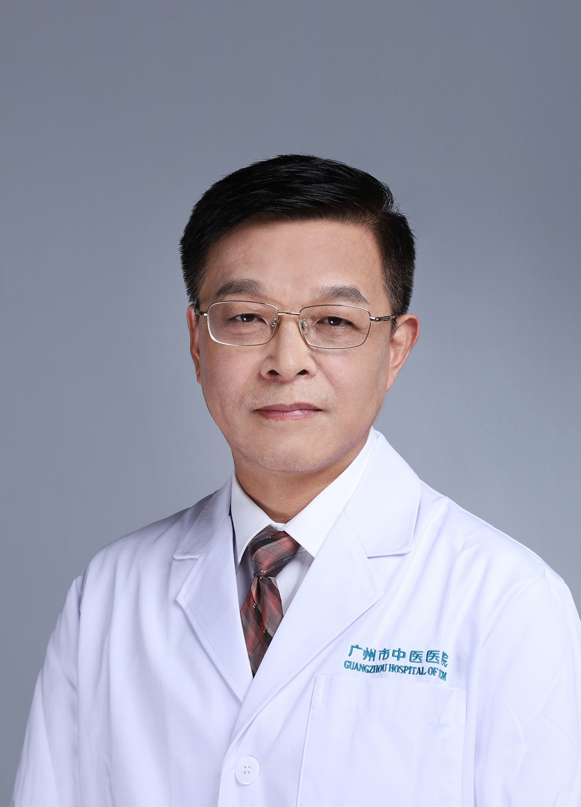

<!-- AUTO-GENERATED-BY: work/generate_obsidian_profiles.py -->

<!-- TEMPLATE: D:\workspace\信息收集整理\医生画像仓库\模板\医生画像模板.md -->

# 祝维峰

## 基础信息

| 字段 | 内容 |
|---|---|
| 姓名 | 祝维峰 |
| 医院 | 广州市中医院 |
| 科室 | 名医堂 |
| 职称/身份 | 主任中医师 |
| 来源链接 | [官网原文](https://www.gzszyy.com/expert/2026/oQeZ6Jep.html) |
| 采集日期 | 2026-08-13 |

## 简介/擅长

于失眠（睡眠障碍、焦虑）、中风（脑血管病）、头痛、颈腰腿痛（颈椎、腰椎病）、眩晕、颤证（帕金森）、痴呆、健忘、胸痹（冠心病）等内科疾病的治疗。

## 科研项目与成果

- 从事中西医结合临床、科研及教学工作三十余年，擅长于失眠、中风、头痛、眩晕、颤证、痴呆、胸痹、心悸等内科疾病的治疗，曾主持、参与国家、省、市科研课题十余项，主编、副主编学术著作十部，发表学术论文三十余篇。

## 论文与学术产出

- 从事中西医结合临床、科研及教学工作三十余年，擅长于失眠、中风、头痛、眩晕、颤证、痴呆、胸痹、心悸等内科疾病的治疗，曾主持、参与国家、省、市科研课题十余项，主编、副主编学术著作十部，发表学术论文三十余篇。

## 可包装亮点

- 医学博士 广东省名中医 主任中医师 广州中医药大学教授 博士研究生导师 广州医科大学附属中医医院院长 国家中医药管理局“十二五”重点专科负责人，国家中医药管理局第三批全国优秀中医临床人才。
- 兼任广州市中医药学会会长 ， 广东省中医药学会副会长，广东省中西医结合学会常务理事，广东省中西医结合学会神经病专业委员会副主任委员，广东省中医药学会老年病专业委员会副主任委员，广东省中医药学会标准化专业委员会副主任委员等。
- 从事中西医结合临床、科研及教学工作三十余年，擅长于失眠、中风、头痛、眩晕、颤证、痴呆、胸痹、心悸等内科疾病的治疗，曾主持、参与国家、省、市科研课题十余项，主编、副主编学术著作十部，发表学术论文三十余篇。

## 重点疾病/人群标签

- 慢性病：冠心病
- 肿瘤：
- 生殖疾病：
- 免疫/风湿：
- 术后恢复/康复：
- 疑难重症：

## 证据摘录

> 只摘录官网公开信息中的短句或关键字段，不复制大段原文。

- 官网身份字段：主任中医师
- 官网简介/擅长：于失眠（睡眠障碍、焦虑）、中风（脑血管病）、头痛、颈腰腿痛（颈椎、腰椎病）、眩晕、颤证（帕金森）、痴呆、健忘、胸痹（冠心病）等内科疾病的治疗。
- 官网亮眼经历线索：医学博士 广东省名中医 主任中医师 广州中医药大学教授 博士研究生导师 广州医科大学附属中医医院院长 国家中医药管理局“十二五”重点专科负责人，国家中医药管理局第三批全国优秀中医临床人才。 兼任广州市中医药学会会长 ， 广东省中医药学会副会长，广东省中西医结合学会常务理事，广东省中西医结合学会神经病专业委员会副主任委员，广东省中医药学会老年病专业委员会副主任委员，广东省中医药学会标准化专业委员会副主任委员等。 从事中西医结合临床、科研…
- 来源链接：https://www.gzszyy.com/expert/2026/oQeZ6Jep.html

## BD 画像摘要

祝维峰医生可作为慢性病方向的基础画像候选。后续 BD 使用应继续以官网来源和人工复核为准，不添加疗效承诺或无来源包装。

## 合规边界

- 仅使用医院官网、官方公众号、官方小程序等公开渠道。
- 不采集私人电话、私人微信、家庭住址、患者隐私或非公开排班信息。
- 不写“保证治愈”“疗效第一”“包治疑难杂症”等无法由官网证明的表述。
