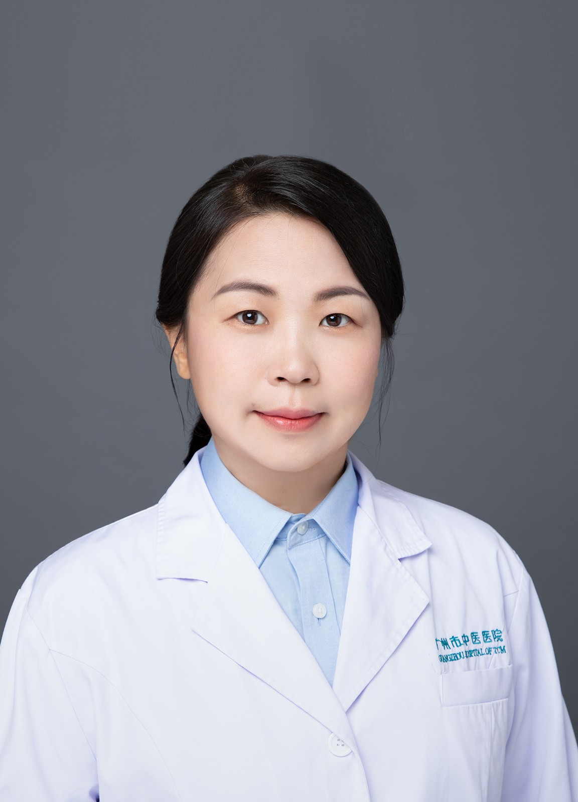

<!-- AUTO-GENERATED-BY: work/generate_obsidian_profiles.py -->

<!-- TEMPLATE: D:\workspace\信息收集整理\医生画像仓库\模板\医生画像模板.md -->

# 秦棱

## 基础信息

| 字段 | 内容 |
|---|---|
| 姓名 | 秦棱 |
| 医院 | 广州市中医院 |
| 科室 | 内分泌科 |
| 职称/身份 | 主治医师 |
| 来源链接 | [官网原文](https://www.gzszyy.com/expert/2026/J0dN8KaL.html) |
| 采集日期 | 2026-08-13 |

## 简介/擅长

熟悉各种内分泌疾病的诊断与治疗，尤其擅长糖尿病及其各种并发症（糖尿病足、糖尿病周围神经病变、糖尿病肾病）、甲状腺疾病、痛风、血脂异常、骨质疏松症、骨代谢疾病等的诊治。

## 教育与进修经历

- 规培秘书， 医学硕士，毕业于广州中医药大学，中西医结合临床，内分泌专业。
- 毕业后一直在广州市中医医院 内分泌科 从事医学临床及相关科研工作。
- 2015年在上海市第六人民医院内分泌代谢科及骨质疏松和骨病专科进修。

## 科研项目与成果

- 毕业后一直在广州市中医医院 内分泌科 从事医学临床及相关科研工作。

## 可包装亮点

- 2015年在上海市第六人民医院内分泌代谢科及骨质疏松和骨病专科进修。

## 重点疾病/人群标签

- 慢性病：糖尿病、代谢
- 肿瘤：
- 生殖疾病：
- 免疫/风湿：
- 术后恢复/康复：
- 疑难重症：

## 证据摘录

> 只摘录官网公开信息中的短句或关键字段，不复制大段原文。

- 官网身份字段：主治医师
- 官网简介/擅长：熟悉各种内分泌疾病的诊断与治疗，尤其擅长糖尿病及其各种并发症（糖尿病足、糖尿病周围神经病变、糖尿病肾病）、甲状腺疾病、痛风、血脂异常、骨质疏松症、骨代谢疾病等的诊治。
- 官网亮眼经历线索：2015年在上海市第六人民医院内分泌代谢科及骨质疏松和骨病专科进修。
- 来源链接：https://www.gzszyy.com/expert/2026/J0dN8KaL.html

## BD 画像摘要

秦棱医生可作为慢性病方向的基础画像候选。后续 BD 使用应继续以官网来源和人工复核为准，不添加疗效承诺或无来源包装。

## 合规边界

- 仅使用医院官网、官方公众号、官方小程序等公开渠道。
- 不采集私人电话、私人微信、家庭住址、患者隐私或非公开排班信息。
- 不写“保证治愈”“疗效第一”“包治疑难杂症”等无法由官网证明的表述。
