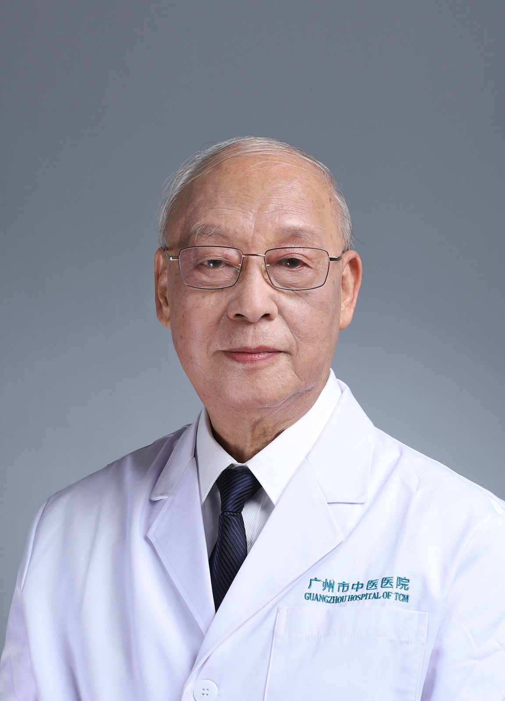

<!-- AUTO-GENERATED-BY: work/generate_obsidian_profiles.py -->

<!-- TEMPLATE: D:\workspace\信息收集整理\医生画像仓库\模板\医生画像模板.md -->

# 罗永佳

## 基础信息

| 字段 | 内容 |
|---|---|
| 姓名 | 罗永佳 |
| 医院 | 广州市中医院 |
| 科室 | 名医堂 |
| 职称/身份 | 主任中医师 |
| 来源链接 | [官网原文](https://www.gzszyy.com/expert/2026/nXe0LGex.html) |
| 采集日期 | 2026-08-13 |

## 简介/擅长

四肢血管疾病

## 教育与进修经历

- 1965年毕业于广州中医药大学。

## 可包装亮点

- 曾任广州市中医医院院长、全国中西医结合学会周围血管疾病专业委员会副主任委员。
- 罗永佳 出身中医世家，外祖父何竹林、父亲罗广荫、姐姐罗笑容均为饮誉岭南的“省市名中医”，故有“一门四名医”之美称。
- 对骨关节炎、颈腰腿痛、腰突症、坐骨神经痛、呼吸系统、消化系统疾病、不孕不育症、更年期综合征、抑郁症、焦虑症、睡眠障碍、老人病等疑难疾病的治疗效果明显。

## 重点疾病/人群标签

- 慢性病：
- 肿瘤：
- 生殖疾病：不孕、营养、疑难
- 免疫/风湿：
- 术后恢复/康复：不孕、营养、疑难
- 疑难重症：不孕、营养、疑难

## 证据摘录

> 只摘录官网公开信息中的短句或关键字段，不复制大段原文。

- 官网身份字段：主任中医师
- 官网简介/擅长：四肢血管疾病
- 官网亮眼经历线索：曾任广州市中医医院院长、全国中西医结合学会周围血管疾病专业委员会副主任委员。 罗永佳 出身中医世家，外祖父何竹林、父亲罗广荫、姐姐罗笑容均为饮誉岭南的“省市名中医”，故有“一门四名医”之美称。 对骨关节炎、颈腰腿痛、腰突症、坐骨神经痛、呼吸系统、消化系统疾病、不孕不育症、更年期综合征、抑郁症、焦虑症、睡眠障碍、老人病等疑难疾病的治疗效果明显。
- 来源链接：https://www.gzszyy.com/expert/2026/nXe0LGex.html

## BD 画像摘要

罗永佳医生可作为生殖疾病、术后恢复/康复、疑难重症方向的基础画像候选。后续 BD 使用应继续以官网来源和人工复核为准，不添加疗效承诺或无来源包装。

## 合规边界

- 仅使用医院官网、官方公众号、官方小程序等公开渠道。
- 不采集私人电话、私人微信、家庭住址、患者隐私或非公开排班信息。
- 不写“保证治愈”“疗效第一”“包治疑难杂症”等无法由官网证明的表述。
