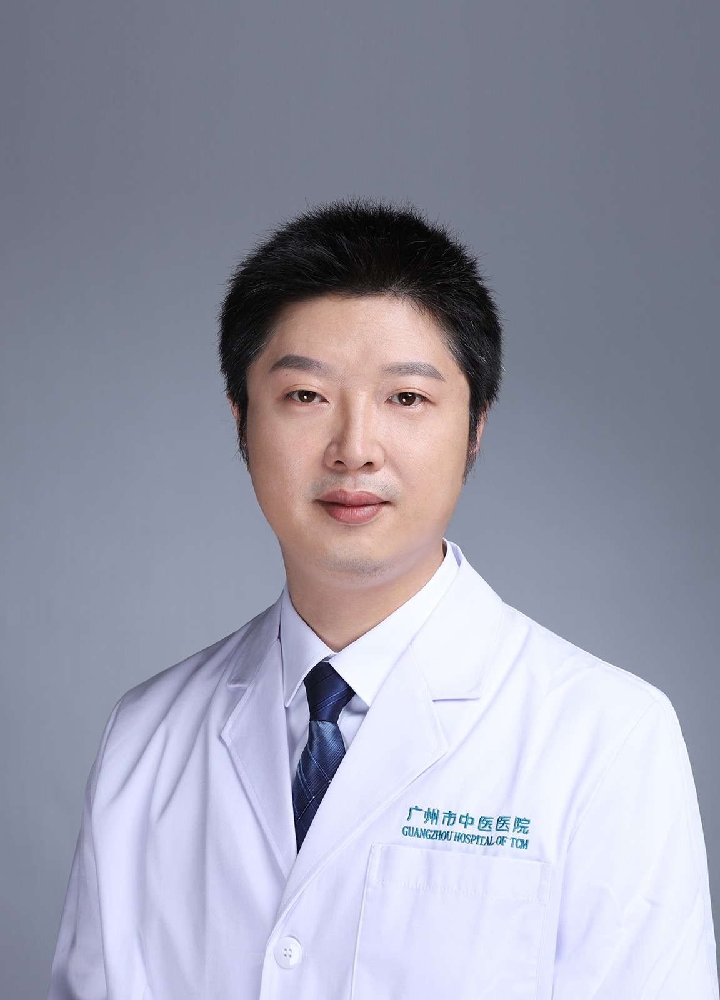

<!-- AUTO-GENERATED-BY: work/generate_obsidian_profiles.py -->

<!-- TEMPLATE: D:\workspace\信息收集整理\医生画像仓库\模板\医生画像模板.md -->

# 翁旭亮

## 基础信息

| 字段 | 内容 |
|---|---|
| 姓名 | 翁旭亮 |
| 医院 | 广州市中医院 |
| 科室 | 脑病科（神经内科） |
| 职称/身份 | 副主任中医师 |
| 来源链接 | [官网原文](https://www.gzszyy.com/expert/2026/y5eVMdEP.html) |
| 采集日期 | 2026-08-13 |

## 简介/擅长

治疗脑血管疾病、头痛、头晕、颤震、失眠、重症肌无力等疾病。

## 教育与进修经历

- 毕业于江西中医学院，硕士研究生学历，毕业后一直从事脑病科工作，广东省首批名医师承学员，第六批全国名老中医药专家学术经验继承工作学员，广东省中西结合学会神经科专业委员会委员，广东省中西医结合学会心血管病预防专业委员会委员，广东省中西医结合学会神经肌肉与临床神经电生理学会委员。

## 可包装亮点

- 毕业于江西中医学院，硕士研究生学历，毕业后一直从事脑病科工作，广东省首批名医师承学员，第六批全国名老中医药专家学术经验继承工作学员，广东省中西结合学会神经科专业委员会委员，广东省中西医结合学会心血管病预防专业委员会委员，广东省中西医结合学会神经肌肉与临床神经电生理学会委员。

## 重点疾病/人群标签

- 慢性病：
- 肿瘤：
- 生殖疾病：
- 免疫/风湿：
- 术后恢复/康复：
- 疑难重症：重症

## 证据摘录

> 只摘录官网公开信息中的短句或关键字段，不复制大段原文。

- 官网身份字段：副主任中医师
- 官网简介/擅长：治疗脑血管疾病、头痛、头晕、颤震、失眠、重症肌无力等疾病。
- 官网亮眼经历线索：毕业于江西中医学院，硕士研究生学历，毕业后一直从事脑病科工作，广东省首批名医师承学员，第六批全国名老中医药专家学术经验继承工作学员，广东省中西结合学会神经科专业委员会委员，广东省中西医结合学会心血管病预防专业委员会委员，广东省中西医结合学会神经肌肉与临床神经电生理学会委员。
- 来源链接：https://www.gzszyy.com/expert/2026/y5eVMdEP.html

## BD 画像摘要

翁旭亮医生可作为疑难重症方向的基础画像候选。后续 BD 使用应继续以官网来源和人工复核为准，不添加疗效承诺或无来源包装。

## 合规边界

- 仅使用医院官网、官方公众号、官方小程序等公开渠道。
- 不采集私人电话、私人微信、家庭住址、患者隐私或非公开排班信息。
- 不写“保证治愈”“疗效第一”“包治疑难杂症”等无法由官网证明的表述。
