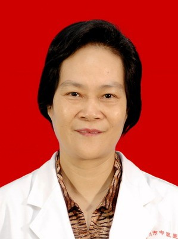

<!-- AUTO-GENERATED-BY: work/generate_obsidian_profiles.py -->

<!-- TEMPLATE: D:\workspace\信息收集整理\医生画像仓库\模板\医生画像模板.md -->

# 苏丽玲

## 基础信息

| 字段 | 内容 |
|---|---|
| 姓名 | 苏丽玲 |
| 医院 | 广州市中医院 |
| 科室 | 肺病科（呼吸内科） |
| 职称/身份 | 副主任医师 |
| 来源链接 | [官网原文](https://www.gzszyy.com/expert/2026/YqaQOqdn.html) |
| 采集日期 | 2026-08-13 |

## 简介/擅长

中西结合治疗呼吸系统急，慢性支气管炎，哮喘，支气管扩张感染并咯血，慢性阻塞性肺疾病，过敏性鼻炎，慢性咳嗽等常见病，多发病，肺康复等。准确运用体质辨识的标准，对人体健康之路的宏观，纵观，微观管理，达到防治疾病，提高人体免疫力和自愈能力，帮助康复等目的。

## 教育与进修经历

- 曾任呼吸科主任， 体检科 、 治未病科 主任 1980年毕业于广州医科大学医疗系，参加系统的中医培训学习，基本功扎实，一直在临床一线工作，积累了丰富的临床经验，熟练运用中西结合方法治疗呼吸系统常见病：哮喘，慢性阻塞性肺疾病，肺炎，支气管扩张合并感染及咯血，过敏性鼻炎，慢性咳嗽，肺癌的治疗。

## 可包装亮点

- 曾任呼吸科主任， 体检科 、 治未病科 主任 1980年毕业于广州医科大学医疗系，参加系统的中医培训学习，基本功扎实，一直在临床一线工作，积累了丰富的临床经验，熟练运用中西结合方法治疗呼吸系统常见病：哮喘，慢性阻塞性肺疾病，肺炎，支气管扩张合并感染及咯血，过敏性鼻炎，慢性咳嗽，肺癌的治疗。

## 重点疾病/人群标签

- 慢性病：慢性、肺癌、免疫、感染、康复
- 肿瘤：慢性、肺癌、免疫、感染、康复
- 生殖疾病：
- 免疫/风湿：慢性、肺癌、免疫、感染、康复
- 术后恢复/康复：慢性、肺癌、免疫、感染、康复
- 疑难重症：

## 证据摘录

> 只摘录官网公开信息中的短句或关键字段，不复制大段原文。

- 官网身份字段：副主任医师
- 官网简介/擅长：中西结合治疗呼吸系统急，慢性支气管炎，哮喘，支气管扩张感染并咯血，慢性阻塞性肺疾病，过敏性鼻炎，慢性咳嗽等常见病，多发病，肺康复等。准确运用体质辨识的标准，对人体健康之路的宏观，纵观，微观管理，达到防治疾病，提高人体免疫力和自愈能力，帮助康复等目的。
- 官网亮眼经历线索：曾任呼吸科主任， 体检科 、 治未病科 主任 1980年毕业于广州医科大学医疗系，参加系统的中医培训学习，基本功扎实，一直在临床一线工作，积累了丰富的临床经验，熟练运用中西结合方法治疗呼吸系统常见病：哮喘，慢性阻塞性肺疾病，肺炎，支气管扩张合并感染及咯血，过敏性鼻炎，慢性咳嗽，肺癌的治疗。
- 来源链接：https://www.gzszyy.com/expert/2026/YqaQOqdn.html

## BD 画像摘要

苏丽玲医生可作为慢性病、肿瘤、免疫/风湿/感染、术后恢复/康复方向的基础画像候选。后续 BD 使用应继续以官网来源和人工复核为准，不添加疗效承诺或无来源包装。

## 合规边界

- 仅使用医院官网、官方公众号、官方小程序等公开渠道。
- 不采集私人电话、私人微信、家庭住址、患者隐私或非公开排班信息。
- 不写“保证治愈”“疗效第一”“包治疑难杂症”等无法由官网证明的表述。
