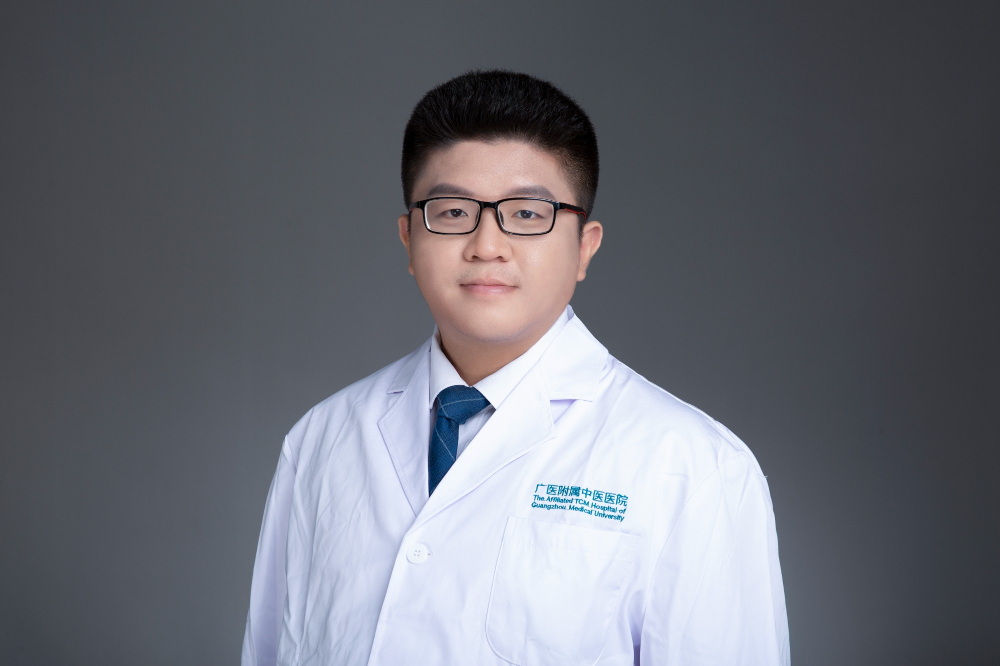

<!-- AUTO-GENERATED-BY: work/generate_obsidian_profiles.py -->

<!-- TEMPLATE: D:\workspace\信息收集整理\医生画像仓库\模板\医生画像模板.md -->

# 蔡松

## 基础信息

| 字段 | 内容 |
|---|---|
| 姓名 | 蔡松 |
| 医院 | 广州市中医院 |
| 科室 | 肺病科（呼吸内科） |
| 职称/身份 | 主治中医师 |
| 来源链接 | [官网原文](https://www.gzszyy.com/expert/2026/APdR8zaG.html) |
| 采集日期 | 2026-08-13 |

## 简介/擅长

善于运用中西医方法治疗感冒、急慢性咳嗽、肺炎、慢性阻塞性肺疾病、支气管哮喘、支气管扩张、间质性肺病等呼吸科疾病，并擅长运用中医方法治疗鼻炎、失眠等其他系统疾病。

## 科研项目与成果

- 曾参与国家自然科学基金课题2项，发表SCI论文2篇，以第一作者发表中文核心期刊论文5篇。

## 论文与学术产出

- 曾参与国家自然科学基金课题2项，发表SCI论文2篇，以第一作者发表中文核心期刊论文5篇。

## 可包装亮点

- 曾参与国家自然科学基金课题2项，发表SCI论文2篇，以第一作者发表中文核心期刊论文5篇。
- 广东省中西结合学会呼吸专业委员会委员，广东省药学会第二届变态反应专家委员会委员。

## 重点疾病/人群标签

- 慢性病：慢性
- 肿瘤：
- 生殖疾病：
- 免疫/风湿：
- 术后恢复/康复：
- 疑难重症：

## 证据摘录

> 只摘录官网公开信息中的短句或关键字段，不复制大段原文。

- 官网身份字段：主治中医师
- 官网简介/擅长：善于运用中西医方法治疗感冒、急慢性咳嗽、肺炎、慢性阻塞性肺疾病、支气管哮喘、支气管扩张、间质性肺病等呼吸科疾病，并擅长运用中医方法治疗鼻炎、失眠等其他系统疾病。
- 官网亮眼经历线索：曾参与国家自然科学基金课题2项，发表SCI论文2篇，以第一作者发表中文核心期刊论文5篇。 广东省中西结合学会呼吸专业委员会委员，广东省药学会第二届变态反应专家委员会委员。
- 来源链接：https://www.gzszyy.com/expert/2026/APdR8zaG.html

## BD 画像摘要

蔡松医生可作为慢性病方向的基础画像候选。后续 BD 使用应继续以官网来源和人工复核为准，不添加疗效承诺或无来源包装。

## 合规边界

- 仅使用医院官网、官方公众号、官方小程序等公开渠道。
- 不采集私人电话、私人微信、家庭住址、患者隐私或非公开排班信息。
- 不写“保证治愈”“疗效第一”“包治疑难杂症”等无法由官网证明的表述。
