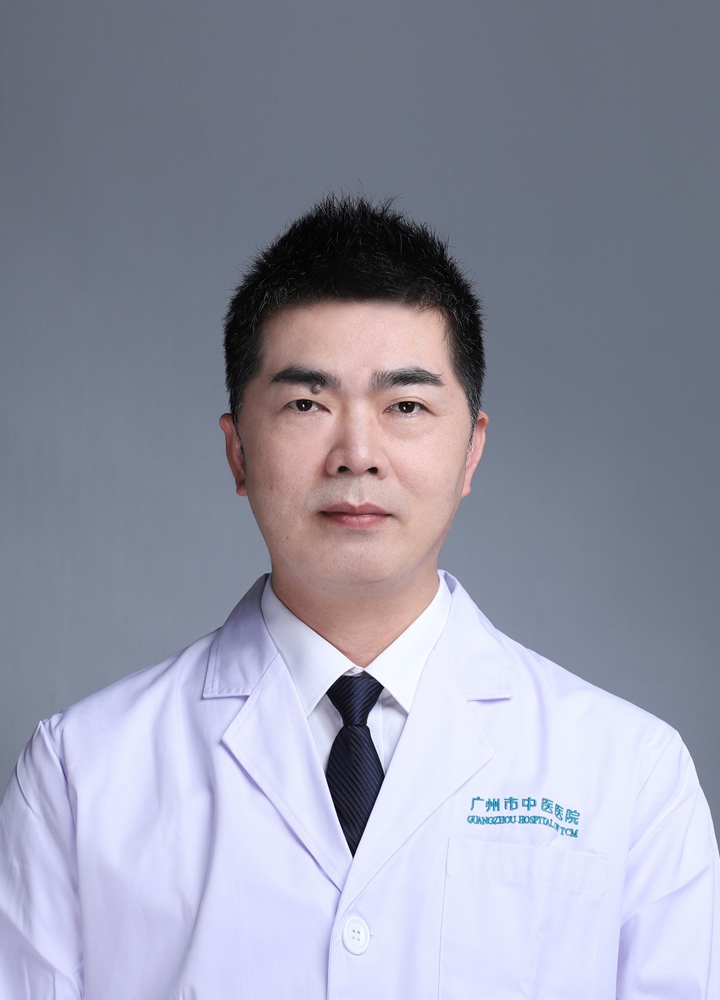

<!-- AUTO-GENERATED-BY: work/generate_obsidian_profiles.py -->

<!-- TEMPLATE: D:\workspace\信息收集整理\医生画像仓库\模板\医生画像模板.md -->

# 蔡迎峰

## 基础信息

| 字段 | 内容 |
|---|---|
| 姓名 | 蔡迎峰 |
| 医院 | 广州市中医院 |
| 科室 | 名医堂、骨伤科 |
| 职称/身份 | 主任中医师 |
| 来源链接 | [官网原文](https://www.gzszyy.com/expert/2026/X7axvrdy.html) |
| 采集日期 | 2026-08-13 |

## 简介/擅长

骨伤科疑难疾病的诊治及各种复杂、精细骨科手术。精于各种脊柱外科手术、微创脊柱外科手术及髋膝关节置换手术。在运用中医药方法治疗各种骨折、脱位、颈腰椎间盘突出、骨关节疾病较有丰富经验。

## 科研项目与成果

- 参与编撰专业著作 1 部，拥有实用型专利技术 1 项，发表各类学术论文多篇，主持参与国家级自然基金课题 1 项，省、市级课题多项。

## 论文与学术产出

- 参与编撰专业著作 1 部，拥有实用型专利技术 1 项，发表各类学术论文多篇，主持参与国家级自然基金课题 1 项，省、市级课题多项。

## 可包装亮点

- 广东省名中医，主任中医师 广东省第二批中医临床优秀人才，广州市第二批优秀中医临床人才，师从广东省名中医刘金文教授。
- 广东省基层医药学会中西医结合八法正骨分会副会长、世界中医药联合会 骨伤科 专业委员会常务理事。
- 擅长 骨伤科 疑难疾病的诊治及各种复杂、精细骨科手术。
- 参与编撰专业著作 1 部，拥有实用型专利技术 1 项，发表各类学术论文多篇，主持参与国家级自然基金课题 1 项，省、市级课题多项。

## 重点疾病/人群标签

- 慢性病：
- 肿瘤：
- 生殖疾病：
- 免疫/风湿：
- 术后恢复/康复：
- 疑难重症：疑难、复杂

## 证据摘录

> 只摘录官网公开信息中的短句或关键字段，不复制大段原文。

- 官网身份字段：主任中医师
- 官网简介/擅长：骨伤科疑难疾病的诊治及各种复杂、精细骨科手术。精于各种脊柱外科手术、微创脊柱外科手术及髋膝关节置换手术。在运用中医药方法治疗各种骨折、脱位、颈腰椎间盘突出、骨关节疾病较有丰富经验。
- 官网亮眼经历线索：广东省名中医，主任中医师 广东省第二批中医临床优秀人才，广州市第二批优秀中医临床人才，师从广东省名中医刘金文教授。 广东省基层医药学会中西医结合八法正骨分会副会长、世界中医药联合会 骨伤科 专业委员会常务理事。 擅长 骨伤科 疑难疾病的诊治及各种复杂、精细骨科手术。 参与编撰专业著作 1 部，拥有实用型专利技术 1 项，发表各类学术论文多篇，主持参与国家级自然基金课题 1 项，省、市级课题多项。
- 来源链接：https://www.gzszyy.com/expert/2026/X7axvrdy.html

## BD 画像摘要

蔡迎峰医生可作为疑难重症方向的基础画像候选。后续 BD 使用应继续以官网来源和人工复核为准，不添加疗效承诺或无来源包装。

## 合规边界

- 仅使用医院官网、官方公众号、官方小程序等公开渠道。
- 不采集私人电话、私人微信、家庭住址、患者隐私或非公开排班信息。
- 不写“保证治愈”“疗效第一”“包治疑难杂症”等无法由官网证明的表述。
