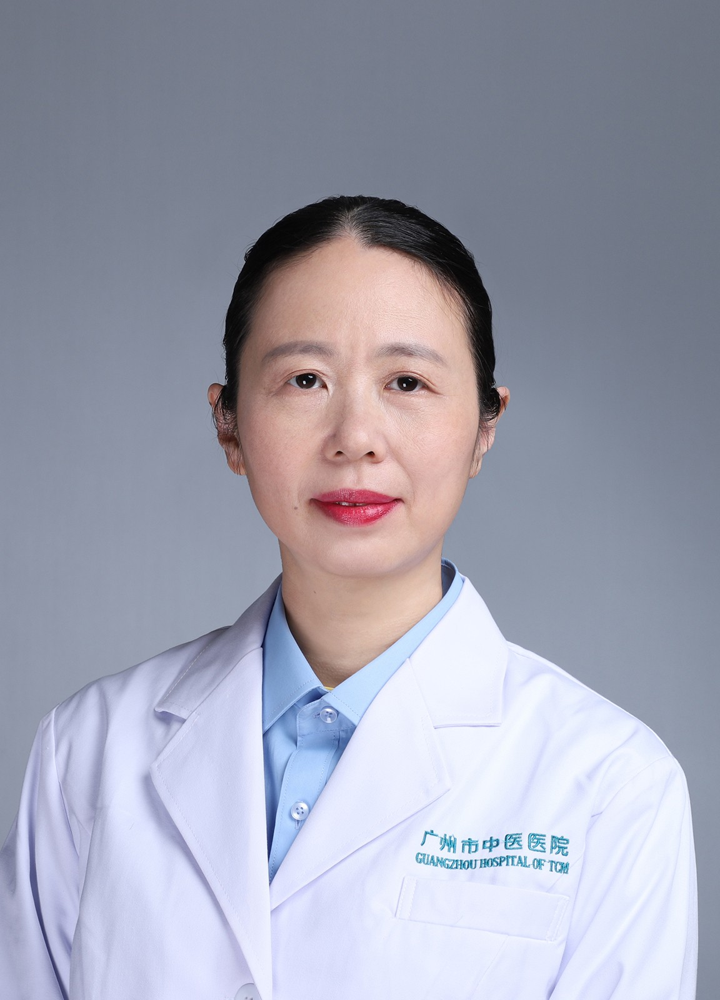

<!-- AUTO-GENERATED-BY: work/generate_obsidian_profiles.py -->

<!-- TEMPLATE: D:\workspace\信息收集整理\医生画像仓库\模板\医生画像模板.md -->

# 许幸仪

## 基础信息

| 字段 | 内容 |
|---|---|
| 姓名 | 许幸仪 |
| 医院 | 广州市中医院 |
| 科室 | 脑病科（神经内科）、体检科 |
| 职称/身份 | 主任中医师 |
| 来源链接 | [官网原文](https://www.gzszyy.com/expert/2026/WZdPwbKg.html) |
| 采集日期 | 2026-08-13 |

## 简介/擅长

脑血管病，睡眠障碍，帕金森病，周围神经病等中西医结合诊治。

## 教育与进修经历

- 97年毕业于广州中医药大学，在广州市中医院脑病科工作。

## 可包装亮点

- 广东省首批名医师承学员，广东省中医药学会脑病专业委员会第四届委员会会员，广东省中西医结合学会神经肌肉病及神经电生理专业委员会第一届委员会委员等。

## 重点疾病/人群标签

- 慢性病：
- 肿瘤：
- 生殖疾病：
- 免疫/风湿：
- 术后恢复/康复：
- 疑难重症：

## 证据摘录

> 只摘录官网公开信息中的短句或关键字段，不复制大段原文。

- 官网身份字段：主任中医师
- 官网简介/擅长：脑血管病，睡眠障碍，帕金森病，周围神经病等中西医结合诊治。
- 官网亮眼经历线索：广东省首批名医师承学员，广东省中医药学会脑病专业委员会第四届委员会会员，广东省中西医结合学会神经肌肉病及神经电生理专业委员会第一届委员会委员等。
- 来源链接：https://www.gzszyy.com/expert/2026/WZdPwbKg.html

## BD 画像摘要

许幸仪医生可作为广州市中医院脑病科（神经内科）、体检科的基础医生资料入库。当前重点方向以总底表标签为准，官网未展示的信息保持空白。

## 合规边界

- 仅使用医院官网、官方公众号、官方小程序等公开渠道。
- 不采集私人电话、私人微信、家庭住址、患者隐私或非公开排班信息。
- 不写“保证治愈”“疗效第一”“包治疑难杂症”等无法由官网证明的表述。
