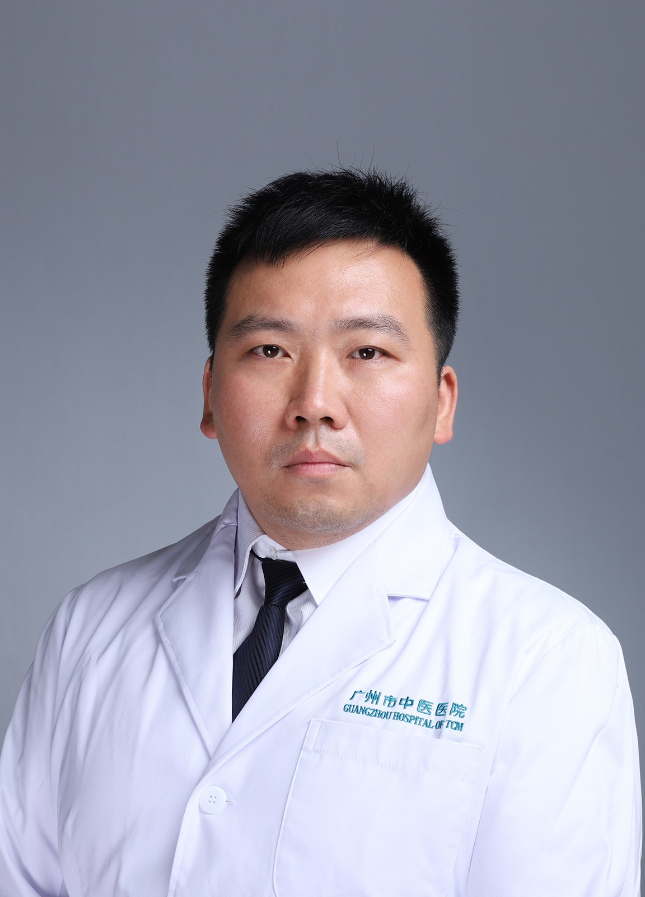

<!-- AUTO-GENERATED-BY: work/generate_obsidian_profiles.py -->

<!-- TEMPLATE: D:\workspace\信息收集整理\医生画像仓库\模板\医生画像模板.md -->

# 赖振辉

## 基础信息

| 字段 | 内容 |
|---|---|
| 姓名 | 赖振辉 |
| 医院 | 广州市中医院 |
| 科室 | 医学影像科 |
| 职称/身份 | 主治医师 |
| 来源链接 | [官网原文](https://www.gzszyy.com/expert/2026/X7ax1nby.html) |
| 采集日期 | 2026-08-13 |

## 简介/擅长

胸腹部及四肢疾病X线、CT、MRI诊断，主要研究方向为血管系统及泌尿系统影像诊断。

## 教育与进修经历

- 毕业于广州医科大学医学影像系，从事放射科工作、科研、教学十余年，擅长胸腹部及四肢疾病 X 线、 CT 、 MRI 诊断，主要研究方向为血管系统及泌尿系统影像诊断。

## 科研项目与成果

- 毕业于广州医科大学医学影像系，从事放射科工作、科研、教学十余年，擅长胸腹部及四肢疾病 X 线、 CT 、 MRI 诊断，主要研究方向为血管系统及泌尿系统影像诊断。
- 参与广东省、广州市多项科研项目，在国内医学期刊发表多篇专业医学论文。

## 论文与学术产出

- 参与广东省、广州市多项科研项目，在国内医学期刊发表多篇专业医学论文。

## 可包装亮点

- 参与广东省、广州市多项科研项目，在国内医学期刊发表多篇专业医学论文。
- 现任广东省中西医结合学会影像专业委员会委员。

## 重点疾病/人群标签

- 慢性病：
- 肿瘤：
- 生殖疾病：
- 免疫/风湿：
- 术后恢复/康复：
- 疑难重症：

## 证据摘录

> 只摘录官网公开信息中的短句或关键字段，不复制大段原文。

- 官网身份字段：主治医师
- 官网简介/擅长：胸腹部及四肢疾病X线、CT、MRI诊断，主要研究方向为血管系统及泌尿系统影像诊断。
- 官网亮眼经历线索：参与广东省、广州市多项科研项目，在国内医学期刊发表多篇专业医学论文。 现任广东省中西医结合学会影像专业委员会委员。
- 来源链接：https://www.gzszyy.com/expert/2026/X7ax1nby.html

## BD 画像摘要

赖振辉医生可作为广州市中医院医学影像科的基础医生资料入库。当前重点方向以总底表标签为准，官网未展示的信息保持空白。

## 合规边界

- 仅使用医院官网、官方公众号、官方小程序等公开渠道。
- 不采集私人电话、私人微信、家庭住址、患者隐私或非公开排班信息。
- 不写“保证治愈”“疗效第一”“包治疑难杂症”等无法由官网证明的表述。
