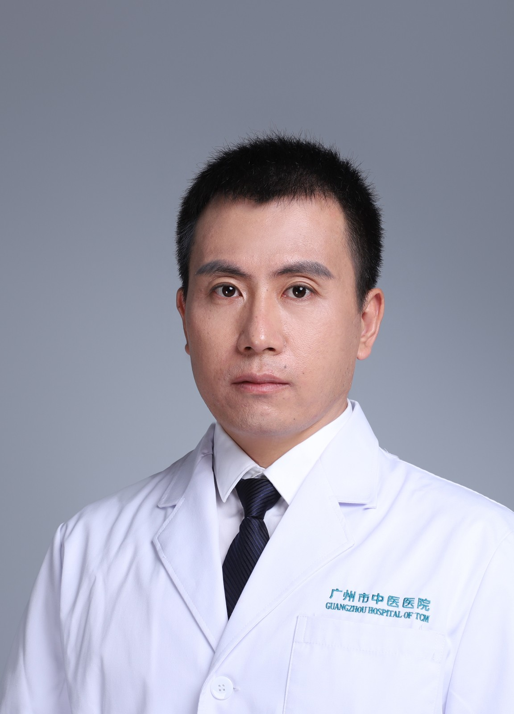

<!-- AUTO-GENERATED-BY: work/generate_obsidian_profiles.py -->

<!-- TEMPLATE: D:\workspace\信息收集整理\医生画像仓库\模板\医生画像模板.md -->

# 赵明昂

## 基础信息

| 字段 | 内容 |
|---|---|
| 姓名 | 赵明昂 |
| 医院 | 广州市中医院 |
| 科室 | 针灸康复科、同德综合门诊部 |
| 职称/身份 | 副主任中医师 |
| 来源链接 | [官网原文](https://www.gzszyy.com/expert/2026/J0dNYLbL.html) |
| 采集日期 | 2026-08-13 |

## 简介/擅长

运用各种针灸疗法、推拿正骨手法、灸法、运动罐疗法及中药等，治疗颈椎、胸椎、腰椎疾病、骨盆旋转综合症、脊柱侧弯、肩周炎、膝关节疾病、失眠、过敏性鼻炎、急性扭伤、妇科病（不孕症、月经病等）、男科病（不育症、早泄、阳痿等）、内科杂病、调理亚健康状态及各种痛症。

## 教育与进修经历

- 从事针灸推拿工作10多年，曾在南部战区总医院进修学习“龙氏正脊”法，对脊柱相关疾病有深入研究。

## 可包装亮点

- 广州医科大学附属中医医院同德院区 针灸康复科 业务副主任，副主任中医师，硕士研究生 第九届羊城青年好医生，广东中医药研究促进会针推康复专业委员会委员。
- 从事针灸推拿工作10多年，曾在南部战区总医院进修学习“龙氏正脊”法，对脊柱相关疾病有深入研究。

## 重点疾病/人群标签

- 慢性病：
- 肿瘤：
- 生殖疾病：不孕、月经、康复
- 免疫/风湿：
- 术后恢复/康复：不孕、月经、康复
- 疑难重症：

## 证据摘录

> 只摘录官网公开信息中的短句或关键字段，不复制大段原文。

- 官网身份字段：副主任中医师
- 官网简介/擅长：运用各种针灸疗法、推拿正骨手法、灸法、运动罐疗法及中药等，治疗颈椎、胸椎、腰椎疾病、骨盆旋转综合症、脊柱侧弯、肩周炎、膝关节疾病、失眠、过敏性鼻炎、急性扭伤、妇科病（不孕症、月经病等）、男科病（不育症、早泄、阳痿等）、内科杂病、调理亚健康状态及各种痛症。
- 官网亮眼经历线索：广州医科大学附属中医医院同德院区 针灸康复科 业务副主任，副主任中医师，硕士研究生 第九届羊城青年好医生，广东中医药研究促进会针推康复专业委员会委员。 从事针灸推拿工作10多年，曾在南部战区总医院进修学习“龙氏正脊”法，对脊柱相关疾病有深入研究。
- 来源链接：https://www.gzszyy.com/expert/2026/J0dNYLbL.html

## BD 画像摘要

赵明昂医生可作为生殖疾病、术后恢复/康复方向的基础画像候选。后续 BD 使用应继续以官网来源和人工复核为准，不添加疗效承诺或无来源包装。

## 合规边界

- 仅使用医院官网、官方公众号、官方小程序等公开渠道。
- 不采集私人电话、私人微信、家庭住址、患者隐私或非公开排班信息。
- 不写“保证治愈”“疗效第一”“包治疑难杂症”等无法由官网证明的表述。
