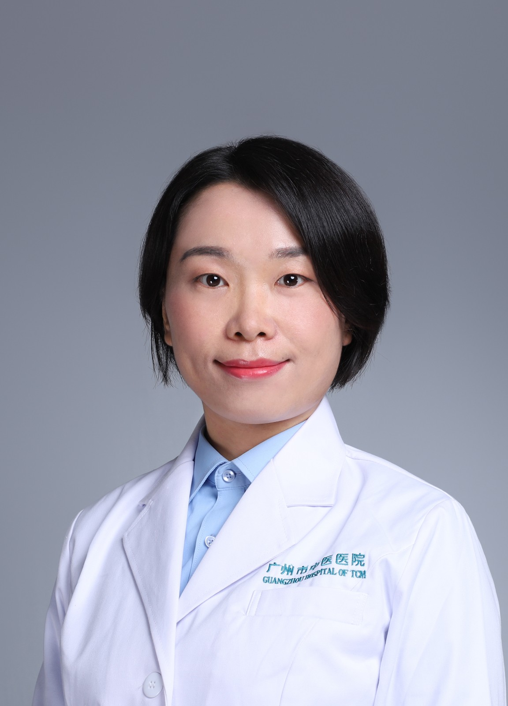

<!-- AUTO-GENERATED-BY: work/generate_obsidian_profiles.py -->

<!-- TEMPLATE: D:\workspace\信息收集整理\医生画像仓库\模板\医生画像模板.md -->

# 郑婕

## 基础信息

| 字段 | 内容 |
|---|---|
| 姓名 | 郑婕 |
| 医院 | 广州市中医院 |
| 科室 | 同德综合门诊部 |
| 职称/身份 | 主任中医师 |
| 来源链接 | [官网原文](https://www.gzszyy.com/expert/2026/N1aMJQbW.html) |
| 采集日期 | 2026-08-13 |

## 简介/擅长

针、药、灸结合治疗颈椎病、失眠、面瘫、头痛、腰腿痛、痛风、中风、呃逆、肥胖、痛经、乳腺增生、更年期综合征、过敏性鼻炎、湿疹、荨麻疹、亚健康等。

## 科研项目与成果

- 主任中医师， 中医博士 广东省第二批名中医学术继承人， 广州市三级名中医传承项目指导老师。

## 可包装亮点

- 广东省人口文化促进会理事、通元疗法临床应用专业委员会常务委员、 广东省针灸学会减肥及内分泌专业委员会常务委员、 广东省中西医结合学会虚证与老年病专业委员会常务委员、 广东省保健协会针灸分会常务委员等。

## 重点疾病/人群标签

- 慢性病：
- 肿瘤：
- 生殖疾病：
- 免疫/风湿：
- 术后恢复/康复：
- 疑难重症：

## 证据摘录

> 只摘录官网公开信息中的短句或关键字段，不复制大段原文。

- 官网身份字段：主任中医师
- 官网简介/擅长：针、药、灸结合治疗颈椎病、失眠、面瘫、头痛、腰腿痛、痛风、中风、呃逆、肥胖、痛经、乳腺增生、更年期综合征、过敏性鼻炎、湿疹、荨麻疹、亚健康等。
- 官网亮眼经历线索：广东省人口文化促进会理事、通元疗法临床应用专业委员会常务委员、 广东省针灸学会减肥及内分泌专业委员会常务委员、 广东省中西医结合学会虚证与老年病专业委员会常务委员、 广东省保健协会针灸分会常务委员等。
- 来源链接：https://www.gzszyy.com/expert/2026/N1aMJQbW.html

## BD 画像摘要

郑婕医生可作为广州市中医院同德综合门诊部的基础医生资料入库。当前重点方向以总底表标签为准，官网未展示的信息保持空白。

## 合规边界

- 仅使用医院官网、官方公众号、官方小程序等公开渠道。
- 不采集私人电话、私人微信、家庭住址、患者隐私或非公开排班信息。
- 不写“保证治愈”“疗效第一”“包治疑难杂症”等无法由官网证明的表述。
