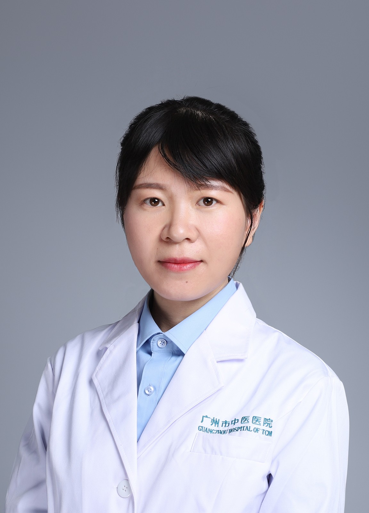

<!-- AUTO-GENERATED-BY: work/generate_obsidian_profiles.py -->

<!-- TEMPLATE: D:\workspace\信息收集整理\医生画像仓库\模板\医生画像模板.md -->

# 闫冉

## 基础信息

| 字段 | 内容 |
|---|---|
| 姓名 | 闫冉 |
| 医院 | 广州市中医院 |
| 科室 | 眼科 |
| 职称/身份 | 主治中医师 |
| 来源链接 | [官网原文](https://www.gzszyy.com/expert/2026/8mep86eM.html) |
| 采集日期 | 2026-08-13 |

## 简介/擅长

白内障、青光眼、干眼症、青少年屈光不正、斜弱视、眼底疾病如糖尿病视网膜病变、视网膜动静脉阻塞、眼底出血，视神经疾病等疾病的中西医结合治疗。

## 教育与进修经历

- 主治中医师， 医学硕士 毕业于广州中医药大学。
- 从事 眼科 临床、科研和教学工作近10年，曾2018年于中山大学中山 眼科 中心进修。

## 科研项目与成果

- 从事 眼科 临床、科研和教学工作近10年，曾2018年于中山大学中山 眼科 中心进修。
- 参与国家自然科学基金项目1项，在国内外核心期刊上发表论文多篇。

## 论文与学术产出

- 参与国家自然科学基金项目1项，在国内外核心期刊上发表论文多篇。

## 可包装亮点

- 从事 眼科 临床、科研和教学工作近10年，曾2018年于中山大学中山 眼科 中心进修。
- 现任广东省视光学学会视力保健委员会委员、广东省眼健康协会眼底病专委会委员、广东省眼健康协会眼镜视光专委会委员、广州市医院协会养生保健工作委员会委员。
- 参与国家自然科学基金项目1项，在国内外核心期刊上发表论文多篇。

## 重点疾病/人群标签

- 慢性病：糖尿病
- 肿瘤：
- 生殖疾病：
- 免疫/风湿：
- 术后恢复/康复：
- 疑难重症：

## 证据摘录

> 只摘录官网公开信息中的短句或关键字段，不复制大段原文。

- 官网身份字段：主治中医师
- 官网简介/擅长：白内障、青光眼、干眼症、青少年屈光不正、斜弱视、眼底疾病如糖尿病视网膜病变、视网膜动静脉阻塞、眼底出血，视神经疾病等疾病的中西医结合治疗。
- 官网亮眼经历线索：从事 眼科 临床、科研和教学工作近10年，曾2018年于中山大学中山 眼科 中心进修。 现任广东省视光学学会视力保健委员会委员、广东省眼健康协会眼底病专委会委员、广东省眼健康协会眼镜视光专委会委员、广州市医院协会养生保健工作委员会委员。 参与国家自然科学基金项目1项，在国内外核心期刊上发表论文多篇。
- 来源链接：https://www.gzszyy.com/expert/2026/8mep86eM.html

## BD 画像摘要

闫冉医生可作为慢性病方向的基础画像候选。后续 BD 使用应继续以官网来源和人工复核为准，不添加疗效承诺或无来源包装。

## 合规边界

- 仅使用医院官网、官方公众号、官方小程序等公开渠道。
- 不采集私人电话、私人微信、家庭住址、患者隐私或非公开排班信息。
- 不写“保证治愈”“疗效第一”“包治疑难杂症”等无法由官网证明的表述。
