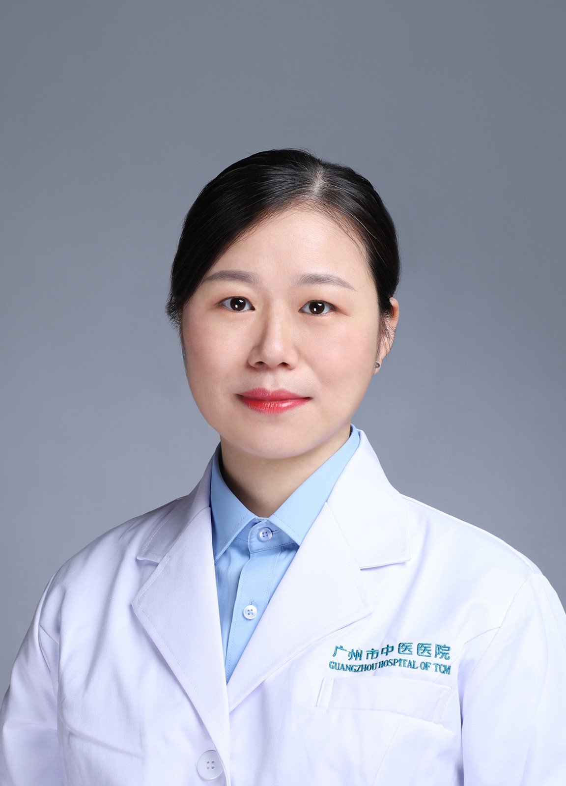

<!-- AUTO-GENERATED-BY: work/generate_obsidian_profiles.py -->

<!-- TEMPLATE: D:\workspace\信息收集整理\医生画像仓库\模板\医生画像模板.md -->

# 陈丽兰

## 基础信息

| 字段 | 内容 |
|---|---|
| 姓名 | 陈丽兰 |
| 医院 | 广州市中医院 |
| 科室 | 内分泌科 |
| 职称/身份 | 副主任中医师 |
| 来源链接 | [官网原文](https://www.gzszyy.com/expert/2026/5xe7XGa7.html) |
| 采集日期 | 2026-08-13 |

## 简介/擅长

中西医结合治疗糖尿病及其慢性并发症，如糖尿病肾病、糖尿病周围神经病变、糖尿病足、糖尿病并高血压、糖尿病性心脏病等；其他内分泌及代谢性疾患，如：甲状腺疾病、高尿酸血症、血脂异常、骨质疏松、痤疮及月经不调等。

## 教育与进修经历

- 2003年毕业于广州中医药大学，曾至中南大学湘雅二院 内分泌科 进修工作一年。

## 科研项目与成果

- 医学硕士，广东省名中医师承项目继承人。

## 可包装亮点

- 2003年毕业于广州中医药大学，曾至中南大学湘雅二院 内分泌科 进修工作一年。
- 现任广东省中西医结合学会内分泌分会委员，广东省中医药学会糖尿病专业委员会委员，广州市医师协会青年医师分会委员。

## 重点疾病/人群标签

- 慢性病：高血压、糖尿病、慢性、代谢、月经
- 肿瘤：
- 生殖疾病：高血压、糖尿病、慢性、代谢、月经
- 免疫/风湿：
- 术后恢复/康复：
- 疑难重症：

## 证据摘录

> 只摘录官网公开信息中的短句或关键字段，不复制大段原文。

- 官网身份字段：副主任中医师
- 官网简介/擅长：中西医结合治疗糖尿病及其慢性并发症，如糖尿病肾病、糖尿病周围神经病变、糖尿病足、糖尿病并高血压、糖尿病性心脏病等；其他内分泌及代谢性疾患，如：甲状腺疾病、高尿酸血症、血脂异常、骨质疏松、痤疮及月经不调等。
- 官网亮眼经历线索：2003年毕业于广州中医药大学，曾至中南大学湘雅二院 内分泌科 进修工作一年。 现任广东省中西医结合学会内分泌分会委员，广东省中医药学会糖尿病专业委员会委员，广州市医师协会青年医师分会委员。
- 来源链接：https://www.gzszyy.com/expert/2026/5xe7XGa7.html

## BD 画像摘要

陈丽兰医生可作为慢性病、生殖疾病方向的基础画像候选。后续 BD 使用应继续以官网来源和人工复核为准，不添加疗效承诺或无来源包装。

## 合规边界

- 仅使用医院官网、官方公众号、官方小程序等公开渠道。
- 不采集私人电话、私人微信、家庭住址、患者隐私或非公开排班信息。
- 不写“保证治愈”“疗效第一”“包治疑难杂症”等无法由官网证明的表述。
