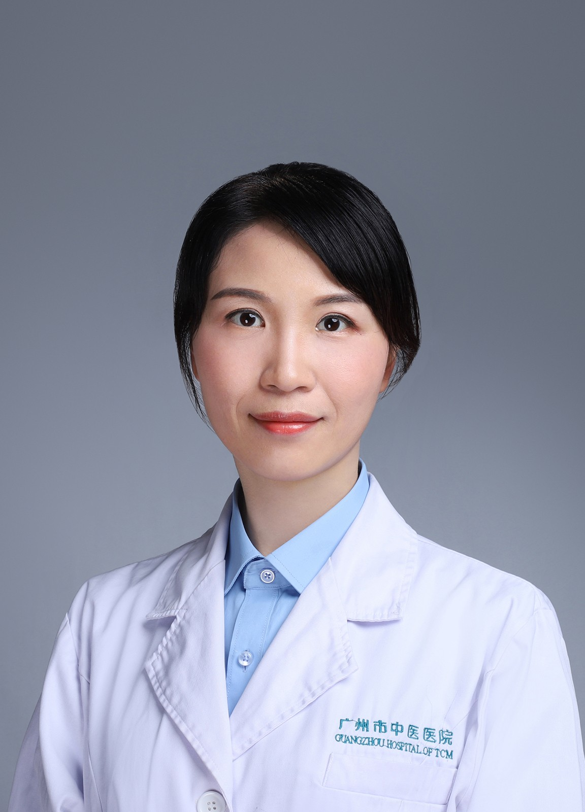

<!-- AUTO-GENERATED-BY: work/generate_obsidian_profiles.py -->

<!-- TEMPLATE: D:\workspace\信息收集整理\医生画像仓库\模板\医生画像模板.md -->

# 陈致雯

## 基础信息

| 字段 | 内容 |
|---|---|
| 姓名 | 陈致雯 |
| 医院 | 广州市中医院 |
| 科室 | 儿科 |
| 职称/身份 | 副主任中医师 |
| 来源链接 | [官网原文](https://www.gzszyy.com/expert/2026/3YaO7Nax.html) |
| 采集日期 | 2026-08-13 |

## 简介/擅长

儿童生长发育评估及身高管理指导，中西医治疗儿童矮小症、性早熟、生长发育异常等内分泌疾病

## 科研项目与成果

- 参与省市科研课题多项。

## 可包装亮点

- 副主任医师，副教授 从事 儿科 工作二十余年，尤其擅长儿童生长发育评估及身高管理指导，中西医治疗儿童矮小症、性早熟、生长发育异常等内分泌疾病；
- 广东省保健协会儿童内分泌遗传代谢分会委员；
- 广东省中医药学会小儿推拿学会常务委员；
- 广东省中西医结合学会 儿科 专业委员会委员；

## 重点疾病/人群标签

- 慢性病：代谢、感染
- 肿瘤：
- 生殖疾病：
- 免疫/风湿：代谢、感染
- 术后恢复/康复：
- 疑难重症：

## 证据摘录

> 只摘录官网公开信息中的短句或关键字段，不复制大段原文。

- 官网身份字段：副主任中医师
- 官网简介/擅长：儿童生长发育评估及身高管理指导，中西医治疗儿童矮小症、性早熟、生长发育异常等内分泌疾病
- 官网亮眼经历线索：副主任医师，副教授 从事 儿科 工作二十余年，尤其擅长儿童生长发育评估及身高管理指导，中西医治疗儿童矮小症、性早熟、生长发育异常等内分泌疾病； 广东省保健协会儿童内分泌遗传代谢分会委员； 广东省中医药学会小儿推拿学会常务委员； 广东省中西医结合学会 儿科 专业委员会委员；
- 来源链接：https://www.gzszyy.com/expert/2026/3YaO7Nax.html

## BD 画像摘要

陈致雯医生可作为慢性病、免疫/风湿/感染方向的基础画像候选。后续 BD 使用应继续以官网来源和人工复核为准，不添加疗效承诺或无来源包装。

## 合规边界

- 仅使用医院官网、官方公众号、官方小程序等公开渠道。
- 不采集私人电话、私人微信、家庭住址、患者隐私或非公开排班信息。
- 不写“保证治愈”“疗效第一”“包治疑难杂症”等无法由官网证明的表述。
