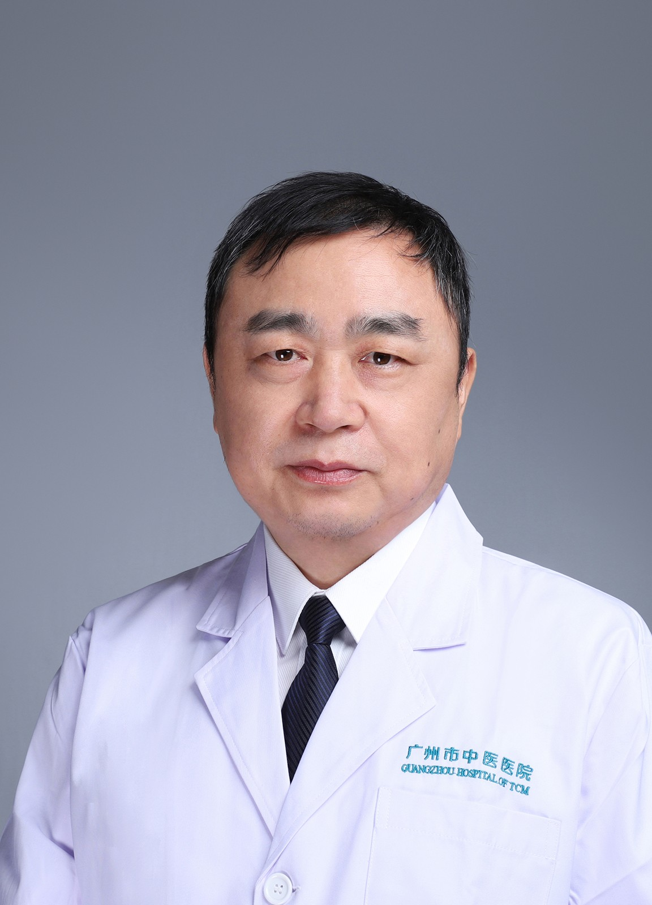

<!-- AUTO-GENERATED-BY: work/generate_obsidian_profiles.py -->

<!-- TEMPLATE: D:\workspace\信息收集整理\医生画像仓库\模板\医生画像模板.md -->

# 马卫东

## 基础信息

| 字段 | 内容 |
|---|---|
| 姓名 | 马卫东 |
| 医院 | 广州市中医院 |
| 科室 | 针灸康复科 |
| 职称/身份 | 主任中医师 |
| 来源链接 | [官网原文](https://www.gzszyy.com/expert/2026/M7e5yBe2.html) |
| 采集日期 | 2026-08-13 |

## 简介/擅长

应用针灸、推拿诊疗颈肩腰腿疼痛、中风偏瘫、各型关节炎、脊柱侧弯、亚健康状态、单纯性肥胖、眩晕、失眠、产后腰痛等常见病、多发病。

## 教育与进修经历

- 1992年毕业于湖南中医学院，现为广州市中医医院主任中医师。

## 科研项目与成果

- 参编《林应强教授筋伤学术经验撷英》、《吴山诊治筋伤学术思想及临证经验》等专著，公开发表医学论文6篇，主持参与科研课题3项。
- 广州市第二届优秀中医临床人才研修项目学员，广东省第二批优秀中医临床人才研修项目培养对象。

## 论文与学术产出

- 参编《林应强教授筋伤学术经验撷英》、《吴山诊治筋伤学术思想及临证经验》等专著，公开发表医学论文6篇，主持参与科研课题3项。

## 可包装亮点

- 中华中医药学会推拿分会委员、广东省中医药学会推拿分会常委、广东省针灸学会会员。
- 运用“颈椎定点旋转斜扳法”参加2016年广州市、广东省弘扬“大医精诚”中医药传统技术大比武活动分获第一名及优秀奖，2017年获广东省第二届中医“岭南名匠”之“手法名匠”称号。
- 参编《林应强教授筋伤学术经验撷英》、《吴山诊治筋伤学术思想及临证经验》等专著，公开发表医学论文6篇，主持参与科研课题3项。
- 广州市第二届优秀中医临床人才研修项目学员，广东省第二批优秀中医临床人才研修项目培养对象。

## 重点疾病/人群标签

- 慢性病：
- 肿瘤：
- 生殖疾病：
- 免疫/风湿：
- 术后恢复/康复：康复、疼痛
- 疑难重症：

## 证据摘录

> 只摘录官网公开信息中的短句或关键字段，不复制大段原文。

- 官网身份字段：主任中医师
- 官网简介/擅长：应用针灸、推拿诊疗颈肩腰腿疼痛、中风偏瘫、各型关节炎、脊柱侧弯、亚健康状态、单纯性肥胖、眩晕、失眠、产后腰痛等常见病、多发病。
- 官网亮眼经历线索：中华中医药学会推拿分会委员、广东省中医药学会推拿分会常委、广东省针灸学会会员。 运用“颈椎定点旋转斜扳法”参加2016年广州市、广东省弘扬“大医精诚”中医药传统技术大比武活动分获第一名及优秀奖，2017年获广东省第二届中医“岭南名匠”之“手法名匠”称号。 参编《林应强教授筋伤学术经验撷英》、《吴山诊治筋伤学术思想及临证经验》等专著，公开发表医学论文6篇，主持参与科研课题3项。 广州市第二届优秀中医临床人才研修项目学员，广东省第二批优秀…
- 来源链接：https://www.gzszyy.com/expert/2026/M7e5yBe2.html

## BD 画像摘要

马卫东医生可作为术后恢复/康复方向的基础画像候选。后续 BD 使用应继续以官网来源和人工复核为准，不添加疗效承诺或无来源包装。

## 合规边界

- 仅使用医院官网、官方公众号、官方小程序等公开渠道。
- 不采集私人电话、私人微信、家庭住址、患者隐私或非公开排班信息。
- 不写“保证治愈”“疗效第一”“包治疑难杂症”等无法由官网证明的表述。
